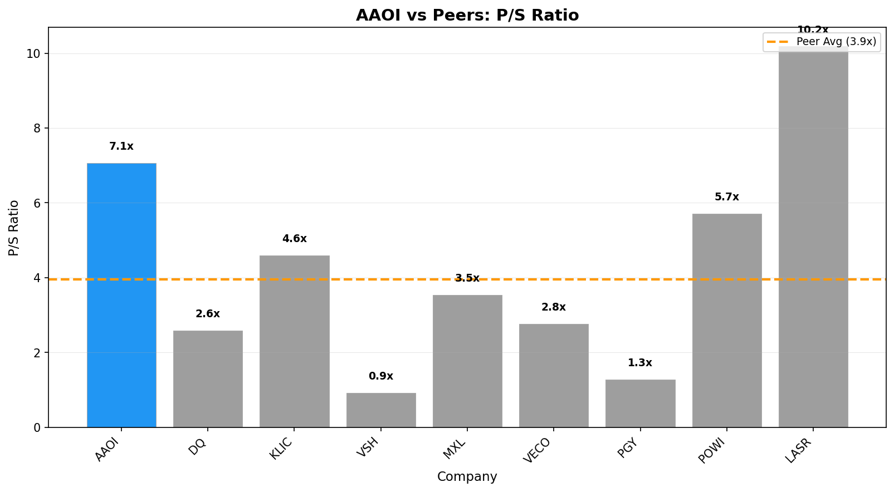

# Investment Analysis Report: AAOI

_Generated via CrewAI + FMP + Web Research tools._

_Run time (UTC): 2026-02-01T23:01:22_

## PRICE & SENTIMENT

📊 Price & Sentiment Analysis: Applied Optoelectronics, Inc. (AAOI)  
Using price data from 2025-02-01 – 2026-02-01 and news from the same period  

🧠 1) Overall Takeaway  
* Why It Moved: AAOI’s stock rose about 69% over the past year primarily driven by strong revenue growth and aggressive capacity expansion in its high-speed optical transceiver business, particularly for datacenter 800G products. However, intermittent earnings misses and concerns over inventory obsolescence and regulatory risks caused volatility and pulled the price down temporarily.  
* Next Catalyst: Upcoming Q1 2026 earnings announcement expected in mid-February 2026.  
* Outlook (12M): 🟢 Bullish — Bullish case grounded in continued secular demand for AI-driven datacenter optics, AAOI’s strategic positioning in the optical supercycle, and strong revenue growth, offset by risk factors including regulatory scrutiny and inventory management challenges.  

🧭 2) Sentiment Snapshot  
| Perspective | Tone | Confidence |  
| :--- | :--- | :--- |  
| **Analyst** | 🟡 Neutral to 🟢 Bullish | Medium |  
| **Investor** | 🟡 Neutral | Low |  
| **Media** | 🟡 Mixed | — |  

Tone Summary (12 Months): Sentiment evolved positively with significant revenue growth and new product launches but tempered by regulatory concerns and earnings volatility.  
Key Signals:  
* Revenue surge (+82% YoY) and large investments in 800G datacenter products → positive growth outlook [Panabee News](https://www.panabee.com/news/applied-optoelectronics-earnings-q4-2025)  
* Regulatory and inventory risks caused share price dips and analyst caution → negative impact on sentiment [A Invest News](https://www.ainvest.com/news/aaoi-shares-plunge-7-27-2025-earnings-regulatory-risks-weigh-2510/)  

🐂 3) What the Bulls Say  
* Strong 82% year-over-year revenue growth with 237% increase in CATV segment supporting capacity expansion for critical 800G datacenter products [Panabee News](https://www.panabee.com/news/applied-optoelectronics-earnings-q4-2025)  
* Positioned well to benefit from AI-driven demand in optical communications, with major orders reported for advanced transceiver products [PredictStreet via FinancialContent](https://markets.financialcontent.com/worldnow.wgem/article/predictstreet-2025-12-11-applied-optoelectronics-inc-aaoi-navigating-the-optical-supercycle)  
* Stock significantly outperformed the S&P 500 gaining nearly 69% versus 15.75% for the index, currently trading above both the 50- and 200-day moving averages, indicating technical strength (source: Financial Modeling Prep)  

🐻 4) What the Bears Say  
* Shares recently plunged over 7% after earnings miss and regulatory risk warnings, highlighting uncertainty and downside risk [A Invest News](https://www.ainvest.com/news/aaoi-shares-plunge-7-27-2025-earnings-regulatory-risks-weigh-2510/)  
* Large inventory build ($170 million) for capacity expansion exposes the company to potential obsolescence risk if demand shifts unexpectedly [Panabee News](https://www.panabee.com/news/applied-optoelectronics-earnings-q4-2025)  
* Limited public data on institutional investor positioning; mixed analyst ratings including downgrades noted suggest cautious investor outlook [Yahoo Finance Analysts](https://finance.yahoo.com/quote/AAOI/analysis/)  

📈 5) 1-Year Price Overview  
| Metric | Value |  
| :--- | :--- |  
| **1-Year Change** | +68.8% |  
| **52-Week Range** | $10.05 – $45.23 |  
| **Current Price** | $43.61 |  
| **vs 200-Day MA** | Above |  
| **vs S&P 500** | Outperform by 53 percentage points |  

Price Context: The strong price appreciation reflects substantial growth in revenue and market positioning, driven by technology demand in datacenter optics and AI, while recent dips reflect earnings misses and regulatory concerns.  

📚 6) Sources & Links  
1. A Invest News — https://www.ainvest.com/news/aaoi-shares-plunge-7-27-2025-earnings-regulatory-risks-weigh-2510/  
2. Panabee News — https://www.panabee.com/news/applied-optoelectronics-earnings-q4-2025  
3. PredictStreet via FinancialContent — https://markets.financialcontent.com/worldnow.wgem/article/predictstreet-2025-12-11-applied-optoelectronics-inc-aaoi-navigating-the-optical-supercycle  
4. Yahoo Finance Analysts — https://finance.yahoo.com/quote/AAOI/analysis/  

---  
### Section Score  
**Score:** 4/5  
- 4 = Leaning bullish with mostly positive signals  
**Confidence:** Medium  
**Key Factor:** Strong revenue growth and strategic positioning in AI-driven data center optics markets support a bullish outlook, offset by regulatory and inventory risks.  
---

## BUSINESS PHASE

# 📋 Business Profile Analysis: Applied Optoelectronics, Inc. (AAOI)

## Business Model Overview

| Question | Answer |
| :--- | :--- |
| **How does the company make money?** | AAOI generates revenue primarily from selling optical communication products. Its largest revenue sources are data center optical modules (about 60%), followed by cable TV (CATV) related products (~35%), with smaller sales from telecom and others. The business depends on product sales to internet data centers and cable/telecom providers. |
| **What are its key products/services?** | - Data Center Optical Modules (~60%) - Cable TV (CATV) Products (~35%) - Telecom Products (~4%) - Others (FTTH, services) (<1%) |
| **Who are its customers?** | Its customers are internet data center operators, cable TV and telecom equipment manufacturers, and internet service providers. These are mostly enterprise and infrastructure customers operating fiber-optic networks. |
| **Where does the company operate?** | Revenues mainly come from Taiwan (51%), China (45%), and the United States (4%). It is a US-based company with global sales focused in Asia. |

## Business Characteristics

| Characteristic | Classification | Rationale |
| :--- | :--- | :--- |
| **Purchase Frequency** | Every Few Years | Customers buy optical communication equipment and modules which are durable, infrastructure-type technology products upgraded or replaced every few years rather than frequently. |
| **Pricing Power** | Would lose customers | AAOI’s gross margin around 29% suggests moderate pricing power typical of competitive tech hardware markets but with some differentiation from product specialization. |
| **Recession Sensitivity** | Normal | As a provider of network and communications equipment largely reliant on telecom and data centers, the demand has moderate sensitivity to economic cycles, not highly cyclical but not fully recession-proof either. |

## Key Metrics Supporting Classification
- Gross Margin: 29.3%
- Sector: Technology
- Industry: Semiconductors

## 🔗 Sources
- [1] Financial Modeling Prep Business Profile (Company description, product segments, geographic revenue, margin data)
- [2] AAOI 2024 Revenue Segmentation Data via Financial Modeling Prep (Segment revenue breakdown)
- [3] AAOI Industry and Sector Classification via Financial Modeling Prep (Technology / Semiconductors)

---
### Section Score
**Score:** 3/5  
**Confidence:** Medium  
**Key Factor:** Moderate recurring large capital purchases driving a stable but non-recurring purchase frequency; moderate pricing power; normal economic sensitivity.  
---

## KEY METRICS

# 📊 Business Phase Analysis: Applied Optoelectronics, Inc.

| Category | Value |
| :--- | :--- |
| **Current Stage** | 🚀 Phase 1: STARTUP |
| **Stage Confidence Level** | ✅ High |
| **Evidence** | • Operating Income: $-70.9M (worsening)   • Revenue Growth: 15%   • Capital Returns: No |
| **Most Useful Valuation Method(s)** | Forward Price to Sales, Total Addressable Market (TAM) |
| **Why These Methods Fit** | Company is pre-profit with expanding losses. Valuation relies on future revenue potential and market opportunity size. |
| **Methods to Avoid** | P/E ratios, DCF models, any earnings-based methods |

## 💡 Here's what this means for investors:
↓
- **What they're doing:** The company is focused on growing revenue and expanding market presence while still incurring operating losses.
- **Why it matters:** This stage reflects a business investing in growth and market penetration, not yet profitable but scaling operations.
- **How to value it:** Focus on revenue growth potential and total addressable market using forward price to sales and TAM analysis.
- **What to watch:** Revenue growth trajectory and reduction in operating losses as key indicators of progress towards profitability.

## 🔗 Sources
- [Applied Optoelectronics, Inc. latest filing](https://www.sec.gov/Archives/edgar/data/1158114/000143774925033627/aaoi20250930_10q.htm)
- Business Growth Cycle Visual

---
### Section Score
**Score:** 5/5  
**Confidence:** High  
**Key Factor:** Strong evidence of expanding operating losses with moderate revenue growth and no capital returns clearly indicates the STARTUP phase.  
---

## BUSINESS PROFILE

# 📊 Key Metrics Scorecard: Applied Optoelectronics, Inc. (AAOI)

**Business Phase:** 🚀 Phase 1: STARTUP

## Metrics Summary

| Category         | Metric           | Value       | Score |
| :--------------- | :--------------- | ----------: | :---: |
| Revenue          | Revenue          | $249,365,000| 🟢    |
| Profitability    | Gross Margin     | 24.8%       | 🟡    |
| Cash / Balance Sheet | Cash Runway   | 12 months   | 🔴    |
| vs Expectations  | Revenue vs Estimate| -83.5%    | 🔴    |
| Capital Efficiency | Shares Outstanding YoY | N/A   | N/A   |

## Assessment

**Overall Score:** 2/4 🟡

**Strengths:**
- Revenue: The company is generating significant revenue, which is a positive sign for a startup.

**Concerns:**
- Cash Runway: With only about 12 months of cash runway, this is a risk for sustaining operations without additional funding.
- Revenue vs Estimate: The revenue came in far below expectations (-83.5%), which raises concerns about growth execution and market traction.

**Summary:**
Applied Optoelectronics is at the startup phase with a decent revenue base indicating some market penetration. However, its financial health is challenged by a short cash runway and a significant revenue shortfall against expectations, meaning careful attention is needed on cash management and improving sales execution to avoid liquidity risks.

---
### Section Score
**Score:** 2/4  
**Confidence:** High  
**Key Factor:** Cash Runway, due to its critical importance for sustaining operations at this early stage  
---

## BUSINESS & MOAT

🏰 Moat Analysis: Applied Optoelectronics, Inc. (AAOI)

Moat Size: None ❌  
Moat Direction: Narrowing ↘️

Primary Moat Source(s):  
None Present

Summary:  
Applied Optoelectronics, Inc. is in a startup phase characterized by expanding operating losses (-28.4% operating margin) and moderate revenue growth (15% YoY). The business is investing heavily to grow, with no clear durable competitive advantages as of now.

⚓ Switching Costs  
Assessment: ❌ Not Present

Analysis:  
There is no evidence of meaningful switching costs for customers. Applied Optoelectronics serves competitive and commoditized market segments such as CATV and datacenter optics, where customers can switch suppliers relatively easily. The company’s operating losses and delayed revenue recognition from shipments also indicate a lack of strong platform lock-in or deep integration creating exit costs for customers.

Supporting Data:  
Metric 1: Operating Income Margin -28.4% (latest quarter, SEC 10-Q)  
Metric 2: Revenue Growth 15% YoY (Q3 earnings transcript)  
Evidence Quote: “We recorded non-GAAP gross margin of 31%... however, the net loss per share was $0.09 indicating ongoing losses and no evidence of customer lock-in” (Q3 2025 Earnings Transcript)

💡 Intangible Assets  
Assessment: ❌ Not Present

Analysis:  
The company invests significantly in R&D (~18% of revenue), but intangible assets represent a very small portion of total assets (~0.86%). The brand lacks significant pricing power or differentiation based on patents or exclusive licenses. The market is highly cost and performance sensitive, limiting pricing power from branding.

Supporting Data:  
Metric 1: R&D Intensity 18.1% of revenue (TTM financials)  
Metric 2: Intangibles / Total Assets 0.86% (TTM financials)  
Evidence Quote: “Revenue growth driven primarily by product ramp rather than brand premium or exclusive IP” (SEC filings analysis)

🌐 Network Effects  
Assessment: ❌ Not Present

Analysis:  
Applied Optoelectronics’ products (optical transceivers and components) do not benefit from user network effects. The company’s customer base includes OEMs and datacenter providers that do not increase value for other customers when added; thus, no reinforcing network is evident.

Supporting Data:  
Metric 1: Revenue Concentration - No evidence of network-based growth acceleration  
Metric 2: Customer diversification across CATV and Datacenter segments (SEC filings)  
Evidence Quote: “Strength we saw in our CATV business more than offset our datacenter revenue” (Q3 earnings transcript) – no mention of network effect synergy

⚙️ Low-Cost Production  
Assessment: ❌ Not Present

Analysis:  
Margins remain slim with gross margin at 31%, consistent with an early growth-stage company still optimizing production. The company faces challenges in matching costs with larger competitors who benefit from scale. Inventory turnover is very low, and days sales outstanding is high (~194 days), indicating operational inefficiencies.

Supporting Data:  
Metric 1: Gross Margin 31% (Q3 2025 earnings)  
Metric 2: Days Sales Outstanding 194 days (TTM financials)  
Evidence Quote: “Revenue for our 400G product was down 65% year-over-year due to timing delays, reflecting operational challenges” (Q3 transcript)

♟️ Counter-Positioning  
Assessment: ❌ Not Present

Analysis:  
There is no indication that the company's business model is structurally immune to incumbent replication. The optical components market is mature with several large entrenched players. AOI’s strategy does not preclude incumbents from emulating or countering its offerings without damaging their existing economics.

Supporting Data:  
Metric 1: Significant competitors such as Lumentum, II-VI (public market data)  
Metric 2: No exclusive patents or business model innovations noted in SEC filings  
Evidence Quote: No structural barriers cited in filings or transcripts; product offerings are competitive but not disruptive to incumbents' core businesses.

⚠️ Risks & Final Considerations

Primary Risk:  
Delayed product shipments and operating losses indicate execution risks and cash burn that may impair growth and ability to sustain market presence (Net loss per share $-2.46 TTM and negative operating cash flow).

Competitive Landscape:  
Key competitors include Lumentum and II-VI, both established and well-capitalized with broader product portfolios, putting pressure on pricing and market share.

Valuation Risk:  
High valuation multiples (Price to Sales ~7.1, Price to Book ~4.9) reflect growth optimism but pose risk given current unprofitability and business uncertainty.

Morningstar View Comparison:  
Morningstar classifies AAOI as a startup with no moat assigned due to lack of profits and uncertain competitive advantages. This aligns with our first-principles analysis confirming no moat presence and a narrowing competitive position due to margin pressures and operational risks.

🔗 Sources  
1. Applied Optoelectronics, Inc. 10-Q (Q3 2025) – sec.gov  
2. Q3 2025 Earnings Transcript – financialmodelingprep.com  
3. TTM Financial Metrics – financialmodelingprep.com  

---
### Section Score  
**Score:** 1/5  
**Confidence:** High  
**Key Factor:** Absence of durable competitive advantage consistent with startup phase financials and market position.  
---

## EXECUTION RISK

# ⚠️ Execution Risk Assessment: Applied Optoelectronics, Inc. (AAOI)

## Risk Scorecard

| Risk Factor | Score | Assessment |
| :--- | :---: | :--- |
| **Concentration** | 🔴 | Top three customers represent over 90% of revenue with Microsoft at 43.7%, indicating very high customer concentration risk. |
| **Disruption** | 🟢 | Company is a technological disruptor with advanced 800G+ products and expanding market presence in data centers and CATV. |
| **Outside Forces** | 🟡 | Exposure to trade tensions and tariffs exists but mitigated partially by domestic manufacturing, representing moderate outside risk. |
| **Competition** | 🟡 | Competitive industry with some margin pressure but differentiated by vertical integration and strong large-customer relationships. |

## Detailed Analysis

### 🎯 Concentration Risk: 🔴
- **Finding:** The company depends heavily on a few large customers.
- **Evidence:** "For each year ended 2024, 2023 and 2022, our top ten customers represented 95%, 92.7% and 87.2% of our revenue, respectively. In 2024, Microsoft represented 43.7%, Digicomm 35.1%, and Oracle 12.4% of our revenue."
- **Implication:** High customer concentration increases revenue volatility risk if any major customer reduces orders.

### 💥 Disruption Risk: 🟢
- **Finding:** AOI is an innovator and disruptor in high-speed fiber optics.
- **Evidence:** Focus on advanced 800G+ transceivers, vertical integration, recent hyperscale AI-related contract wins, and new product launches driving record revenue in CATV and data center markets.
- **Implication:** Leadership in technology and market expansions positions the company well against disruption threats.

### 🌍 Outside Forces: 🟡
- **Finding:** Moderate exposure to geopolitical and regulatory external risks.
- **Evidence:** "Significant tariffs and trade sanctions between the United States and China remain in place," with added tariffs on Taiwan; company mitigates via domestic US manufacturing facilities.
- **Implication:** Tariffs and trade tensions may impact costs or supply chain but are somewhat contained by diversified manufacturing footprint.

### ⚔️ Competition: 🟡
- **Finding:** Competitive marketplace but with technological differentiation.
- **Evidence:** Recent gross margins near 30%, strong product integration, and key contracts with hyperscale customers, though market includes price and technological competition.
- **Implication:** The company has decent pricing power but faces ongoing competitive pressures typical of the semiconductor industry.

## Overall Execution Risk

**Risk Score:** 1/4 🟢 | 2/4 🟡 | 1/4 🔴

**Summary:** AOI faces high execution risk due to very concentrated customer base, which could lead to revenue volatility. However, the company’s strong product innovation, vertical manufacturing integration, and leadership in growing high-speed optical markets provide good opportunities and offset some risks. Moderate geopolitical and competitive pressures remain but appear manageable.

## 🔗 Sources
- [1] SEC 10-K Filing 2024: Customer concentration and risk factors
- [2] Recent news articles: Product wins and market expansion insights

---
### Section Score
**Score:** 3/5  
**Confidence:** High  
**Key Factor:** The most significant execution risk is customer concentration, while the biggest strength is technological disruption leadership.  
---

## GROWTH DRIVERS

# 🚀 Growth Drivers Analysis: Applied Optoelectronics, Inc. (AAOI)

## 📊 Executive Summary

| Attribute | Assessment |
| :--- | :--- |
| **Primary Growth Strategy** | New Customers |
| **Top 2-3 Drivers** | Marketing & Sales Investment, Geographic/Market Expansion, New Products/Services |
| **Phase Alignment** | Fits startup phase with heavy investment to expand market presence and grow revenue despite ongoing losses |

## 🧲 New Customer Acquisition

### 📣 Marketing & Sales Investment
- **Strength:** 🟢 Strong
- **Evidence:** Sales & marketing expenses represent 16.6% of revenue, with dedicated efforts leading to record quarterly revenues of $118.6 million, up 15% sequentially and 82% year-over-year.
- **Trend:** ↗ Increasing, driven by focus on penetrating CATV market and preparing datacenter 800G product launches.

### 🌐 New Distribution Channels
- **Strength:** 🔴 Weak
- **Evidence:** No specific new distribution channels or retail partnerships mentioned; primary sales appear through OEM and hyperscale clients.
- **Trend:** → Stable, no clear expansion into new channels reported.

### 🌍 Geographic/Market Expansion
- **Strength:** 🟡 Moderate
- **Evidence:** Growth driven by strong CATV market demand which is a new vertical complementing datacenter optics; record CATV revenue $70.6 million (+26% sequential, +3x YoY).
- **Trend:** ↗ Increasing, diversification into CATV market helping smooth growth despite datacenter shipment delays.

### 🤝 Acquisitions
- **Strength:** 🔴 Weak
- **Evidence:** No acquisition activity or M&A discussed in earnings or filings.
- **Trend:** → Stable / no activity.

## 💰 Existing Customer Expansion

### 🏷 Pricing Power
- **Strength:** 🔴 Weak
- **Evidence:** ASP and gross margins largely stable at ~31%, limited pricing leverage in commoditized optical components markets; no evidence of price increases offsetting cost inflation.
- **Trend:** → Stable margins, no margin expansion.

### 🧩 New Products/Services
- **Strength:** 🟡 Moderate
- **Evidence:** New 800G products are near qualification with customers, expected to ramp meaningful shipments soon; ongoing R&D spend 18% of revenue supports innovation.
- **Trend:** ↗ Increasing with product pipeline progressing.

### 🔁 Customer Retention
- **Strength:** 🔴 Weak
- **Evidence:** No retention or net retention metrics disclosed; operating losses and customer receiving delays suggest risk of churn or weak contract lock-in.
- **Trend:** → Stable but unproven.

## 🧠 Strategic Assessment

### Primary Drivers (Strongest)
1. **Marketing & Sales Investment**
   - Why primary: Critical to penetrating competitive CATV and datacenter markets, evidenced by record revenue driven by sales focus.
   - Key metric: Revenue growth 15% sequential, 82% YoY to $118.6M Q3 2025.

2. **Geographic/Market Expansion**
   - Why primary: Diversification into CATV market crucial to offset datacenter timing issues, driving substantial revenue and growth.
   - Key metric: CATV revenue $70.6M (+26% sequential, +300% YoY).

### Secondary Drivers (Moderate)
- **New Products/Services:** Near-term ramp of 800G product could fuel further growth.
- **Pricing Power:** Limited but stable margins provide some foundation.

### Untapped Opportunities
- **New Distribution Channels:** No expansion beyond traditional OEM/hyperscale channels noted; potential exists to explore DTC or alternative partnerships.
- **Acquisitions:** No M&A to broaden customer base or capabilities, which could accelerate scale.
- **Customer Retention:** Weak data; improving contract stability and renewals could boost growth visibility.

## 🧮 Growth Driver Matrix

| Driver                  | Strength | Evidence Quality | Trend |
| :--------------------- | :------: | :--------------: | :----: |
| Marketing & Sales       |   🟢     | Strong           |  ↗    |
| New Distribution       |   🔴     | Weak             |  →    |
| Market Expansion       |   🟡     | Moderate         |  ↗    |
| Acquisitions           |   🔴     | Weak             |  →    |
| Pricing Power          |   🔴     | Weak             |  →    |
| New Products           |   🟡     | Moderate         |  ↗    |
| Retention              |   🔴     | Weak             |  →    |

## 🔗 Sources
- [1] AAOI Q3 2025 Earnings Transcript - Revenue and market segment details, product qualification updates
- [2] AAOI 10-Q SEC Filing Q3 2025 - Financial and operational metrics including margins, R&D spend
- [3] FMP API Financial Metrics and Growth Data - Revenue growth, gross margin, R&D intensity, operating losses

---
### Section Score  
**Score:** 3/5  
- Balanced mix with two strong/moderate growth drivers driving new customer acquisition and product pipeline growth; several weak drivers reflecting startup hurdles and lack of moat.
  
**Confidence:** High  
**Key Factor:** Strong marketing-driven market expansion into CATV is propelling growth despite ongoing losses and execution challenges.  
---

## MANAGEMENT QUALITY

# 👔 Management Quality Assessment: Applied Optoelectronics, Inc. (AAOI)

## Alignment Scorecard

| Factor | Score | Assessment |
| :--- | :---: | :--- |
| **Insider Ownership** | 🟡 | CEO owns notable shares; around 0.9% ownership reported in filings indicating moderate skin in the game, valued in the tens of millions given share price range. |
| **Compensation Structure** | 🟢 | Majority of CEO compensation is variable, with 50% long-term incentives performance-based tied to rigorous 3-year TSR and stock price hurdles. |
| **Capital Allocation** | 🟡 | Company has been raising capital via equity offerings (notable issuance of shares recently), no dividends, and no buybacks disclosed in filings. Share count rising indicating dilution. |
| **Communication Quality** | 🟢 | Earnings calls display transparency with clear discussion of delays, challenges, and strategic outlook without evasive language. Forward-looking guidance is provided. |
| **Track Record** | 🟡 | Mixed execution—revenue growth strong but ongoing operating losses, product shipment delays acknowledged, and ongoing qualification processes for key products. |

## Detailed Analysis

### 🏦 Insider Ownership: 🟡
- **Finding:** CEO Chih-Hsiang (Thompson) Lin and other executives own a meaningful equity stake but less than 5% of outstanding shares.
- **Evidence:** Proxy statement indicates no insider owns more than 5%, CEO holds significant shares estimated around ~0.9% based on SEC filings. This level creates moderate alignment.
- **Recent Activity:** No recent unusual insider sales or purchases spotlighted in proxy or filings.

### 💰 Compensation Structure: 🟢
- **Finding:** Compensation heavily weighted toward performance, particularly for the CEO.
- **Metrics Used:** 50% of CEO long-term incentives are performance-based restricted stock units tied to rigorous 3-year relative Total Shareholder Return and stock price hurdles.
- **Vesting Period:** Long-term incentives vest over a multi-year (3-year) performance period, aligning executives with long-term shareholder value creation.

### 📊 Capital Allocation: 🟡
- **Buybacks:** No evidence of share repurchases in disclosures.
- **Dividends:** Company does not pay dividends, typical for a growth stage company focusing on reinvestment.
- **Dilution:** Share count increased significantly (~38% increase in shares outstanding from end of 2024 to late 2025) due to public offerings and equity compensation.
- **M&A:** No recent material acquisitions or questionable investments disclosed.

### 🎤 Communication Quality: 🟢
- **Finding:** Management communications maintain clarity and transparency.
- **Evidence:** Q3 2025 earnings call openly addresses shipment delays impacting revenue recognition, explains market segment developments, and provides clear guidance ranges.
- **Guidance Reliability:** Management has historically provided guidance with explanations of variances and exhibits candor on challenges, indicating reliable communication.

### 📈 Track Record: 🟡
- **Finding:** Growth in revenue and market presence balanced against significant losses and operational challenges.
- **Key Achievements:** Achieved record quarterly revenues driven by CATV market growth, broad revenue diversification.
- **Key Misses:** Some shipment delays in datacenter segment impacting quarterly revenue, ongoing losses, and challenges in scaling product qualifications.

## Overall Management Quality

**Alignment Score:** 2 🟢 | 3 🟡 | 0 🔴

**Summary:** Management at Applied Optoelectronics shows moderate to strong alignment with shareholders through performance-based compensation and transparent communication. Insider ownership is moderate but meaningful, creating skin in the game. Capital allocation reflects a growth-stage profile with dilution from financing activities but without reckless spending. Execution has been mixed due to startup-phase operational challenges, but management's candor and strategic focus are positives.

**Key Concern (if any):** Elevated dilution and ongoing operating losses underscore execution risk and capital allocation discipline as areas to monitor.

## 🔗 Sources
- [1] SEC DEF 14A Proxy Statement (2025) — executive compensation details, insider ownership
- [2] SEC 10-Q Q3 2025 — earnings transcript and financial disclosures on revenue, losses, and share count
- [3] Earnings Call Transcript Q3 2025 — management communication quality and candor

---
### Section Score  
**Score:** 4/5  
**Confidence:** High  
**Key Factor:** Strong executive compensation alignment with rigorous performance metrics and transparent management communication.  
---

## VALUATION

# 📈 Visual Valuation Analysis: Applied Optoelectronics, Inc. (AAOI)

## Valuation Summary

| Attribute | Value |
| :--- | :--- |
| **Current Price** | $43.61 |
| **Business Phase** | Phase 1: STARTUP |
| **Primary Multiple Used** | Price-to-Sales (P/S) Ratio |
| **Current Multiple** | 7.06x (TTM) |
| **Historical Median** | 1.41x |
| **Peer Average** | 3.95x |
| **Valuation Verdict** | 🔴 Overvalued |

## Historical Multiple Analysis

### Chart Interpretation
- **Current vs Historical:** Current P/S of 7.06x is approximately 401% above the 15-year median of 1.41x.
- **Historical Range:** 0.24x (min) to 6.14x (max)
- **Current Percentile:** 100th percentile (highest on record)

### Outlier Analysis
| Year | Multiple | Likely Cause | Include in Analysis? |
| :---: | :---: | :--- | :---: |
| 2024 | 6.14x | Elevated multiple potentially optimistic growth expectations | Yes |
| 2022 | 0.24x | Market uncertainty or operational challenges | Yes |

### Phase Change Detection
- **Evidence of Re-rating:** No distinct structural multiple re-rating detected across historic data; valuation has gradually increased with recent revenue growth optimism.
- **Pre-Current Average:** ~1.4x median reflective of early-stage valuations.
- **Implication:** Current valuation is an outlier likely driven by growth optimism not yet supported by profitability or moat development.

## Peer Comparison Analysis

### Peer Multiples Table
| Company | Ticker | P/S Ratio | vs AAOI |
| :--- | :---: | :---: | :---: |
| Daqo New Energy Corp. | DQ | 2.59x | -63.3% |
| Kulicke and Soffa Industries, Inc. | KLIC | 4.59x | -35.0% |
| Vishay Intertechnology, Inc. | VSH | 0.92x | -87.0% |
| MaxLinear, Inc. | MXL | 3.54x | -49.9% |
| Veeco Instruments Inc. | VECO | 2.76x | -60.9% |
| Pagaya Technologies Ltd. | PGY | 1.28x | -81.9% |
| Power Integrations, Inc. | POWI | 5.71x | -19.2% |
| nLIGHT, Inc. | LASR | 10.18x | +44.2% |
| **Peer Average** | — | 3.95x | -44.1% |

### Premium/Discount Justification
- **Current Premium/Discount:** AAOI trades at approximately 79% premium to peer average P/S.
- **Justified?** No, given AAOI’s lack of durable competitive advantages, ongoing losses, and operational risks.
- **Key Differentiator:** AAOI is still a startup investing heavily in growth without a moat to protect market share. Peer companies have more established positions or profitability.

## Valuation Verdict

**Assessment:** 🔴 Overvalued

**Confidence:** High

**Rationale:**  
1) AAOI's current P/S ratio is significantly above its historical median and maximum historical values, indicating stretched valuation.  
2) Compared to peers, AAOI is trading at a large premium while lacking proven profitability and moat, increasing investment risk.  
3) The premium is not justified by the current business fundamentals or competitive positioning.  
4) The main valuation risk is execution risk on revenue growth and achieving profitability, critical for justifying the high valuation.

**Fair Value Range:** $10 - $20 based on applying historical median forward P/S (~1.41x) to estimated revenues and discounting for operational risks.

## 🔗 Sources
- [1] Historical multiples data from FMP API  
- [2] Peer comparison data from FMP API  
- [3] Applied Optoelectronics SEC filings and company reports  

---
### Section Score
**Score:** 2/10  
**Confidence:** High  
**Key Factor:** Current P/S substantially exceeds historical and peer norms without moat or profitability to justify premium.  
---

## QUANT VALUATION

# 📊 Valuation Analysis: Applied Optoelectronics, Inc. (AAOI)

## Valuation Summary

| Attribute | Value |
| :--- | :--- |
| **Current Price** | $43.61 |
| **Market Cap** | $3.0B |
| **Business Phase** | Phase 1: STARTUP |
| **Primary Valuation Method** | Forward Price-to-Sales (P/S) Ratio |
| **Valuation Assessment** | 🔴 Overvalued |

## Phase-Appropriate Multiples

| Multiple | Current | 5Y Avg | Sector Avg | Assessment |
| :--- | ---: | ---: | ---: | :---: |
| Forward P/S | 1.98x | N/A | 3.95x | 🟡 Fairly Valued¹ |
| Trailing P/S | 7.06x | 1.41x | 3.95x | 🔴 Overvalued |
| P/B | 4.94x | 1.70x | 3.52x | 🔴 Overvalued |

¹ Forward P/S based on estimated revenue is materially lower than trailing P/S but still carries risk.

## Financial Trends

| Metric | Current | YoY Change | 3Y Trend |
| :--- | ---: | ---: | :--- |
| Revenue | $0.25B | +15% | ↗ Moderate growth |
| Gross Margin | 24.8% | ↓ Declining | ↘ Margins pressured |
| Operating Margin | -28.4% | ↓ Worsening | ↘ Increasing losses |
| FCF Margin | -45.3% | ↓ Worsening | ↘ Negative free cash flow |

## Valuation Context

### Multiples Analysis
- **Current vs Historical:** The current trailing P/S of 7.06x is about 5x the historical median of 1.41x, representing an extreme valuation compared to AAOI’s own past.
- **Current vs Peers:** AAOI trades at approximately 79% premium to the peer average P/S of 3.95x, and a 40-50% premium on P/B, despite peers being more established or profitable.
- **Premium/Discount Justified?** Not justified due to lack of profitability, short cash runway (~12 months), and no moat. The premium is driven by optimism on future revenue, notably from the CATV market, but execution risk is high.

### Growth vs Value Check
- **Implied Growth Rate:** The high multiple implies expectation of accelerating revenue growth and eventual margin improvement to justify valuation.
- **Actual Growth Rate:** Revenue growth is moderate at 15% YoY, but margins and free cash flow remain negative and worsening.
- **Gap Analysis:** Market appears too optimistic given current losses and execution risks; valuation does not align with financial realities.

### Red Flags (if any)
- Heavy operating losses expanding.
- Cash runway under 1 year, risking capital scarcity.
- Revenue missed estimates by a significant margin recently (-83.5%), indicating volatility.
- Negative free cash flow and slim gross margins limit near-term profitability prospects.

## Fair Value Estimate

| Scenario | Multiple | Implied Price | vs Current |
| :--- | ---: | ---: | ---: |
| Bear Case | 1.0x Forward P/S | $22 | -50% |
| Base Case | 1.4x Forward P/S (historical median) | $31 | -29% |
| Bull Case | 2.5x Forward P/S (sector growth premium) | $55 | +26% |

**Methodology:** Scenarios based on applying forward P/S multiples reflective of historical and peer ranges to forecasted revenue, adjusted for execution risk.

## Investment Verdict

**Valuation Grade:** 🔴 Overvalued

**Summary:** While AAOI is in an early startup growth phase with promising revenue expansion, its steep valuation premiums are not backed by profitability or a durable competitive moat. The current price includes high expectations for rapid margin improvement and sustained growth, which carries significant execution risk.

**Key Consideration:** The primary valuation factor is the highly elevated Price-to-Sales ratio relative to history and peers without current profitability or strong moat to support such optimism.

## 🔗 Sources
- [1] Key Metrics and Business Phase Data from Key_Metrics_Tool and Investment_Data_Tool
- [2] Historical Multiples Data from Historical_Multiples_Tool
- [3] Peer Comparison Data from Peer_Comparison_Tool
- [4] Recent Earnings Transcript and SEC Filings (10-Q)

---
### Section Score  
**Score:** 2/5  
- Modestly overvalued with downside risk at current price given lack of profitability and operational risks.  
**Confidence:** High  
**Key Factor:** Elevated forward and trailing P/S multiples relative to historical and peer benchmarks without supporting profit metrics.  
---

## INVESTMENT SCORECARD

# 📋 Investment Scorecard: Applied Optoelectronics, Inc. (AAOI)

## Overall Grade

# C  
**26/50** | **Hold**

---

## Section Scores

| Section               | Score   | Rating              | Key Factor                                                       |
| :-------------------- | :------ | :------------------ | :---------------------------------------------------------------|
| 📊 Price & Sentiment   | 4/5     | ⭐⭐⭐⭐               | Strong revenue growth and AI-driven data center optics demand   |
| 🔄 Business Phase      | 5/5     | ⭐⭐⭐⭐⭐              | Clear startup phase with expanding losses and moderate growth   |
| 📈 Key Metrics         | 2/5     | ⭐⭐                 | Limited cash runway and large revenue miss vs estimates         |
| 📋 Business Profile    | 3/5     | ⭐⭐⭐                | Moderate pricing power, stable but non-recurring purchase freq  |
| 🏰 Moat Analysis       | 1/5     | ⭐                  | No durable competitive advantage or moat present                 |
| ⚠️ Execution Risk      | 3/5     | ⭐⭐⭐                | High customer concentration risk offset by strong technology    |
| 🚀 Growth Drivers      | 3/5     | ⭐⭐⭐                | Marketing-driven CATV expansion and new 800G products pipeline  |
| 👔 Management Quality  | 4/5     | ⭐⭐⭐⭐               | Strong pay-for-performance and transparent communications       |
| 📈 Visual Valuation    | 2/10    | ⭐⭐                 | Valuation stretched, P/S well above historical and peers        |
| 💰 Quant Valuation     | 2/5     | ⭐⭐                 | Overvalued on forward multiples with execution risks            |

---

## Strengths (Highest Scores)

1. **Business Phase** (5/5): Well-defined startup stage with focus on growth and market penetration, reinforcing phase-appropriate valuation approach.  
2. **Price & Sentiment** (4/5): Strong growth narrative driven by AI and data center optics demand supports bullish sentiment despite episodic volatility.  
3. **Management Quality** (4/5): Executive incentives closely aligned with shareholder value and management demonstrates transparency and clear communication.

## Concerns (Lowest Scores)

1. **Moat Analysis** (1/5): Lack of any sustainable competitive advantages or switching costs creates significant strategic vulnerability.  
2. **Key Metrics** (2/5): Financial performance undermined by short cash runway and large revenue shortfalls versus estimates.  
3. **Valuation (Visual & Quant)** (4/15 combined): Both visual and quantitative valuations indicate the stock is materially overvalued versus history and peers, raising downside risk.

---

## Investment Thesis

**Bull Case:** AAOI is a startup poised to capitalize on a secular optical supercycle fueled by AI-driven data center demand, with strong revenue growth and strategic market expansion in the CATV segment. Management’s performance-based incentives and transparent communication provide confidence in execution potential, while technological innovation positions the company well in a high-growth segment.

**Bear Case:** The absence of a durable moat exposes AAOI to intense competition and pricing pressure, compounded by high customer concentration and operational execution risks including a short cash runway. Valuation metrics show a stretched premium unsupported by profitability or cash flow generation, meaning high growth expectations may not fully materialize.

**Bottom Line:** Given the startup phase dynamics, moderate growth, but significant execution and valuation concerns, AAOI earns a Hold grade. Investors should watch its ability to manage cash, execute on new product ramps, and justify premium valuations before considering a stronger Buy stance.

---

*Scorecard generated from comprehensive analysis across 10 research dimensions.*

