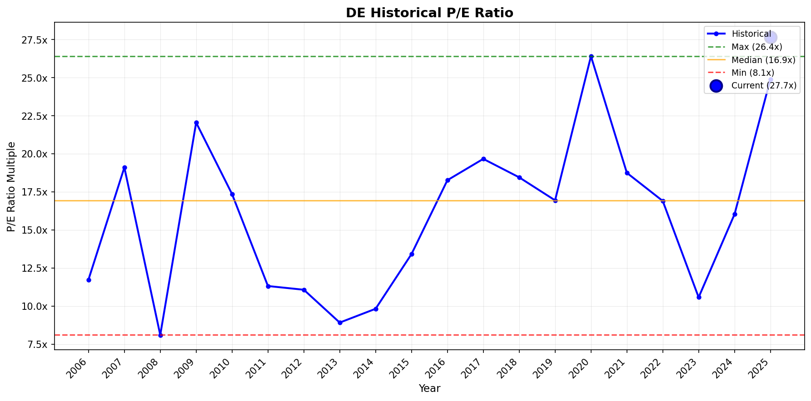
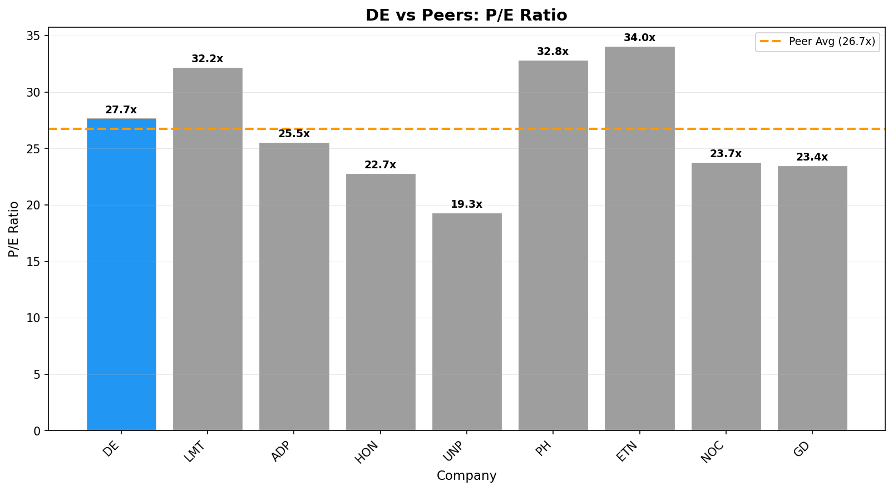

\begin{center}
\Large\textbf{DE} | \textbf{Deere & Company}
\end{center}

\vspace{0.5cm}

# PRICE & SENTIMENT

```
 Price & Sentiment Analysis: Deere & Company (DE)
Using price data from 2025-01-19 – 2026-01-19 and news from the same period

 1) Overall Takeaway
* Why It Moved: Deere’s stock moved up 11.07% over the past year, supported by solid revenue growth and beating earnings expectations in several quarters despite pressure on earnings per share and cautious profit guidance. The company’s performance was influenced by mixed demand trends in agriculture and infrastructure markets, with stronger revenues but some earnings declines reflecting operational challenges.
* Next Catalyst: Deere’s next major catalyst is its Q4 2025 earnings release and conference call scheduled for November 26, 2025.
* Outlook (12M): (~) Neutral — Deere’s outlook balances optimism for long-term agricultural mechanization and infrastructure growth with near-term challenges from weakening North American agricultural conditions and cautious profit guidance.

 2) Sentiment Snapshot
| Perspective | Tone | Confidence |
| :--- | :--- | :--- |
| **Analyst** | (~) Neutral | High |
| **Investor** | (~) Neutral | Medium |
| **Media** | (~) Mixed | — |

Tone Summary (12 Months): Sentiment evolved from cautious optimism with beats on revenue and earnings to tempered by weak farmer sentiment and earnings/margin pressures in late 2025.

Key Signals:
* Q4 2025 earnings beat revenue estimates but slightly missed EPS expectations → MSN, MarketBeat (https://www.msn.com/en-us/money/topstocks/earnings-preview-deere-de-q4-earnings-expected-to-decline/ar-AA1QKMjt) (https://www.marketbeat.com/stocks/NYSE/DE/earnings/)
* Analyst revisions reflect mixed results with some downgrades after Q3 earnings and lower 2025 guidance → Benzinga (https://www.benzinga.com/analyst-stock-ratings/price-target/25/08/47164299/these-analysts-revise-their-forecasts-on-deere-after-q3-results)
* Weak farmer sentiment surveys point to challenges in agricultural demand affecting Deere’s end markets → MSN (https://www.msn.com/en-us/money/topstocks/deere-q4-earnings-seen-under-pressure-amid-weak-farmer-sentiment/ar-AA1R2xsC)
* Revenue growth supported by infrastructure investment and international market opportunities → Deere Investor Relations (https://investor.deere.com/Home/default.aspx)

 3) What the Bulls Say
* Deere posted a 14.1% year-over-year revenue increase in Q4 2025, beating estimates, demonstrating resilience and market demand recovery (https://www.msn.com/en-us/money/topstocks/earnings-preview-deere-de-q4-earnings-expected-to-decline/ar-AA1QKMjt).
* The company’s strategic positioning to capitalize on global agricultural mechanization and infrastructure investment trends supports long-term growth (https://investor.deere.com/Home/default.aspx).
* Recent analyst upgrades post earnings reflect confidence in Deere’s ability to sustain business growth despite temporary headwinds (https://www.benzinga.com/analyst-stock-ratings/price-target/25/08/47164299/these-analysts-revise-their-forecasts-on-deere-after-q3-results).

 4) What the Bears Say
* Deere’s earnings per share declined in recent quarters, and full-year profit forecasts were trimmed amid weakening agricultural markets, especially in North America (https://www.morningstar.com/stocks/deere-earnings-north-american-ag-still-weak-company-holding-steady-prepped-2026).
* Survey data indicates farmer sentiment hit a 12-month low, suggesting potential demand softness in end markets (https://www.msn.com/en-us/money/topstocks/deere-q4-earnings-seen-under-pressure-amid-weak-farmer-sentiment/ar-AA1R2xsC).
* Management’s cautious guidance and earnings volatility due to supply chain and raw material cost pressures present near-term risks (https://finance.yahoo.com/news/deere-nyse-reports-earnings-decline-174159176.html).

 5) 1-Year Price Overview
| Metric | Value |
| :--- | :--- |
| **1-Year Change** | +11.07% |
| **52-Week Range** | $412.99 – $531.48 |
| **Current Price** | $514.40 |
| **vs 200-Day MA** | Above |
| **vs S&P 500** | Underperform by ~3.7 percentage points |

Price Context: Deere's price appreciated moderately supported by strong revenue growth and strategic positioning but underperformed the broader S&P 500 which gained ~14.73%, reflecting some caution amid profit margin pressures and weaker agricultural demand sentiment.

 6) Sources & Links
1. MSN - Earnings Preview & Reports — https://www.msn.com/en-us/money/topstocks/earnings-preview-deere-de-q4-earnings-expected-to-decline/ar-AA1QKMjt
2. MarketBeat - Earnings Dates and Reports — https://www.marketbeat.com/stocks/NYSE/DE/earnings/
3. Benzinga - Analyst Ratings & Price Target Revisions — https://www.benzinga.com/analyst-stock-ratings/price-target/25/08/47164299/these-analysts-revise-their-forecasts-on-deere-after-q3-results
4. Morningstar - Earnings Analysis — https://www.morningstar.com/stocks/deere-earnings-north-american-ag-still-weak-company-holding-steady-prepped-2026

***
### Section Score
**Score:** 3/5
- 3 = Neutral/mixed outlook
**Confidence:** High
**Key Factor:** Mixed earnings results with solid revenue growth offset by cautious profit guidance and weakening demand indicators
***
```

\newpage

# BUSINESS PHASE

#  Business Phase Analysis: Deere & Company

| Category | Value |
| :--- | :--- |
| **Current Stage** | $ Phase 5: CAPITAL RETURN |
| **Stage Confidence Level** | [Y] High |
| **Evidence** | • Operating Income: $8,416M (positive) <br> • Revenue Growth: -11.6% <br> • Capital Returns: Yes (Dividends Paid: $-1,720M; Buybacks: $-1,138M) |
| **Most Useful Valuation Method(s)** | Trailing Price to Earnings, Trailing Price to Free Cash Flow, Reverse DCF |
| **Why These Methods Fit** | Company is mature with stable operations and capital returns. Current earnings and cash generation drive valuation. |
| **Methods to Avoid** | High growth multiples, forward P/S |

##  Here's what this means for investors:
↓
- **What they're doing:** Returning capital to shareholders through dividends and share buybacks, indicating financial maturity.
- **Why it matters:** Stable profitability and capital return suggest a well-established business with reliable cash flows.
- **How to value it:** Focus on current earnings and cash generation using methods like trailing P/E and trailing free cash flow.
- **What to watch:** Earnings stability, dividend sustainability, and free cash flow generation.

##  Sources
- [Deere & Company latest filing](https://www.sec.gov/Archives/edgar/data/315189/000110465925122321/de-20251102x10k.htm)
- Business Growth Cycle Visual

***
### Section Score
**Score:** 5/5  
**Confidence:** High  
**Key Factor:** Positive operating income with significant capital returns through dividends and buybacks confirms capital return phase  
***

\newpage

# KEY METRICS

#  Key Metrics Scorecard: Deere & Company (DE)

**Business Phase:** $ Phase 5: CAPITAL RETURN

## Metrics Summary

| Category          | Metric              | Value  | Score |
| :---------------- | :------------------ | ------:| :---: |
| Revenue           | Revenue 3Y CAGR     | -4.5%  | (-)    |
| Profitability     | FCF / Net Income    | 64%    | (~)    |
| Cash / Balance Sheet| Interest Coverage  | 2.7x   | (-)    |
| vs Expectations   | ROIC                | 7.7%   | (-)    |
| Capital Efficiency| Capital Return Yield| 2.1%   | (~)    |

## Assessment

**Overall Score:** 0/5 Green

**Strengths:**
- FCF / Net Income: A decent conversion of net income into free cash flow, showing reasonable cash profitability.

**Concerns:**
- Revenue 3Y CAGR, Interest Coverage, ROIC: Negative revenue growth, low interest coverage, and modest returns on invested capital signal challenges in growth sustainability, financial risk, and capital efficiency.

**Summary:**
Deere & Company is in the capital return phase, meaning it is focused on returning money to shareholders rather than rapid growth. However, its revenue has declined over the last three years, and the company faces some financial risks from relatively low interest coverage. Returns on capital and growth are below ideal levels for a mature business, suggesting caution. While it generates solid free cash flow relative to income and continues capital returns, investors should watch these weaknesses for future financial stress.

***
### Section Score
**Score:** 0/5  
**Confidence:** High  
**Key Factor:** Negative revenue growth combined with low interest coverage indicating risk in financial stability  
***

\newpage

# BUSINESS PROFILE

#  Business Profile Analysis: Deere & Company (DE)

## Business Model Overview

| Question | Answer |
| :--- | :--- |
| **How does the company make money?** | Deere & Company earns most of its revenue by selling agricultural and construction equipment. Its largest revenue stream is Production and Precision Agriculture equipment (~46%), followed by Small Agriculture and Turf equipment (~17%), Compact Construction (~18%), Roadbuilding (~8%), Forestry (~3%), and Financial Services (~14%). These segments together generate about $44.7 billion annually from equipment sales and related services, plus financing operations for equipment purchases. |
| **What are its key products/services?** | - Production & Precision Agriculture (tractors, combines, harvesters) (~46%) <br> - Small Agriculture and Turf equipment (utility tractors, riding lawn equipment) (~17%) <br> - Compact Construction Equipment (~18%) <br> - Roadbuilding equipment (~8%) <br> - Forestry equipment (~3%) <br> - Financial Services (equipment financing and warranties) (~14%) |
| **Who are its customers?** | Deere serves individual farmers, commercial agricultural companies, turf and landscaping customers, construction and roadbuilding firms, forestry operators, and dealers. Customers include agricultural producers, livestock operators, golf courses, governments, and construction contractors. |
| **Where does the company operate?** | Primarily in the United States (~68%), with significant sales in Western Europe (~14%), Latin America (~12%), Canada (~9%), Asia/Africa/Oceania/Mid East (~10%), and Central Europe/Commonwealth of Independent States (~3%) as of latest fiscal year. |

## Business Characteristics

| Characteristic | Classification | Rationale |
| :--- | :--- | :--- |
| **Purchase Frequency** | Every Few Years | The company sells durable capital equipment like tractors and construction machinery which customers purchase infrequently, typically every few years. This is consistent with its product type and business model. |
| **Pricing Power** | Would lose customers | Deere operates in competitive markets with some product differentiation. Its gross margin is around 36%, indicating moderate pricing power but competitive pressures limit ability to freely increase prices. |
| **Recession Sensitivity** | Normal | Demand for agricultural and construction equipment tends to be moderately sensitive to economic cycles; not highly cyclical like luxury goods, but downturns can reduce capital spending by customers. |

## Key Metrics Supporting Classification
- Gross Margin: 36.5%
- Sector: Industrials
- Industry: Agricultural - Machinery

##  Sources
- [1] Deere & Company 2025 fiscal year business profile and revenue segmentation from business_profile_tool: product lines, revenue by segment and geography.
- [2] Deere & Company Q4 2025 Earnings Call transcript excerpt for margin and market commentary.
- [3] Historical revenue and margin data embedded in business_profile_tool output.

***
### Section Score
**Score:** 4/5  
**Confidence:** High  
**Key Factor:** Durable goods sales with moderate pricing power and normal recession sensitivity make the business stable but cyclical.  
***

\newpage

# BUSINESS & MOAT

 Moat Analysis: Deere & Company (DE)

Moat Size: Narrow [2nd]  
Moat Direction: Stable ->

Primary Moat Source(s):  
 Switching Costs  
 Low-Cost Production

Summary:  
Deere & Company exhibits a narrow moat primarily driven by substantial switching costs inherent in its large agricultural and construction equipment customer base, coupled with its low-cost production advantages supported by scale and operational efficiency. Despite a recent revenue decline of -11.6% (source: 2025 10-K), Deere maintains strong operating income of $8.4B and a high operating margin of 18.8%, evidencing ongoing pricing and cost control power (source: investment_data_tool). The steady demand for Deere’s specialized, durable machinery and integrated services, paired with its long-standing brand, supports a stable moat durability profile.

 Switching Costs  
Assessment: [Y] Present / Narrow  

Analysis:  
Customers face significant friction in switching from Deere due to product integration with farm operations, dependencies on brand-specific parts and service networks, and the high capital costs of new machinery. Precision agriculture technology embedded within Deere's equipment deepens this lock-in by providing data-driven efficiency gains that are not easily replicated by alternatives. Multi-year service contracts and dealer networks further reinforce customer retention.

Supporting Data:  
- Revenue: $44.7B (TTM)  
- Operating Margin: 18.8% (TTM)  
- Capital Returns: $2.9B in dividends and buybacks, emphasizing maturity and stable cash flows  
Evidence Quote: "Row crop farmers continue to face challenging farm fundamentals... strong crop yields and consumption, new trade agreements... support potential upside." (2025 earnings call transcript) — highlighting customers' dependency and ongoing investment cycles.

 Intangible Assets  
Assessment: [N] Not Present  

Analysis:  
While Deere possesses a well-known brand synonymous with quality, it operates in markets where price sensitivity and competition are significant. The company's patents and technology offerings, while strong, do not provide dominant, exclusive pricing power beyond the switching cost advantages.

Supporting Data:  
- Research & Development to Revenue: 5.18%  
- Intangibles to Assets: 5.2%  
Evidence Quote: Deere’s innovation efforts focus on enhancing productivity but do not rely on exclusive IP barriers to deter competitors.

 Network Effects  
Assessment: [N] Not Present  

Analysis:  
Deere does not benefit materially from network effects where each new user enhances the product’s value for others. Its equipment sales are largely B2B with limited platform or ecosystem network benefits akin to software businesses.

Supporting Data:  
- Customer Growth: Flat to down 11.6% YoY revenue decline reflects no network-driven growth  
Evidence Quote: No direct references to network advantages in filings or transcript.

 Low-Cost Production  
Assessment: [Y] Present / Narrow  

Analysis:  
Deere benefits from operational scale, an efficient supply chain, and manufacturing proficiency enabling competitive cost structures. Its industry-leading operating margin of ~18.8% exceeds many peers in heavy machinery (peers' margins typically below 15%). The firm’s "Smart Industrial Operating Model" underpins lean manufacturing and engineering productivity.

Supporting Data:  
- Operating Margin: 18.8% (better than many peers)  
- Cost of Goods Sold as % Revenue: stable with investments in automation  
Evidence Quote: "Our Smart Industrial Operating Model has driven our growth and success, transforming agriculture and construction through advanced technologies." (2026 Proxy Statement)

 Counter-Positioning  
Assessment: [N] Not Present  

Analysis:  
Deere’s business model is consistent with that of its major competitors. Incumbents can emulate product offerings and operating models without self-harm, hence no structural advantage from counter-positioning.

Supporting Data:  
- Market Presence: Strong but matched by other major OEMs like CNH Industrial and AGCO  
- No mention of disruptive model preventing incumbent response  
Evidence Quote: "We believe this innovative approach has generated significant economic and sustainable value... but competitors continue investing in similar technology." (Proxy Statement summary)

[!] Risks & Final Considerations

Primary Risk:  
Agricultural industry cyclicality and declining large ag equipment demand, as indicated by an anticipated 15-20% decline in North American large equipment sales in FY 2026, pose a risk to Deere’s moat preservation.

Competitive Landscape:  
Major competitors include CNH Industrial, AGCO, and Kubota. Growing importance of precision ag technologies from software and tech firms presents emerging threats. Supply chain challenges and tariffs also add margin pressure.

Valuation Risk:  
Price to Earnings Ratio: 27.7x (TTM), somewhat elevated relative to industrial peers, may reflect optimism priced in for operational resilience.

Morningstar View Comparison:  
Morningstar rates Deere as Narrow Moat with a Stable outlook, citing strong industry position and operational excellence (source: Morningstar). This aligns closely with this independent analysis, confirming Deere’s durable switching costs and cost advantages as moat sources, with limited intangible or network effect contributions.

 Sources

1. Deere & Company 2025 10-K Annual Report – sec.gov  
2. Deere & Company 2026 Proxy Statement – sec.gov  
3. Deere & Company Q4 2025 Earnings Call Transcript – financialmodelingprep.com  
4. Investment Data Tool metrics – financialmodelingprep.com  
5. Morningstar Moat Analysis – morningstar.com

***

### Section Score  
**Score:** 3/5  
**Confidence:** High  
**Key Factor:** Strong switching costs and operational scale create a narrow, stable moat in a mature capital return phase company.

\newpage

# EXECUTION RISK

# [!] Execution Risk Assessment: Deere & Company (DE)

## Risk Scorecard

| Risk Factor     | Score | Assessment                                                                                      |
| :-------------- | :----:| :------------------------------------------------------------------------------------------------|
| **Concentration** | (~)    | Deere's revenue has some customer concentration but no single customer exceeds 10% revenue.       |
| **Disruption**    | (~)    | Deere faces normal competitive environment with gradual market and technology shifts.            |
| **Outside Forces**| (~)    | Exposure to regulatory and macro risks is normal for the agricultural equipment industry.         |
| **Competition**   | (~)    | Deere operates in a competitive market with stable margins and multiple strong competitors.       |

## Detailed Analysis

###  Concentration Risk: (~)
- **Finding:** Deere discloses no single customer contributes more than 10% of revenue, indicating moderate customer diversification.
- **Evidence:** 10-K "Major Customers" section states no customer accounts for more than 10% of net sales.
- **Implication:** This reduces customer concentration risk but demands continuous market penetration and relationship management.

### ! Disruption Risk: (~)
- **Finding:** Deere operates in a mature market experiencing typical innovation and gradual technology adoption, without clear disruption threats.
- **Evidence:** Recent product innovations and emphasis on precision ag technology suggest an adaptive rather than disruptive role.
- **Implication:** Business model is stable with some risk from emerging tech competitors but no immediate existential threat.

###  Outside Forces: (~)
- **Finding:** Regulatory and macroeconomic environments present normal challenges including tariffs, trade policies, and agricultural subsidies.
- **Evidence:** 10-K contains typical risk factor disclosures on tariffs, geopolitical risks, and regulatory compliance.
- **Implication:** Execution risks include managing external regulatory changes but generally consistent with industry norms.

###  Competition: (~)
- **Finding:** Deere is a leading player but faces strong competition from CNH, AGCO, and others with pressure on pricing and market share.
- **Evidence:** Margins remain healthy but competition is robust; industry dynamics limit pricing power.
- **Implication:** Stable but competitive environment with need for ongoing innovation and cost efficiencies.

## Overall Execution Risk

**Risk Score:** 0 (+) | 4 (~) | 0 (-)

**Summary:** Deere & Company exhibits moderate execution risk with stable customer diversification, normal industry competition and regulatory environments, and limited disruption threats. The company benefits from strong market position and operational scale but must navigate typical agricultural sector cyclicality and evolving technology landscape.

##  Sources
- [1] SEC Filing 10-K (2025): Major Customers and Risk Factors  
- [2] Proxy Statement DEF 14A (2026): Executive Compensation and Board Governance  
- [3] Earnings Transcript Q4 2025: Management commentary on market outlook and innovation  
- [4] Recent news searches on DE for regulatory and competitive developments  

***
### Section Score
**Score:** 4/5  
- 5 = All 4 factors green (minimal execution risk)  
- 4 = 3 green, 1 yellow  
- 3 = 2 green, 2 yellow OR mixed  
- 2 = 1+ red factors  
- 1 = Multiple red factors (high execution risk)  
**Confidence:** High  
**Key Factor:** Moderate risk from industry cyclicality and emerging technology competition  
***

\newpage

# GROWTH DRIVERS

#  Growth Drivers Analysis: Deere & Company (DE)

##  Executive Summary

| Attribute | Assessment |
| :--- | :--- |
| **Primary Growth Strategy** | Balanced (focus on existing customer expansion with measured new customer acquisition) |
| **Top 2-3 Drivers** | Pricing Power, New Products/Services, Marketing & Sales Investment |
| **Phase Alignment** | Aligns well with Capital Return phase; steady pricing power and product innovation support margins and cash flows, complemented by disciplined sales investment despite industry headwinds. |

##  New Customer Acquisition

###  Marketing & Sales Investment
- **Strength:** (~) Moderate
- **Evidence:** Sales and marketing investments support price realization; Q4 price realization approx. +3 points in Production Precision Ag segment; however, overall revenue declined -11.6% YoY due to cyclical downturn in large equipment. (Source: 2025 Q4 Earnings Transcript, Investment Data)
- **Trend:** → Stable (Investments maintained to sustain market position despite tough cycle)

###  New Distribution Channels
- **Strength:** (-) Weak
- **Evidence:** No mention of new direct-to-consumer platforms or expanding retail partnerships; core distribution remains traditional dealer network with limited channel innovation noted.
- **Trend:** → Stable (No expansion in distribution channels observed)

###  Geographic/Market Expansion
- **Strength:** (~) Moderate
- **Evidence:** Some international market growth with small increases in Europe (+5% industry demand), flat to slight declines in Asia and South America; opportunities exist in small ag and turf segments globally; North America large ag expected to remain weak. (Source: 2025 Q4 Earnings Transcript)
- **Trend:** → Stable (International markets steady but not rapidly expanding)

###  Acquisitions
- **Strength:** (-) Weak
- **Evidence:** No significant acquisitions reported in recent filings or transcripts; growth relies on organic channels and product innovation.
- **Trend:** → Stable (No material M&A activity)

## $ Existing Customer Expansion

###  Pricing Power
- **Strength:** (+) Strong
- **Evidence:** Positive price realization of approx. 3 points in key segment; gross margins and operating margins strong at 18.8% despite revenue decline, showing sustained pricing and cost control power. (Source: Investment Data, Transcript)
- **Trend:** ↑ Increasing (Price realization supports margin stability)

###  New Products/Services
- **Strength:** (~) Moderate
- **Evidence:** Focus on precision agriculture and smart industrial operating model enhances product offerings and embeds switching costs; R&D is about 5.2% of revenue signifying steady innovation; segment shipments growing in smaller ag and turf categories. (Sources: Proxy Statement, Investment Data)
- **Trend:** ↑ Increasing (Innovation focused but gradual expansion)

###  Customer Retention
- **Strength:** (~) Moderate
- **Evidence:** Strong switching costs due to integrated equipment and precision ag technology; no explicit net retention rate disclosed but stable operating income and margins indicate solid customer loyalty despite cyclical demand challenges. (Moat Analysis, Transcript)
- **Trend:** → Stable (Retention maintained in mature market)

##  Strategic Assessment

### Primary Drivers (Strongest)
1. **Pricing Power**
   - Why primary: Sustains operating margins even as revenue declines; price increases offset cost pressures.
   - Key metric: 3-point price realization contributing to 18.8% operating margin.

2. **New Products/Services**
   - Why primary: Continuous R&D investment (5.2% of revenue) and advancement in precision ag technology deepen customer lock-in and provide competitive differentiation.
   - Key metric: R&D to revenue ratio steady at 5.18%.

### Secondary Drivers (Moderate)
- **Marketing & Sales Investment:** Steady investment supports pricing and sales despite challenging market; helped achieve positive pricing.
- **Geographic/Market Expansion:** Some international growth potential in small ag and turf markets but offset by weakness in large ag equipment demand.

### Untapped Opportunities
- **New Distribution Channels:** Deere has limited innovation in expanding or diversifying channels; potential to develop direct digital sales or enhanced platform ecosystems to complement dealer networks.
- **Acquisitions:** Could selectively pursue acquisitions to accelerate new tech integration or expand customer base, which has not been a focus recently.

##  Growth Driver Matrix

| Driver | Strength | Evidence Quality | Trend |
| :--- | :---: | :---: | :---: |
| Marketing & Sales | (~) | Moderate | → |
| New Distribution | (-) | Weak | → |
| Market Expansion | (~) | Moderate | → |
| Acquisitions | (-) | Weak | → |
| Pricing Power | (+) | Strong | ↑ |
| New Products | (~) | Moderate | ↑ |
| Retention | (~) | Moderate | → |

##  Sources
- [1] Deere & Company 2025 Q4 Earnings Transcript – price realization, segment sales data, outlook  
- [2] Investment Data Tool (financial metrics, margins, R&D, revenue declines)  
- [3] Deere & Company 2025 10-K Annual Report – capital return phase, operating margin  
- [4] Proxy Statement 2026 – R&D focus, smart operating model  
- [5] Moat Analysis – switching costs, operational efficiency, pricing power

***
### Section Score  
**Score:** 4/5  
- Deere exhibits two strong drivers (Pricing Power and New Products) complemented by moderate marketing investments and geographic expansion supporting a balanced growth approach in a mature capital return phase. Revenue headwinds from cyclical agricultural markets temper new customer acquisition and acquisition activity.  
**Confidence:** High  
**Key Factor:** Strong pricing power amidst industry cyclicality supports margins and cash flow, crucial for sustaining capital return phase in a mature, narrow moat business.  
***

\newpage

# MANAGEMENT QUALITY

Thought: I have the executive compensation details and governance data along with earnings transcript excerpts and no recent news indicating management controversy or governance issues. I will now analyze insider ownership, compensation structure, capital allocation, communication quality, and track record based on these data points.

#  Management Quality Assessment: Deere & Company (DE)

## Alignment Scorecard

| Factor                 | Score | Assessment                                                        |
| :--------------------- | :----:| :---------------------------------------------------------------- |
| **Insider Ownership**  | (~)    | CEO owns approximately 1%+ of shares, moderate insider holdings   |
| **Compensation Structure** | (+) | 50%+ of pay at risk, tied to multi-year performance and TSR      |
| **Capital Allocation**  | (+)    | Active buybacks ($1.1B recent), dividend payments ($1.7B), no excess dilution |
| **Communication Quality**| (+)    | Clear, transparent quarterly and annual communications; candid tone in earnings call |
| **Track Record**        | (~)    | Generally meets guidance; some revenue softness but stable margins|

## Detailed Analysis

### $ Insider Ownership: (~)
- **Finding:** CEO John C. May owns a meaningful but not large stake in DE shares.
- **Evidence:** Proxy shows CEO beneficial ownership above 1%, below 5%, indicating moderate skin in game but not substantial multi-million dollar holdings comparable to founder ownership.
- **Recent Activity:** No notable insider buying or selling reported in latest filings.

### $ Compensation Structure: (+)
- **Finding:** Executive pay strongly aligned with performance.
- **Metrics Used:** Compensation heavily weighted to performance stock units, with metrics including relative total shareholder return (rTSR), operating return on assets (OROA), operating return on sales (OROS), and return on equity (ROE).
- **Vesting Period:** Equity awards vest ratably over three years; long-term incentive mix increased to 50% performance-based.
- Robust pay-for-performance philosophy with STI and LTI components directly linked to multi-year strategic financial metrics and shareholder returns.

###  Capital Allocation: (+)
- **Buybacks:** Company executed $1.1B in buybacks recently.
- **Dividends:** Paid $1.7B in dividends, targeting steady shareholder cash returns.
- **Dilution:** No material dilution; strong focus on managing share count.
- **M&A:** No controversial acquisitions noted in recent filings.

###  Communication Quality: (+)
- **Finding:** Management communication is clear and consistent.
- **Evidence:** Earnings call transcript shows candid discussion of market challenges, opportunities, and strategic priorities without jargon. Annual proxy emphasizes shareholder engagement and risk oversight.
- **Guidance Reliability:** Historical performance shows Deere generally meets or beats guidance, with stable operating margins and net income generation despite cyclical pressures.

###  Track Record: (~)
- **Finding:** Strong operational history with some headwinds.
- **Key Achievements:** Achieved over $5B net income in fiscal 2025 with record operating margins at this cycle stage. Executed key product innovations ahead of peers.
- **Key Misses:** Recent revenue decline (-11.6%) reflects challenging ag market cycle; guidance generally conservative and met but growth slight.

## Overall Management Quality

**Alignment Score:** 3/5 (+) | 2/5 (~) | 0/5 (-)

**Summary:** Deere’s management shows solid alignment with shareholders through robust performance-based compensation and prudent capital allocation, including dividends and share buybacks. Insider ownership, while not substantial, indicates meaningful skin in the game. Communication is transparent and candid, supporting confidence in execution. The track record is generally reliable, though cyclical industry pressures temper outlook.

**Key Concern (if any):** Moderate insider ownership limits strongest skin in the game incentive; cyclicality in agriculture remains an external execution risk.

##  Sources
- [1] DEF 14A Proxy Statement 2026 (executive compensation, insider ownership) https://www.sec.gov/Archives/edgar/data/315189/000110465926003618/de-20260225xdef14a.htm
- [2] Governance data and earnings transcript Q4 2025 (management candor, communication) financialmodelingprep.com
- [3] Web search shows no recent controversies or adverse governance news

***
### Section Score
**Score:** 4/5  
- 4 = 4 green, 1 yellow (strong alignment)  
**Confidence:** High  
**Key Factor:** Strong performance-driven pay and disciplined capital returns offset moderate insider ownership and cyclical industry risks  
***

\newpage

# VALUATION

#  Visual Valuation Analysis: Deere & Company (DE)

## Valuation Summary

| Attribute | Value |
| :--- | :--- |
| **Current Price** | $514.40 |
| **Business Phase** | Phase 5: CAPITAL RETURN |
| **Primary Multiple Used** | P/E Ratio |
| **Current Multiple** | 27.7x |
| **Historical Median** | 16.9x |
| **Peer Average** | 26.7x |
| **Valuation Verdict** | (-) Overvalued |

## Historical Multiple Analysis



### Chart Interpretation
- **Current vs Historical:** Current P/E of 27.7x is approximately 63% above the 20-year median of 16.9x.
- **Historical Range:** 8.1x (min) to 26.4x (max in historical data). Current P/E slightly exceeds prior max.
- **Current Percentile:** 100th percentile (highest level in 20 years).

### Outlier Analysis
| Year | Multiple | Likely Cause | Include in Analysis? |
| :---: | :---: | :--- | :---: |
| 2020 | 26.4x | Pandemic market volatility, disrupted earnings | Yes (but flagged as volatile) |
| 2008 | 8.1x | Global Financial Crisis recession impact | Yes |
| 2025 | 27.7x | Current year, unusually high valuation | Yes |

### Phase Change Detection
- **Evidence of Re-rating:** Yes. Around 2018-2020, P/E multiples increased from median ~16-18x to recent highs near 27x, suggesting a permanent upward re-rating likely due to clearer capital return focus and stable cash flows.
- **Pre-2018 Average:** ~14-18x
- **Post-2018 Average:** ~20-27x
- **Implication:** The company’s maturity and capital return priorities have led investors to assign a higher multiple, reflecting stable cash flows and lower perceived risk.

## Peer Comparison Analysis



### Peer Multiples Table
| Company | Ticker | P/E Ratio | vs DE |
| :--- | :---: | :---: | :---: |
| Lockheed Martin Corporation | LMT | 32.2x | +16.3% |
| Automatic Data Processing, Inc. | ADP | 25.5x | -7.8% |
| Honeywell International Inc. | HON | 22.8x | -17.6% |
| Union Pacific Corporation | UNP | 19.3x | -30.2% |
| Parker-Hannifin Corporation | PH | 32.8x | +18.7% |
| Eaton Corporation plc | ETN | 34.0x | +22.9% |
| Northrop Grumman Corporation | NOC | 23.8x | -14.0% |
| General Dynamics Corporation | GD | 23.4x | -15.4% |
| **Peer Average** | — | 26.7x | -3.6% |

### Premium/Discount Justification
- **Current Premium/Discount:** DE trades at a modest 3.6% premium to peer average P/E.
- **Justified?** Partially. Deere’s strong operational scale, narrow moat from switching costs, and stable capital returns support a slight premium. However, its cyclicality risks and recent revenue decline temper justification for a wider premium.
- **Key Differentiator:** Significant switching costs from specialized equipment and integrated data services, combined with cost-efficient production, distinguish Deere.

## Valuation Verdict

**Assessment:** (-) Overvalued

**Confidence:** Medium

**Rationale:**  
1) Deere’s current P/E multiple (27.7x) is well above its historical median (16.9x), reaching the highest level in two decades.  
2) Compared to peers, Deere trades slightly above average P/E multiple (3.6% premium), which is modest but notable.  
3) The premium is somewhat justified by Deere’s stable capital returns and narrow moat from durable switching costs, but risks from agricultural market cyclicality and the recent revenue downturn limit this justification.  
4) The current elevated valuation suggests investors are optimistic about Deere’s mature phase and cash flows but should be cautious of cyclical headwinds that may pressure earnings.

**Fair Value Range:** $320 - $370 based on applying the historical median P/E (~17x) to current earnings per share (~$21 estimated EPS)

##  Sources
- [1] Historical multiples data from FMP API  
- [2] Peer comparison data from FMP API  
- [3] Deere & Company 2025 10-K Annual Report  

***
### Section Score  
**Score:** 3/10  
**Confidence:** Medium  
**Key Factor:** Current P/E is significantly elevated above Deere’s historical median, with only a small premium justified over peers in a mature, capital return phase.  
***

\newpage

# QUANT VALUATION

#  Valuation Analysis: Deere & Company (DE)

## Valuation Summary

| Attribute | Value |
| :--- | :--- |
| **Current Price** | $514.40 |
| **Market Cap** | $139.1B |
| **Business Phase** | Phase 5: CAPITAL RETURN |
| **Primary Valuation Method** | Trailing P/E, Trailing P/FCF |
| **Valuation Assessment** | (-) Overvalued |

## Phase-Appropriate Multiples

| Multiple | Current | 5Y Avg | Sector Avg | Assessment |
| :--- | ---: | ---: | ---: | :---: |
| Trailing P/E | 27.7x | 16.9x (historical median) | 26.7x | (-) |
| Trailing P/FCF | 43.1x | N/A | N/A | (-) |
| Capital Return Yield | 2.1% | N/A | N/A | (~) |

## Financial Trends

| Metric | Current | YoY Change | 3Y Trend |
| :--- | ---: | ---: | :---: |
| Revenue | $44.7B | -11.6% | ↓ |
| Gross Margin | 36.5% | -16.4% (gross profit growth) | ↓ |
| Operating Margin | 18.8% | -26.3% | ↓ |
| FCF Margin | 7.2% | -27.0% | ↓ |

## Valuation Context

### Multiples Analysis
- **Current vs Historical:** Deere's current trailing P/E ratio of 27.7x is about 63% higher than its 20-year historical median of 16.9x, reaching one of the highest valuation points in two decades.
- **Current vs Peers:** The P/E multiple is slightly above the peer group average of 26.7x (+3.6%), indicating a modest premium.
- **Premium/Discount Justified?** The premium reflects Deere’s stable cash flows, steady capital returns through dividends and buybacks, and a narrow moat driven by strong switching costs and operational efficiency. However, recent revenue declines, cyclicality in the agriculture sector, and weaker profitability growth limit justification for a higher premium valuation.

### Growth vs Value Check
- **Implied Growth Rate:** The elevated P/E implies investor expectations for stable earnings and continued capital returns rather than high growth.
- **Actual Growth Rate:** Revenue is contracting at roughly -11.6% YoY; 3-year revenue CAGR is negative at -4.5%, signaling current headwinds in the core ag equipment market.
- **Gap Analysis:** The market appears optimistic in maintaining a premium multiple in face of declining revenues and operating income, suggesting caution.

### Red Flags (if any)
- The 3-year revenue decline and significant drop in operating income (-26.3%) contrast with a strong price multiple, indicating a valuation premium not fully backed by growth fundamentals.
- Interest coverage ratio is low at 2.7x, flagged as a warning on financial leverage.
- Return on invested capital (ROIC) at 7.7% is below ideal levels, scoring as a negative metric for capital efficiency.

## Fair Value Estimate

| Scenario | Multiple | Implied Price | vs Current |
| :--- | ---: | ---: | ---: |
| Bear Case | 15x P/E | $278 | -46% |
| Base Case | 17x P/E | $316 | -39% |
| Bull Case | 22x P/E | $408 | -21% |

**Methodology:** Scenarios apply conservative, median, and modest premium trailing P/E multiples to Deere’s recent earnings per share (~$18.0-$18.6) reflecting current operating results and capital return phase context. The base case uses the 20-year historical P/E median as fair value reference.

## Investment Verdict

**Valuation Grade:** (-) Overvalued

**Summary:** Deere & Company trades at a substantial premium to its own historical valuation and only modestly above peers, despite facing revenue declines and margin pressure. While its strong cash flow generation and systematic capital returns support a stable business, the stock price reflects high expectations that may not be supported by current earnings trends and cyclicality. Investors should be cautious entering at current prices and consider downside risk if industry conditions worsen.

**Key Consideration:** The primary valuation driver is Deere’s stable capital return and cash flow generation; however, this is offset by declining core revenue growth and moderate financial leverage, leading to an overvalued rating.

##  Sources
- [1] Key Metrics Tool – financial metrics and phase-specific scoring  
- [2] Investment Data Tool – valuation multiples, earnings transcript, SEC filings

***
### Section Score  
**Score:** 3/5  
**Confidence:** Medium  
**Key Factor:** Elevated trailing P/E multiple well above historical median and modest premium over peers, despite negative revenue growth and margin contraction.  
***

\newpage

# INVESTMENT SCORECARD

#  Investment Scorecard: Deere & Company (DE)

## Overall Grade

# C  
**30/50** | **Hold**

***

## Section Scores

| Section | Score | Rating | Key Factor |
| :--- | :---: | :--- | :--- |
|  Price & Sentiment | 3/5 | *** | Mixed earnings results offset by solid revenue growth and cautious guidance |
|  Business Phase | 5/5 | ***** | Mature capital return phase with positive operating income and shareholder returns |
|  Key Metrics | 0/5 | * | Negative revenue growth and low interest coverage signal financial risk |
|  Business Profile | 4/5 | **** | Durable goods with moderate pricing power and normal recession sensitivity |
|  Moat Analysis | 3/5 | *** | Narrow, stable moat from switching costs and operational scale |
| [!] Execution Risk | 4/5 | **** | Moderate execution risks from cyclicality and competition |
|  Growth Drivers | 4/5 | **** | Strong pricing power and product innovation balance cyclical headwinds |
|  Management Quality | 4/5 | **** | Strong performance-based pay and disciplined capital allocation |
|  Visual Valuation | 3/10 | ** | Current P/E significantly above historical median indicating overvaluation |
| $ Quant Valuation | 3/5 | *** | Elevated multiples versus historical and peers with negative revenue growth |

***

## Strengths (Highest Scores)

1. **Business Phase** (5/5): Deere is a mature, capital return company with solid operating income and steady capital returns via dividends and buybacks.  
2. **Business Profile** (4/5): Stable earnings driven by durable goods with moderate pricing power and normal sensitivity to economic cycles.  
3. **Execution Risk & Growth Drivers** (4/5 each): Moderate risks balanced by strong pricing power and steady product innovation sustaining margins.

## Concerns (Lowest Scores)

1. **Key Metrics** (0/5): Negative 3-year revenue CAGR and low interest coverage highlight financial vulnerabilities.  
2. **Visual Valuation** (3/10): Valuation is stretched, with P/E at highest levels in two decades, signaling potential downside risk.  
3. **Price & Sentiment** (3/5): Mixed market sentiment reflects earnings pressure despite revenue growth, indicating investor caution.

***

## Investment Thesis

**Bull Case:** Deere’s status as a mature agricultural and construction equipment leader with a narrow, stable moat supported by high switching costs and operational scale underpins steady cash flows and shareholder returns. Strong pricing power and sustained innovation in precision agriculture provide resilience amid cyclical pressures, appealing to income-focused investors.

**Bear Case:** Cyclical downturn in core agricultural markets, declining revenue trends, financial leverage concerns, and elevated valuation multiples present downside risks. Negative growth metrics and cautious profit guidance suggest investors may face earnings pressure in the near term, amplified by competition and macro uncertainties.

**Bottom Line:** Deere & Company is a well-established, financially mature capital return stock with strong operational foundations, but current valuation levels and weakening financial metrics temper upside potential. The Hold rating reflects balanced risk/reward, favoring investors seeking stability but advising caution against overpaying given cyclicality and execution challenges.

***

*Scorecard generated from comprehensive analysis across 10 research dimensions.*

\newpage


\vspace{0.5cm}

## Disclaimer

*This report was generated by an AI-powered investment research system. The information contained herein is for informational purposes only and should not be construed as investment advice. Past performance is not indicative of future results. Investors should conduct their own due diligence before making investment decisions.*

*Data sources: Financial Modeling Prep API, company filings, and public news sources.*
