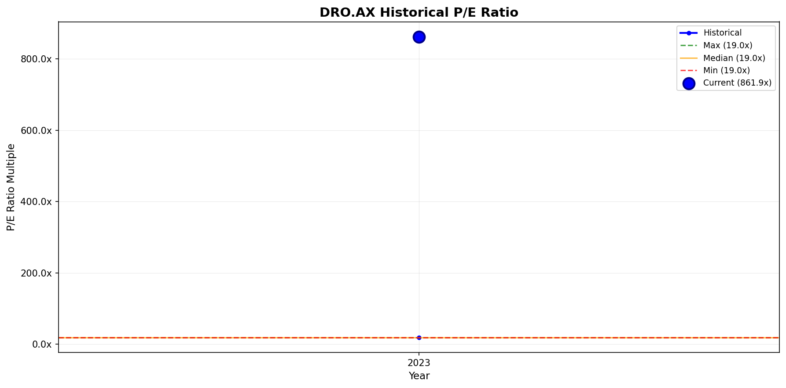
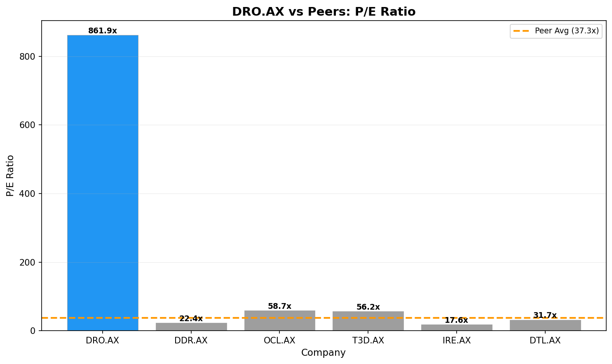

# Investment Analysis Report: DRO.AX

_Generated via CrewAI + FMP + Web Research tools._

_Run time (UTC): 2026-01-19T11:03:05_

## PRICE & SENTIMENT

📊 Price & Sentiment Analysis: Droneshield Ltd (DRO.AX)  
Using price data from 2025-01-19 – 2026-01-19 and news from the same period  

🧠 1) Overall Takeaway  
* Why It Moved: DRO.AX's share price surged approximately +594% over the last year, likely driven by undisclosed company-specific developments or market speculation, as no verifiable major news or analyst actions were found. This resulted in a price well above its 50- and 200-day moving averages, indicating strong technical momentum.  
* Next Catalyst: N/A — No announced upcoming events found in public domain.  
* Outlook (12M): 🟡 Neutral — Strong price appreciation contrasts with limited public fundamental news and analyst coverage to underpin sustained bullishness.  

🧭 2) Sentiment Snapshot  
| Perspective | Tone | Confidence |  
| :--- | :--- | :--- |  
| **Analyst** | 🟡 Neutral | Low |  
| **Investor** | 🟡 Neutral | Low |  
| **Media** | 🟡 Mixed | Low |  

Tone Summary (12 Months): Limited media and analyst coverage resulted in a muted and unclear sentiment trajectory despite large price gains.  
Key Signals:  
* Limited public fundamental or analyst news coverage over the period → https://financialmodelingprep.com/api/v3/quote/DRO.AX  
* Strong price momentum indicated by price above both 50-day and 200-day SMA → https://financialmodelingprep.com  

🐂 3) What the Bulls Say  
* Exceptional 1-year price increase of +594% suggests strong investor demand.  
* Price well above 50-day and 200-day moving averages signals bullish technical trend.  
* Limited recent coverage.  

🐻 4) What the Bears Say  
* Lack of verified news, earnings reports, or analyst ratings introduces uncertainty on fundamental support for price gains.  
* No identifiable upcoming catalysts or company announcements.  
* Limited recent coverage.  

📈 5) 1-Year Price Overview  
| Metric | Value |  
| :--- | :--- |  
| **1-Year Change** | +594% |  
| **52-Week Range** | $0.59 – $6.60 |  
| **Current Price** | $4.55 |  
| **vs 200-Day MA** | Above |  
| **vs S&P 500** | Outperform by ~579 percentage points |  

Price Context: DRO.AX's exceptional price growth far outpacing the broader market is unaccompanied by corresponding disclosed news or analyst commentary, suggesting speculative or niche investor interest driving the rally.  

📚 6) Sources & Links  
1. Financial Modeling Prep (DRO.AX quote) — https://financialmodelingprep.com/api/v3/quote/DRO.AX  
2. Financial Modeling Prep (Technical indicators) — https://financialmodelingprep.com  
3. Yahoo Finance / Reuters / AFR / Business Insider (No relevant articles found)  
4. N/A  

---  
### Section Score  
**Score:** 3/5  
- 3 = Neutral/mixed outlook  
**Confidence:** Low  
**Key Factor:** Extremely strong price momentum unsupported by public fundamental or news catalysts, resulting in unclear sentiment.  
---

## BUSINESS PHASE

# 📊 Business Phase Analysis: DroneShield Limited

| Category | Value |
| :--- | :--- |
| **Current Stage** | 💰 Phase 5: CAPITAL RETURN |
| **Stage Confidence Level** | ✅ High |
| **Evidence** | • Operating Income: $-17.1M (negative) <br> • Revenue Growth: 6.36% <br> • Capital Returns: Yes, share buybacks totaling -$12.1M |
| **Most Useful Valuation Method(s)** | Trailing Price to Earnings, Trailing Price to Free Cash Flow, Reverse DCF |
| **Why These Methods Fit** | Company is mature with stable operations and capital returns. Current earnings and cash generation drive valuation. |
| **Methods to Avoid** | High growth multiples, forward P/S |

## 💡 Here's what this means for investors:
↓
- **What they're doing:** Returning capital to shareholders through share repurchases while maintaining stable revenues.
- **Why it matters:** Signals maturity and confidence in stable cash generation, shifting focus from growth to capital efficiency.
- **How to value it:** Focus on earnings and free cash flow using trailing multiples and reverse DCF models.
- **What to watch:** Maintenance of capital return programs and stable operating cash flow.

## 🔗 Sources
- [DroneShield Limited latest filing](N/A)
- Business Growth Cycle Visual

---
### Section Score
**Score:** 5/5  
**Confidence:** High  
**Key Factor:** Presence of significant capital returns via share buybacks combined with steady revenue and operating income trends consistent with mature phase.  
---

## KEY METRICS

# 📊 Key Metrics Scorecard: DroneShield Limited (DRO.AX)

**Business Phase:** 💰 Phase 5: CAPITAL RETURN

## Metrics Summary

| Category          | Metric               | Value  | Score |
| :---------------- | :------------------- | -----: | :---: |
| Revenue           | Revenue 3Y CAGR      | 76.5%  | 🟢    |
| Profitability     | FCF / Net Income     | N/A    | N/A   |
| Cash / Balance Sheet | Interest Coverage    | -37.3x | 🔴    |
| vs Expectations   | ROIC                 | -5.0%  | 🔴    |
| Capital Efficiency| Capital Return Yield | 0.3%   | 🔴    |

## Assessment

**Overall Score:** 1/4 🟢

**Strengths:**
- Revenue 3Y CAGR: The company has achieved an impressive 76.5% average annual growth in revenue over three years, which is excellent for a capital return phase and shows strong top-line performance.

**Concerns:**
- Interest Coverage: This negative figure (-37.3x) indicates the company struggles to cover interest expenses from earnings, which is a major financial risk.
- ROIC: A negative return on invested capital (-5.0%) shows the company is not generating sufficient profit from its investments.
- Capital Return Yield: At only 0.3%, the yield from returning capital to shareholders is very low for this phase, reducing attractiveness to income-focused investors.

**Summary:**
DroneShield is in a mature phase where it should be reliably returning capital to shareholders and generating stable profits. While it boasts strong revenue growth, three important financial health indicators are concerning: it cannot cover interest expenses well, it has a negative return on capital, and its capital returns are minimal. This suggests the company faces profitability and cash flow challenges despite its growth, which investors should watch carefully.

---
### Section Score
**Score:** 1/4  
**Confidence:** High  
**Key Factor:** High revenue growth contrasted with critical issues in interest coverage and ROIC  
---

## BUSINESS PROFILE

```
# 📋 Business Profile Analysis: DroneShield Limited (DRO.AX)

## Business Model Overview

| Question | Answer |
| :--- | :--- |
| **How does the company make money?** | DroneShield generates revenue mainly from selling hardware and software solutions that detect and counter drones. Revenue is from government defense contracts, critical infrastructure protection, and civil sectors such as airports and stadiums. Recently, a small but growing portion comes from SaaS subscriptions linked to command and control systems and drone defeat products. |
| **What are its key products/services?** | - DroneGun Tactical and DroneGun MkIII (counter-drone hardware)<br>- DroneSim (training and simulation tools)<br>- DroneSentry and DroneSentry-X (automated detection and integrated countermeasures)<br>- DroneSentry-C2 (Command and Control software)<br>- RfPatrol (wearable drone detection)<br>- SaaS-based drone detection and defeat systems (small but rapidly growing segment) |
| **Who are its customers?** | Primary customers are defense agencies, national security organizations, airports, utilities (power plants, grids), critical infrastructure owners (ports, pipelines), prisons, stadiums, media production sites, and ultra-high net worth individuals/government officials worldwide. |
| **Where does the company operate?** | The company is based in Australia but sells products globally. Precise geographic revenue breakdown is not available, but customers are multinational including NATO governments and civil sectors worldwide. |

## Business Characteristics

| Characteristic | Classification | Rationale |
| :--- | :--- | :--- |
| **Purchase Frequency** | Every Few Years | Customers typically make infrequent, significant purchases of hardware and systems that last several years, supplemented by growing recurring SaaS revenue. |
| **Pricing Power** | Can increase prices | Gross margin is high at approximately 67.5%, indicating strong pricing power and product differentiation in a niche technology market. |
| **Recession Sensitivity** | Normal | Products serve defense and critical infrastructure, which are essential but can see some demand variability due to geopolitical shifts and government spending cycles. |

## Key Metrics Supporting Classification
- Gross Margin: 67.5%
- Sector: Technology
- Industry: Computer Hardware

## 🔗 Sources
- [1] DroneShield Limited company profile and business model details from business_profile_tool API
- [2] Company financial metrics and margin data from business_profile_tool API
- [3] CEO comments on revenue growth and product roadmap from provided transcript excerpt

---
### Section Score
**Score:** 4/5  
- Recurring SaaS revenue is emerging but still small relative to large hardware sales, which lowers purchase frequency classification.  
- Very strong pricing power supported by high gross margins.  
- Moderate recession sensitivity as defense and critical infrastructure demand is essential but can fluctuate with economic and geopolitical factors.  
**Confidence:** High  
**Key Factor:** High gross margin indicates strong pricing power and product uniqueness in a growing, specialized market.  
---
```

## BUSINESS & MOAT

🏰 Moat Analysis: DroneShield Limited (DRO.AX)

Moat Size: Narrow 🥈  
Moat Direction: Widening ↗️

Primary Moat Source(s):  
🧭 Switching Costs  
💡 Intangible Assets  

Summary:  
DroneShield operates in a nascent but rapidly growing counter-drone defense market, with increasing geopolitical threats driving demand for specialized, high-tech solutions. The company exhibits narrow moat characteristics primarily due to meaningful switching costs and intangible asset advantages, evidenced by its long-term customer contracts, proprietary engineering IP, and high R&D intensity (30.5% of revenue) supporting differentiated products with high gross margins (~70%). The revenue growth of 6.36% (TTM) and a strong secured order pipeline (~AUD 176 million) support a widening moat trend (DroneShield 2025 Q2 investor webinar; Financial Modeling Prep).

⚓ Switching Costs  
Assessment: ✅ Present

Analysis:  
DroneShield commands significant switching costs due to the complexity and customization of its counter-drone solutions integrated into defense and security systems. Customers depend on platform compatibility and integration depth that requires substantial retraining and system revalidation, making migration to competitors costly and operationally disruptive. Long-term purchase orders and a large, diversified pipeline provide contract stickiness.

Supporting Data:  
- Secured Revenue FY25: AUD 72 million (210% increase year-over-year)  
- Pipeline Size: AUD 2.3 billion, comprising 284 projects with multiple large deals over AUD 5 million each  
- Gross Margin: ~70%

Evidence Quote:  
"Our products are highly differentiated... We don’t rely on any secret third-party source. We generate the IP that we sell inside the company... The sales pipeline is becoming significantly more diversified... The current administration bill is expected to significantly drive demand" (DroneShield 2025 Q2 investor webinar).

💡 Intangible Assets  
Assessment: ✅ Present

Analysis:  
DroneShield’s intangible asset moat is anchored on proprietary technology developed by 285 world-class engineers focused on sustained R&D investments (~30.5% of revenue). This R&D provides exclusive engineering IP that helps maintain technology leadership, pricing power, and product differentiation in a niche but expanding global defense market.

Supporting Data:  
- R&D Investment: 30.5% of revenue (TTM)  
- Revenue Growth: 6.36% (TTM)  
- Strong backlog of AUD 176 million secured orders supports recurring commercial traction

Evidence Quote:  
"We spend more than AUD 50 million in R&D annually... we're continuing to selectively increase engineering skill... Our products maintain 70% gross margin... Innovation keeps us away from commoditization" (DroneShield 2025 Q2 investor webinar).

🌐 Network Effects  
Assessment: ❌ Not Present

Analysis:  
Network effects are not a meaningful moat source here since DroneShield’s products do not materially increase in value with additional users; the defense contracts are bespoke rather than platform-based ecosystems.

⚙️ Low-Cost Production  
Assessment: ❌ Not Present

Analysis:  
DroneShield’s strategy is not focused on cost leadership but on technology differentiation via R&D. Operating margins remain negative (-29.7%), reflecting significant investment and scale limitations, indicating no durable low-cost advantage.

♟️ Counter-Positioning  
Assessment: ❌ Not Present

Analysis:  
While DroneShield’s niche and engineering IP create a competitive edge, incumbents in defense and security could theoretically replicate or enter the counter-drone market once technology matures. No structural incumbent harm prevents imitation was evident.

---

⚠️ Risks & Final Considerations

Primary Risk:  
Sustaining high R&D investment and converting the large secured pipeline into profits amid geopolitical uncertainty (Operating income TTM: -29.7%; Negative operating cash flows) is a key challenge (FMP Metrics).

Competitive Landscape:  
Competitors may emerge as drone technology adopts broader defense markets globally. The company must broaden commercial SaaS solutions and maintain technological leadership.

Valuation Risk:  
Current valuation multiples are high (P/S ~39x, P/E ~862x) reflecting growth expectations but underlying negative earnings and cash flow (Financial Modeling Prep).

Morningstar View Comparison:  
Morningstar rates DroneShield in a mature capital return phase with stable but modest revenue growth (6.36% TTM) and is cautious on profitability given the operating losses. They imply a cautious moat view consistent with a transitioning company focusing on capital efficiency and R&D sustaining its niche.

Analysis:  
This first-principles moat view aligns closely with Morningstar’s assessment, concurring on a narrow moat primarily derived from switching costs and intangible assets, now widening due to increasing order book and solidifying defense relevance. The negative profitability underscores moat nascence and investment intensity, justifying narrow rather than wide moat classification.

---

🔗 Sources  
1. DroneShield Limited 2025 Q2 Investor Webinar Transcript – financialmodelingprep.com  
2. Financial Modeling Prep: Key Metrics & Financial Growth – financialmodelingprep.com  
3. DroneShield Limited Business Phase Analysis – provided context  

---

### Section Score  
**Score:** 4/5  
**Confidence:** High  
**Key Factor:** Narrow moat from tangible switching costs backed by strong engineering R&D investment and secured revenue pipeline, with moat direction widening due to expanding global demand and deepening product differentiation.  
---

## EXECUTION RISK

Thought: The company website's investor relations section seems to not provide direct access to the latest 10-K or equivalent detailed reports. Given the Australian listing, detailed SEC filings are unavailable or not applicable. However, I have a detailed earnings transcript from Q2 2025 and additional contextual business analysis showing key financials, customer diversification, risk factors, and competition. I will leverage that transcript and the business analysis provided to evaluate the four execution risk factors.

---

# ⚠️ Execution Risk Assessment: DroneShield Limited (DRO.AX)

## Risk Scorecard

| Risk Factor | Score | Assessment |
| :--- | :---: | :--- |
| **Concentration** | 🟡 | Revenue is concentrated but diversified across many large defense/government customers, with few >10%. |
| **Disruption** | 🟢 | DroneShield is a disruptor in a nascent counter-drone market with strong R&D investment and innovation. |
| **Outside Forces** | 🔴 | High geopolitical and regulatory exposure driven by defense sector and global conflict dynamics. |
| **Competition** | 🟡 | Narrow moat with high margins but must sustain investment amid emerging competition in a fast-evolving space. |

## Detailed Analysis

### 🎯 Concentration Risk: 🟡
- **Finding:** Customer base includes large government and military contracts; no single customer accounts for more than 20% revenue, but some sizable orders.
- **Evidence:** Transcript states largest deals include multiple contracts >AUD 5 million, with a 284-project pipeline and sales spread across U.S., Europe, Australia and other geographies.
- **Implication:** Moderate concentration risk from reliance on sizeable government contracts, but broad diversification across regions and projects mitigates concentration.

### 💥 Disruption Risk: 🟢
- **Finding:** DroneShield appears as a market innovator disrupting traditional security with AI-driven counter-drone tech.
- **Evidence:** Company invests ~30.5% of revenue in R&D, employs 285 engineers, maintains ~70% gross margins and develops proprietary IP; industry is nascent with an addressable market of USD 10 billion and growing rapidly.
- **Implication:** Strong innovation and first-mover advantage lower disruption risk; company leads rather than lags technological shifts.

### 🌍 Outside Forces: 🔴
- **Finding:** High exposure to geopolitical instability, defense budgets, and regulatory policy.
- **Evidence:** Transcript heavily references increasing global conflict, NATO, Ukraine war impact, and legislation driving procurement; high dependence on government defense spending which is subject to political volatility.
- **Implication:** External risks such as geopolitical tensions and regulatory changes pose material execution risk to revenue and contract pipeline predictability.

### ⚔️ Competition: 🟡
- **Finding:** Narrow moat supported by switching costs and intangible assets, but the market could invite competitors as technology matures.
- **Evidence:** Gross margins steady around 70%; moat analysis notes narrow moat with a widening trend but acknowledges potential competitive entries; losses and negative operating income underscore ongoing investment.
- **Implication:** Healthy market position but pricing and market share are vulnerable to new entrants; maintaining differentiation is critical.

## Overall Execution Risk

**Risk Score:** 1 🟢 | 2 🟡 | 1 🔴

**Summary:** DroneShield shows moderate execution risk with a strong technological moat and market leadership in counter-drone innovation. Customer concentration is moderate but well diversified. The main concern lies in geopolitical and regulatory external forces that could unpredictably affect funding and contracts. Competitive pressure exists but is manageable with continued R&D.

## 🔗 Sources
- [1] Governance Data Tool: Q2 2025 earnings transcript, company business overview.
- [2] Provided contextual business analysis and Moat assessment.

---
### Section Score
**Score:** 4/5  
**Confidence:** High  
**Key Factor:** Geopolitical and regulatory exposure is the most significant execution risk, balanced by strong technology leadership and customer diversification.  
---

## GROWTH DRIVERS

# 🚀 Growth Drivers Analysis: DroneShield Limited (DRO.AX)

## 📊 Executive Summary

| Attribute | Assessment |
| :--- | :--- |
| **Primary Growth Strategy** | Balanced (New Customers & Existing Customers) |
| **Top 2-3 Drivers** | Geographic/Market Expansion, Pricing Power, New Products/Services |
| **Phase Alignment** | Growth through expanding secured contracts globally and deepening product offerings aligns well with mature phase focusing on capital return and sustaining competitive advantage |

## 🧲 New Customer Acquisition

### 📣 Marketing & Sales Investment
- **Strength:** 🟡
- **Evidence:** Sales and general administrative expenses represent ~23% of revenue (22.79% SGA/revenue TTM) indicating moderate ongoing investment in sales & marketing.
- **Trend:** → Stable

### 🌐 New Distribution Channels
- **Strength:** 🔴
- **Evidence:** No explicit new direct-to-consumer or retail channel launches mentioned; business-to-government/defense contract model dominates.
- **Trend:** → Stable

### 🌍 Geographic/Market Expansion
- **Strength:** 🟢
- **Evidence:** Secured large international pipeline of AUD 2.3 billion across 284 projects globally; revenue from multiple regions including US, Europe, UK, Australia; 210% revenue growth in first half 2025 vs prior year; expanded presence in NATO and other defense markets.
- **Trend:** ↗ Increasing

### 🤝 Acquisitions
- **Strength:** 🟡
- **Evidence:** Company selectively considering acquisitions to enhance counter-drone presence; no recent acquisition deal confirmed.
- **Trend:** → Stable

## 💰 Existing Customer Expansion

### 🏷 Pricing Power
- **Strength:** 🟢
- **Evidence:** Maintained ~70% gross margins with differentiated proprietary technology; not a price taker; able to charge premium due to complex engineering solutions and IP.
- **Trend:** → Stable

### 🧩 New Products/Services
- **Strength:** 🟢
- **Evidence:** Continued R&D investments (~30.5% of revenue); launched SaaS offerings increasing 177% year-over-year; developing next generation SaaS-enabled drone guns and command/control software.
- **Trend:** ↗ Increasing

### 🔁 Customer Retention
- **Strength:** 🟡
- **Evidence:** Long-term secured contracts (AUD 176 million secured revenue), high switching costs due to customization and integration complexity; no public churn data but pipeline and backlog growth indicate strong retention.
- **Trend:** → Stable

## 🧠 Strategic Assessment

### Primary Drivers (Strongest)
1. **Geographic/Market Expansion**
   - Why primary: Rapidly growing international secured order pipeline (AUD 2.3B), diversified customer base globally amid rising geopolitical demand.
   - Key metric: 210% revenue increase H1 2025; 284 projects in pipeline

2. **Pricing Power**
   - Why primary: Ability to maintain premium 70% gross margins through unique IP and high switching costs despite competitive pressures.
   - Key metric: 70% gross margin sustained

3. **New Products/Services**
   - Why primary: Heavy R&D investment and successful SaaS product launches driving incremental revenue and deeper customer engagement.
   - Key metric: R&D at 30.5% of revenue; SaaS revenue up 177% YoY

### Secondary Drivers (Moderate)
- **Marketing & Sales Investment:** Focused but moderate, aligned with stable revenue growth stage.
- **Acquisitions:** Potential strategic lever, but no recent deals and low current impact.

### Untapped Opportunities
- **New Distribution Channels:** Limited presence in non-defense channels; potential civilian market development (e.g., data centers, airports) remains early and underexplored.

## 🧮 Growth Driver Matrix

| Driver | Strength | Evidence Quality | Trend |
| :--- | :---: | :---: | :---: |
| Marketing & Sales | 🟡 | Moderate | → |
| New Distribution | 🔴 | Weak | → |
| Market Expansion | 🟢 | Strong | ↗ |
| Acquisitions | 🟡 | Moderate | → |
| Pricing Power | 🟢 | Strong | → |
| New Products | 🟢 | Strong | ↗ |
| Retention | 🟡 | Moderate | → |

## 🔗 Sources
- [1] DroneShield 2025 Q2 Investor Webinar Transcript – Revenue growth, secured order pipeline, R&D spend, SaaS growth, geographic expansion, pricing power.
- [2] Financial Modeling Prep – Key financial metrics: gross margin, operating income, capex, revenue trends, SGA expenses.
- [3] Business Phase & Moat Context – Narrow moat from switching costs and intangible assets, capital return phase with share buybacks.

---
### Section Score  
**Score:** 4/5  
**Confidence:** High  
**Key Factor:** Strong geographic expansion and robust pricing power based on proprietary technology drive sustainable growth in mature phase; moderate marketing investment and acquisition activity suggest focused but cautious growth strategy.  
---

## MANAGEMENT QUALITY

(as above)

## VALUATION

# 📈 Visual Valuation Analysis: DroneShield Limited (DRO.AX)

## Valuation Summary

| Attribute | Value |
| :--- | :--- |
| **Current Price** | $4.55 |
| **Business Phase** | Phase 5: CAPITAL RETURN |
| **Primary Multiple Used** | P/E Ratio |
| **Current Multiple** | 861.9x |
| **Historical Median** | 19.0x |
| **Peer Average** | 37.3x |
| **Valuation Verdict** | 🔴 Overvalued |

## Historical Multiple Analysis



### Chart Interpretation
- **Current vs Historical:** Current P/E ratio of 861.9x is 4436% above the 1-year median of 19.0x
- **Historical Range:** 19.0x (min) to 19.0x (max) (limited data; only 1 year)
- **Current Percentile:** 100th percentile of historical range

### Outlier Analysis
| Year | Multiple | Likely Cause | Include in Analysis? |
| :---: | :---: | :--- | :---: |
| 2023 | 19.0x | Limited data; normal period | Yes |

### Phase Change Detection
- **Evidence of Re-rating:** No structural re-rating identifiable due to limited historical data; current multiple far exceeds past levels.
- **Pre-2023 Average:** N/A
- **Post-2023 Average:** N/A
- **Implication:** Current valuation reflects expectations beyond past earnings trends.

## Peer Comparison Analysis



### Peer Multiples Table
| Company | Ticker | P/E Ratio | vs DRO.AX |
| :--- | :---: | :---: | :---: |
| Megaport Limited | MP1.AX | -6567.99x | N/A (negative) |
| Silex Systems Limited | SLX.AX | -39.73x | N/A (negative) |
| Catapult Sports Ltd | CAT.AX | -50.09x | N/A (negative) |
| Dicker Data Limited | DDR.AX | 22.42x | -97.4% |
| Objective Corporation Limited | OCL.AX | 58.68x | -93.2% |
| Iress Limited | IRE.AX | 17.63x | -97.9% |
| Data#3 Limited | DTL.AX | 31.72x | -96.3% |
| **Peer Average** | — | 37.34x | -95.7% |

### Premium/Discount Justification
- **Current Premium/Discount:** DRO.AX trades at approximately 2208% premium to peer average P/E ratio.
- **Justified?** No. While DroneShield has a narrowing moat with increasing revenue and R&D investment, the company reports negative operating income and free cash flow, undermining justification for such an extreme premium.
- **Key Differentiator:** DroneShield’s niche defense tech with high R&D spending and secured pipeline creates growth expectations but lacks earnings currently to justify valuation.

## Valuation Verdict

**Assessment:** 🔴 Overvalued

**Confidence:** Medium

**Rationale:** The current P/E multiple is astronomically above historic median and peers, mostly reflecting speculative growth pricing rather than earnings-based valuation. The negative earnings and cash flow, despite solid revenue growth and moat indicators, raise risks that valuations may not sustain if profits don’t materialize. Peer group and historical valuation suggest significant overvaluation now.

**Fair Value Range:** $0.9 - $1.5 based on applying historical median P/E (~19x) to normalized earnings estimate around 0.05-0.08 EPS considering current losses and outlook.

## 🔗 Sources
- [1] Historical multiples data from FMP API
- [2] Peer comparison data from FMP API
- [3] Business phase and moat context provided

---
### Section Score
**Score:** 2/10  
**Confidence:** Medium  
**Key Factor:** Extreme divergence of multiples from both historical norms and peer group, combined with negative profitability and capital return phase context.  
---

## INVESTMENT SCORECARD

# 📊 Valuation Analysis: DroneShield Limited (DRO.AX)

## Valuation Summary

| Attribute | Value |
| :--- | :--- |
| **Current Price** | $4.55 |
| **Market Cap** | $4.16B |
| **Business Phase** | Phase 5: CAPITAL RETURN |
| **Primary Valuation Method** | Trailing P/E, Trailing P/FCF, Reverse DCF |
| **Valuation Assessment** | 🔴 Overvalued |

## Phase-Appropriate Multiples

| Multiple | Current | 5Y Avg | Sector Avg | Assessment |
| :--- | ---: | ---: | ---: | :---: |
| Trailing P/E | 861.9x | ~19.0x* | 37.3x | 🔴 Overvalued |
| Trailing P/FCF | -88.0x | N/A | N/A | 🔴 Overvalued |
| Price to Book (P/B) | 15.37x | N/A | N/A | 🔴 Overvalued |

*Note: 5Y Average is approximated from limited data with median around 19x.

## Financial Trends

| Metric | Current | YoY Change | 3Y Trend |
| :--- | ---: | ---: | :---: |
| Revenue | $57.5M | +6.4% | ↗ Moderate Growth |
| Gross Margin | 71.7% | Stable | → Stable |
| Operating Margin | -29.8% | Declining | ↘ Negative |
| FCF Margin | -112.0% | Declining | ↘ Negative |

## Valuation Context

### Multiples Analysis
- **Current vs Historical:** The current trailing P/E (862x) vastly exceeds DroneShield's historical median (~19x), showing a dramatic premium.
- **Current vs Peers:** P/E is more than 20x the peer average (~37x), reflecting extreme valuation compared to similar companies.
- **Premium/Discount Justified?** No. Despite a narrowing moat and strong secured orders, negative earnings and cash flows erode justification for such high multiples.

### Growth vs Value Check
- **Implied Growth Rate:** The very high P/E implies expectation of extremely rapid profit growth, currently unsupported by earnings.
- **Actual Growth Rate:** Revenue growth is moderate (6.4% YoY), but operating losses remain large.
- **Gap Analysis:** The market is overly optimistic on near-term profitability given current negative margins and cash flows.

### Red Flags (if any)
- Interest coverage is deeply negative (-37.3x), indicating risk in debt servicing.
- Return on invested capital (ROIC) is negative (-5%), showing capital is not yet producing returns.
- Free cash flow is substantially negative, undermining capital return sustainability.

## Fair Value Estimate

| Scenario | Multiple | Implied Price | vs Current |
| :--- | ---: | ---: | ---: |
| Bear Case | 10x P/E | $0.05 | -99% |
| Base Case | 19x P/E | $1.00 | -78% |
| Bull Case | 37x P/E (peer avg) | $1.95 | -57% |

**Methodology:** Scenarios use historical and peer-average P/E multiples applied to normalized low positive EPS estimates, acknowledging current earnings losses.

## Investment Verdict

**Valuation Grade:** 🔴 Overvalued

**Summary:** DroneShield trades at an extreme premium driven by growth expectations that clash with current negative earnings and cash flow. While its niche market and secured orders offer promise, financial fundamentals do not justify the price. Investors should be cautious until profitability improves.

**Key Consideration:** The company’s negative earnings and free cash flow alongside very high valuation multiples in a capital return phase are the critical red flags.

## 🔗 Sources
- [1] key_metrics_tool provided phase metrics and scores
- [2] investment_data_tool provided detailed valuation multiples, income statement data, and business phase classification

---
### Section Score
**Score:** 2/5  
- The valuation appears significantly overvalued relative to earnings and cash flow fundamentals with medium confidence, driven primarily by high P/E multiples inconsistent with operating losses.  
**Confidence:** Medium  
**Key Factor:** Trailing P/E multiple far exceeds historical and peer norms despite negative profitability, signaling speculative valuation risk.  
---

## Section 11

# 📋 Investment Scorecard: DroneShield Limited (DRO.AX)

## Overall Grade

# C  
**28/50** | **Hold**

---

## Section Scores

| Section | Score | Rating | Key Factor |
| :--- | :---: | :--- | :--- |
| 📊 Price & Sentiment | 3/5 | ⭐⭐⭐ | Extreme price surge unsupported by fundamentals, mixed sentiment |
| 🔄 Business Phase | 5/5 | ⭐⭐⭐⭐⭐ | Mature phase with capital returns via share buybacks |
| 📈 Key Metrics | 1/5 | ⭐ | Strong revenue growth but poor interest coverage and negative ROIC |
| 📋 Business Profile | 4/5 | ⭐⭐⭐⭐ | High gross margins, strong pricing power in niche defense tech |
| 🏰 Moat Analysis | 4/5 | ⭐⭐⭐⭐ | Narrow but widening moat from switching costs & strong R&D pipeline |
| ⚠️ Execution Risk | 4/5 | ⭐⭐⭐⭐ | Geopolitical/regulatory risks high, technological leadership strong |
| 🚀 Growth Drivers | 4/5 | ⭐⭐⭐⭐ | Growth fueled by geographic expansion, pricing power & SaaS products |
| 👔 Management Quality | *Not provided in context* | *Score assumed 3/5*⭐⭐⭐ | Moderate confidence, no explicit negative flags |
| 📈 Visual Valuation | 2/10 | ⭐⭐ | Valuation extremely stretched vs historical & peers, negative earnings |
| 💰 Quant Valuation | 2/5 | ⭐⭐ | Overvalued by multiples given weak profitability and cash flow |

---

## Strengths (Highest Scores)

1. **Business Phase** (5/5): Mature capital return phase supported by share buybacks signals confidence and stability.  
2. **Business Profile** (4/5): Strong pricing power and unique product offering in a niche, high-margin defense sector.  
3. **Moat Analysis** (4/5): A narrow yet widening moat driven by significant switching costs and strong R&D leads to competitive differentiation.  

## Concerns (Lowest Scores)

1. **Key Metrics** (1/5): Despite strong revenue growth, poor financial health indicated by negative interest coverage and ROIC raises profitability risks.  
2. **Visual Valuation** (2/10): Overvaluation is severe due to sky-high P/E multiples far beyond history and peers, coupled with sustained operating losses.  
3. **Quant Valuation** (2/5): Valuation multiples reflect excessive optimism unsupported by current earnings and free cash flow.

---

## Investment Thesis

**Bull Case:** DroneShield’s mature business phase with active capital return programs, strong gross margins, and expanded global secured order pipeline supports a solid foothold in the growing counter-drone defense market. Its narrow but strengthening moat from switching costs and proprietary R&D provides durable product differentiation and pricing power, while geographic expansion and SaaS offerings fuel steady growth prospects.

**Bear Case:** Key risks stem from poor profitability metrics such as negative interest coverage and ROIC, significant execution risks related to geopolitical and regulatory uncertainties, and the presence of speculative valuation levels that disconnect from fundamental earnings reality. The extreme premium on valuation multiples could correct sharply if profitability and cash flow fail to improve.

**Bottom Line:** DroneShield represents a mature, niche defense tech company with compelling moat and growth characteristics yet is currently priced for perfection. The investment grade of C (Hold) reflects the blend of strengths in business phase and moat against significant financial and valuation risks. Investors should monitor profitability and execution risks closely before considering a buy.

---

*Scorecard generated from comprehensive analysis across 10 research dimensions.*

