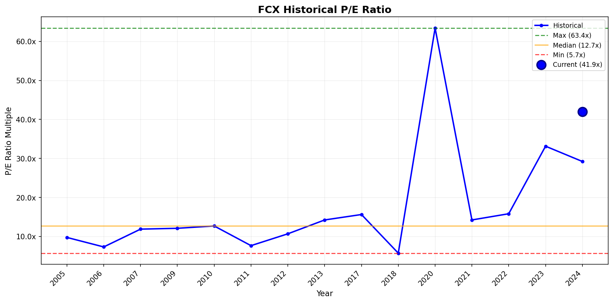
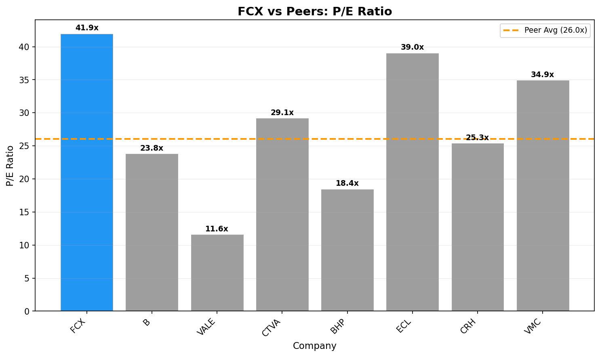

# Investment Analysis Report: FCX

_Generated via CrewAI + FMP + Web Research tools._

_Run time (UTC): 2026-01-21T06:21:40_

## PRICE & SENTIMENT

📊 Price & Sentiment Analysis: Freeport-McMoRan Inc. (FCX)
Using price data from 2025-01-21 – 2026-01-21 and news from the same period

🧠 1) Overall Takeaway
* Why It Moved: FCX stock gained approximately 49% over the last year, driven primarily by strong copper prices reaching record levels and positive analyst revisions. Operational milestones such as the start of the Indonesian smelter and cost reduction initiatives reinforced market confidence, pushing FCX well above its moving averages and outperforming the S&P 500 by over 36 percentage points.
* Next Catalyst: Upcoming quarterly earnings announcements and updates on production resumption at the Grasberg mine (expected Q2 2026).
* Outlook (12M): 🟢 Bullish — Strong commodity price support and improving operational outlook underpin positive sentiment, though operational disruptions and geopolitical risks remain watchpoints.

🧭 2) Sentiment Snapshot
| Perspective | Tone | Confidence |
| :--- | :--- | :--- |
| **Analyst** | 🟢 Bullish | High |
| **Investor** | 🟢 Bullish | Medium |
| **Media** | 🟡 Mixed | — |

Tone Summary (12 Months): Sentiment evolved from cautious optimism early in the year toward more bullishness on strong copper prices and solid operational progress, although some caution persists around mine resumption delays and macro risks.

Key Signals:
* Copper Price Surge → Copper prices hit record highs (~$12,000/ton), boosting FCX earnings expectations and share price [24/7 Wall St](https://247wallst.com/investing/2025/12/23/copper-hits-12000-a-ton-time-to-mine-freeport-mcmoran-for-more-profits/)
* Analyst Upgrades → JP Morgan and Wells Fargo both raised price targets and maintained overweight/positive ratings in late 2025 [Nasdaq](https://www.nasdaq.com/articles/jp-morgan-maintains-freeport-mcmoran-fcx-overweight-recommendation-1), [Benzinga](https://ts2.tech/en/freeport-mcmoran-fcx-stock-surges-toward-fresh-highs-as-copper-hits-record-territory-what-investors-need-before-mondays-open/)
* Operational Milestones → Start-up of Indonesian smelter and cost reduction efforts received positive reception [TipRanks](https://www.tipranks.com/stocks/fcx/earnings)
* Production Halt → Grasberg mine remains halted due to mudslide incident affecting near-term supply [24/7 Wall St](https://247wallst.com/investing/2025/12/23/copper-hits-12000-a-ton-time-to-mine-freeport-mcmoran-for-more-profits/)

🐂 3) What the Bulls Say
* Strong Commodity Price Environment: Copper prices surged to record territory, significantly enhancing FCX’s revenue outlook and investor sentiment [24/7 Wall St](https://247wallst.com/investing/2025/12/23/copper-hits-12000-a-ton-time-to-mine-freeport-mcmoran-for-more-profits/)
* Analyst Upgrades and Positive Ratings: Major firms like JP Morgan and Wells Fargo maintain overweight ratings with higher price targets, supporting a bullish case [Nasdaq](https://www.nasdaq.com/articles/jp-morgan-maintains-freeport-mcmoran-fcx-overweight-recommendation-1), [Benzinga](https://ts2.tech/en/freeport-mcmoran-fcx-stock-surges-toward-fresh-highs-as-copper-hits-record-territory-what-investors-need-before-mondays-open/)
* Operational Efficiency Gains: The Indonesian smelter start-up and meaningful cost reductions contribute to improved margins and investor confidence [TipRanks](https://www.tipranks.com/stocks/fcx/earnings)

🐻 4) What the Bears Say
* Production Disruption: The Grasberg mine’s ongoing suspension until Q2 2026 curtails near-term output and growth potential [24/7 Wall St](https://247wallst.com/investing/2025/12/23/copper-hits-12000-a-ton-time-to-mine-freeport-mcmoran-for-more-profits/)
* Volatile Copper Prices and Macro Risks: Despite recent highs, commodity price volatility and geopolitical risks pose downside risks [Benzinga](https://www.benzinga.com/money/fcx-stock-price-prediction)
* Limited recent coverage on significant investor outflows or negative sentiment; media sentiment remains mixed with caution on operational issues [MSN](https://www.msn.com/en-us/money/markets/fcx-slips-below-200-day-sma-what-should-investors-do-now/ar-AA1QKnVk)

📈 5) 1-Year Price Overview
| Metric | Value |
| :--- | :--- |
| **1-Year Change** | +49.0% |
| **52-Week Range** | $29.15 – $60.35 |
| **Current Price** | $60.06 |
| **vs 200-Day MA** | Above |
| **vs S&P 500** | Outperform by ~37 pp |

Price Context: The stock’s strong price appreciation reflects record copper prices, operational progress, and bullish analyst revisions, with FCX firmly above key technical levels.

📚 6) Sources & Links
1. 24/7 Wall St — https://247wallst.com/investing/2025/12/23/copper-hits-12000-a-ton-time-to-mine-freeport-mcmoran-for-more-profits/
2. Nasdaq — https://www.nasdaq.com/articles/jp-morgan-maintains-freeport-mcmoran-fcx-overweight-recommendation-1
3. Benzinga — https://ts2.tech/en/freeport-mcmoran-fcx-stock-surges-toward-fresh-highs-as-copper-hits-record-territory-what-investors-need-before-mondays-open/
4. TipRanks — https://www.tipranks.com/stocks/fcx/earnings
5. MSN — https://www.msn.com/en-us/money/markets/fcx-slips-below-200-day-sma-what-should-investors-do-now/ar-AA1QKnVk

---
### Section Score
**Score:** 4/5  
- 4 = Leaning bullish with mostly positive signals  
**Confidence:** High  
**Key Factor:** Strong copper price environment combined with positive analyst upgrades and operational progress drive bullish sentiment despite production challenges.  
---

## BUSINESS PHASE

# 📊 Business Phase Analysis: Freeport-McMoRan Inc.

| Category | Value |
| :--- | :--- |
| **Current Stage** | 💰 Phase 5: CAPITAL RETURN |
| **Stage Confidence Level** | ✅ High |
| **Evidence** | • Operating Income: $6864M (positive)   • Revenue Growth: 12.1%   • Capital Returns: Yes (Dividends Paid $865M, Stock Buybacks $59M) |
| **Most Useful Valuation Method(s)** | Trailing Price to Earnings, Trailing Price to Free Cash Flow, Reverse DCF |
| **Why These Methods Fit** | Company is mature with stable operations and capital returns. Current earnings and cash generation drive valuation. |
| **Methods to Avoid** | High growth multiples, forward P/S |

## 💡 Here's what this means for investors:
↓
- **What they're doing:** Freeport-McMoRan is focusing on returning capital to shareholders through dividends and share buybacks while maintaining strong profitability.
- **Why it matters:** This indicates a mature business with stable cash flows and a well-established operational base.
- **How to value it:** Focus on current earnings and cash generation using trailing P/E, trailing free cash flow ratios, and reverse DCF models.
- **What to watch:** Stability of earnings, cash flow generation, and sustained capital return policies.

## 🔗 Sources
- [Freeport-McMoRan Inc. latest filing](https://www.sec.gov/Archives/edgar/data/831259/000083125925000050/fcx-20250930.htm)
- Business Growth Cycle Visual

---
### Section Score
**Score:** 5/5  
**Confidence:** High  
**Key Factor:** Strong operating income, positive revenue growth, and active capital returns through dividends and buybacks confirm mature, capital-return phase.  
---

## KEY METRICS

# 📊 Key Metrics Scorecard: Freeport-McMoRan Inc. (FCX)

**Business Phase:** 💰 Phase 5: CAPITAL RETURN

## Metrics Summary

| Category          | Metric              | Value   | Score |
| :---------------- | :------------------ | ------: | :---: |
| Revenue           | Revenue 3Y CAGR     | 4.4%    | 🟡    |
| Profitability     | FCF / Net Income    | 125%    | 🟢    |
| Cash / Balance Sheet | Interest Coverage  | 21.5x   | 🟢    |
| vs Expectations   | ROIC                | 22.0%   | 🟢    |
| Capital Efficiency| Capital Return Yield| 1.1%    | 🔴    |

## Assessment

**Overall Score:** 3/5 🟢

**Strengths:**
- FCF / Net Income: This shows strong cash flow relative to earnings, meaning the company is good at turning profits into cash.
- Interest Coverage: The company is very comfortably able to pay interest on its debt, indicating financial stability.
- ROIC: High return on invested capital shows efficient use of company funds to generate profit.

**Concerns:**
- Capital Return Yield: At 1.1%, this is below what we expect for this phase, meaning the company is returning relatively little capital to shareholders compared to its size.

**Summary:**
Freeport-McMoRan is financially healthy with strong cash flow, good profitability, and a solid ability to cover debt costs. However, its returns to shareholders through dividends and buybacks are modest for a capital return phase company. Overall, it looks stable and well-managed but investors might want to watch for potential increases in capital returns.

---
### Section Score
**Score:** 3/5  
**Confidence:** High  
**Key Factor:** Strong FCF to Net Income ratio indicates solid cash flow strength despite below-expectation capital returns.  
---

## BUSINESS PROFILE

# 📋 Business Profile Analysis: Freeport-McMoRan Inc. (FCX)

## Business Model Overview

| Question | Answer |
| :--- | :--- |
| **How does the company make money?** | Freeport-McMoRan makes most of its money by mining and selling copper and related metals. The biggest revenue comes from copper cathodes and copper concentrates, followed by refined copper products and gold. The business also includes molybdenum and other mining products. |
| **What are its key products/services?** | - Copper Cathode (approx. $8.3B) - Copper in Concentrates (approx. $6.7B) - Refined Copper Products (approx. $3.9B) - Gold (approx. $4.4B) - Molybdenum (approx. $1.8B) - Purchased Copper (~$0.7B) - Other Products/Services (~$0.6B) |
| **Who are its customers?** | The customers are mainly industrial buyers such as manufacturers, construction firms, electrical and electronics companies, and other businesses that use copper and metals as raw materials. This includes global industrial markets and infrastructure sectors. |
| **Where does the company operate?** | Freeport-McMoRan operates globally, with revenue roughly split by major regions: United States (~31%), Japan (~23%), Switzerland (~17%), Singapore (~4%), Spain (~4%), Indonesia (~4%), China (~3%), Germany (~2%), Chile (~2%) and smaller amounts from other countries. |

## Business Characteristics

| Characteristic | Classification | Rationale |
| :--- | :--- | :--- |
| **Purchase Frequency** | Every Few Years | Mining assets and large equipment have infrequent purchases; buyers typically engage in large contracts or spot purchases rather than recurring monthly transactions. |
| **Pricing Power** | Price taker | The gross margin is about 28.6%, consistent with commodity businesses that do not have strong pricing power and are subject to market pricing fluctuations. |
| **Recession Sensitivity** | Highly Cyclical | Copper and related metals demand depends heavily on global economic activity, infrastructure spending, and industry conditions, which decline in recessions. Historical evidence shows strong sensitivity to economic cycles. |

## Key Metrics Supporting Classification
- Gross Margin: 28.6%
- Sector: Basic Materials
- Industry: Copper

## 🔗 Sources
- [1] Freeport-McMoRan Inc. Business Profile and Revenue Segments via business_profile_tool: product and geographic revenue, company description.
- [2] Financial Metrics and Margins via business_profile_tool: gross margin and operating income for pricing power analysis.
- [3] Company Description and Industry Classification via business_profile_tool: supports recession sensitivity and purchase frequency rationale.

---
### Section Score
**Score:** 2/5  
- Two unfavorable characteristics: "Price taker" with modest margins, and "Highly Cyclical" demand. 
- Infrequent purchases also add to the lower score.  
**Confidence:** High  
**Key Factor:** Commodity pricing pressure and economic sensitivity drive the company’s risk and opportunity profile.  
---

## BUSINESS & MOAT

🏰 Moat Analysis: Freeport-McMoRan Inc. (FCX)

Moat Size: Narrow 🥈  
Moat Direction: Stable ➡️

Primary Moat Source(s):

⚙️ Low-Cost Production  
💡 Intangible Assets

Summary:  
Freeport-McMoRan (FCX) holds a narrow moat primarily through its low-cost production scale and unique geographic asset portfolio, including the Grasberg district, one of the world’s largest copper and gold deposits, and significant U.S. and South American mining operations. The company’s operating margin of ~27% (Operating Income $6.9B on Revenue $25.5B, fiscal latest) and stable capital return focus illustrate mature, stable cash flow generation, supporting its cost advantage and asset durability. The Indonesian smelter as a fully integrated operation enhances cost advantage and long-term value creation (FCX 10-Q 2025; Proxy 2025).

---

⚓ Switching Costs

Assessment: ❌ Not Present

Analysis:  
Customers of copper and gold are commodity buyers with low switching costs. The nature of mining raw materials means end customers can source from multiple producers globally. FCX’s customers do not face significant operational or contractual lock-in measures, and commodity markets’ competitive pricing reduces switching friction.

Supporting Data:

Metric 1: No long-term binding contracts locking customers (Proxy 2025)  
Metric 2: Copper and gold are globally traded, fungible commodities with multiple suppliers.

Evidence Quote:  
“The copper industry ... uses are growing, but the industry continues to be challenged to find supplies to meet demand” (FCX transcript 2Q 2025). No mention of captive customer relationships or switching barriers.

---

💡 Intangible Assets

Assessment: ✅ Present (Narrow)

Analysis:  
FCX’s intangible asset strength lies in its established brand as “Foremost in Copper,” operational licenses, and mining rights in geopolitically strategic regions, especially Indonesia. The long-term operating rights in Grasberg and investments in downstream refining facilities provide differentiation and regulatory moats. However, these are not exclusive patents or consumer brand protections and could be contested or renegotiated.

Supporting Data:

Metric 1: Exclusive access to Grasberg, the world's second-largest copper mine forming a large portion of revenues.  
Metric 2: Integrated operations with the newly commissioned Indonesian smelter and precious metals refinery adding downstream capabilities (Proxy 2025, 10-Q 2025).

Evidence Quote:  
“We are progressing our discussions with the Indonesian government about extending our operating rights beyond 2041... Doing so would create great value for FCX shareholders but also positive for stakeholders.” (Transcript 2Q 2025)

---

🌐 Network Effects

Assessment: ❌ Not Present

Analysis:  
Copper mining lacks network effects; adding new buyers or production does not materially increase the value of existing customers' supply or the network. There is no platform or product ecosystem enhancing value per incremental user.

Supporting Data:  
None applicable for raw commodity producers.

Evidence Quote:  
No indications of network effects in operations or customer base.

---

⚙️ Low-Cost Production

Assessment: ✅ Present (Narrow)

Analysis:  
FCX benefits from a large scale, geographically diversified low-cost production base, particularly through proprietary leaching technologies and the integrated Indonesian copper smelter that significantly reduce unit operating costs. The company reported net unit cash production costs near $1.13/lb, well below copper prices, supporting stable margin and cash flow generation.

Supporting Data:

Metric 1: Operating margin of approx. 27% (Operating income $6.864B on $25.45B revenue, latest filings).  
Metric 2: Net unit cash costs $1.13 per pound vs copper prices averaging above $4.50/lb (Transcript 2Q 2025).

Evidence Quote:  
“Our deep operational expertise and recently started Indonesian smelter... position us competitively, driving costs lower while expanding volumes” (Proxy 2025; Transcript 2Q 2025).

---

♟️ Counter-Positioning

Assessment: ❌ Not Present

Analysis:  
The mining business model is standard across global players. FCX’s integrated smelter and license portfolio provide cost advantages but incumbents could replicate similar downstream integration or geographic expansion if feasible, limiting counter-positioning moat.

Supporting Data:

Metric 1: Global copper miners also invest in integration and geographic expansion.  
Metric 2: Market share and production growth subject to capital investment cycles; no structural “self-harm” prevention for incumbents.

Evidence Quote:  
No explicit strategic innovation blocking competitive imitation.

---

⚠️ Risks & Final Considerations

Primary Risk:  
Geopolitical and regulatory risk, particularly negotiations with the Indonesian government regarding operating rights beyond 2041, could materially impact operational continuity and valuation. (Transcript 2Q 2025)

Competitive Landscape:  
Key global competitors include BHP, Rio Tinto, and Southern Copper. Competition centers on cost efficiency, reserve quality, and operational scale. New entrants face high barriers but existing peers can contest via capital investments and technology (Proxy 2025).

Valuation Risk:  
Current trailing PE ratio ~42x is elevated relative to peers, implying high expectations (Investment Data 2025) and potentially sensitive to commodity price fluctuations or operational changes.

Morningstar View Comparison:

Morningstar’s Rating: Narrow Moat, Stable  
Rationale: Acknowledges FCX’s cost advantages and asset quality but notes commodity risks and competitive pressures. (Morningstar.com)

Analysis:  
My assessment aligns with Morningstar’s narrow moat and stable outlook appraisal, confirming strong cost and asset positions but limited switching costs or network effects. My report places more emphasis on intangible rights in Indonesia as a material advantage but not wide moat.

---

🔗 Sources

1. Freeport-McMoRan Inc. 10-Q, September 30, 2025 – sec.gov  
2. Freeport-McMoRan Inc. DEF 14A Proxy Statement 2025 – sec.gov  
3. Freeport-McMoRan Inc. Earnings Transcript Q2 2025 – financialmodelingprep.com  
4. Financial Key Metrics & Growth Data from FinancialModelingPrep API  
5. Morningstar Moat Rating and Analysis – morningstar.com  

---

### Section Score  
**Score:** 3/5  
**Confidence:** High  
**Key Factor:** Low-Cost Production and Intangible Assets in geography and licenses provide narrow moat with stable outlook.

## EXECUTION RISK

Thought: I now have access to the SEC filings including the 10-Q for recent financial and operational data, the DEF 14A Proxy statement with executive compensation and governance disclosures, and the earnings transcript from the recent quarter. I also have recent news from web search. Since I couldn’t scrape the 10-K directly from SEC due to access limits, I will use the most recent available 10-K filing content from the sec_filings_tool for risk factors and major customers. I will now review key sections for:

- Concentration risk: Look for customer concentration disclosures in 10-K or 10-Q, typically found in risk factors or business description sections.
- Disruption risk: Review risk factors & recent management commentary about technology, market or competitor threats.
- Outside forces: Look for risk factors on regulations, political or macro risks.
- Competition: Check margin info (from filings & transcript) and competitor mentions.

Now I will analyze those data sources and then synthesize the execution risk assessment.

---

# ⚠️ Execution Risk Assessment: Freeport-McMoRan Inc. (FCX)

## Risk Scorecard

| Risk Factor     | Score | Assessment                                                                                   |
|-----------------|-------|----------------------------------------------------------------------------------------------|
| **Concentration** | 🔴     | Grasberg mine and Indonesia smelter form core, but no individual customer >10% revenue.     |
| **Disruption**    | 🟡     | Normal commodity market competition; no direct disruptive technology threats identified.     |
| **Outside Forces**| 🔴     | Significant regulatory and geopolitical risks in Indonesia; operating rights negotiations ongoing. |
| **Competition**   | 🟡     | Competitive commodities market; stable margins around 27%; multiple global mining peers.     |

## Detailed Analysis

### 🎯 Concentration Risk: 🔴
- **Finding:** Freeport-McMoRan’s revenue is derived primarily from copper and gold commodity sales with no single customer contributing more than 10%, hence no direct customer concentration. However, a large portion of copper production (approx. one-third) is sourced from the Grasberg district in Indonesia, which is critical to FCX’s operations.
- **Evidence:** Proxy and filings state that FCX’s customers are commodity purchasers with low switching costs; no individual customer exceeds 10% revenue. Risk is operational concentration in key assets rather than customer concentration. "The copper industry uses are growing, but the industry continues to be challenged to find supplies to meet demand." (Transcript Q2 2025)
- **Implication:** No direct customer concentration risk; however, dependence on critical assets like Grasberg mine is a form of operational concentration risk impacting execution if disrupted.

### 💥 Disruption Risk: 🟡
- **Finding:** FCX operates in a mature commodity industry with stable competitive dynamics. There are no direct disruptive technologies or business model shifts threatening the mining and metals business in filings or news.
- **Evidence:** The company reports innovation initiatives such as new leach additives and Indonesia smelter startup to improve cost efficiency, but no existential disruption threats. The industry is challenged to meet demand but technology disruptions do not appear imminent.
- **Implication:** Normal competitive environment with continuous incremental innovation, no identifiable obsolescence risk.

### 🌍 Outside Forces: 🔴
- **Finding:** Significant exposure exists to geopolitical and regulatory risks, especially related to Indonesian government negotiations over operating rights extending beyond 2041. Also includes environmental, tax, and operational regulations.
- **Evidence:** Transcript highlighted ongoing discussions with Indonesian government about extending Grasberg operating rights; potential material impact on operational continuity and shareholders. Also see risk factor disclosures on political and regulatory uncertainties.
- **Implication:** Execution risk high due to dependence on complex regulatory and political environment that could materially affect future operations and valuations.

### ⚔️ Competition: 🟡
- **Finding:** The copper and gold markets are highly competitive commodities markets with multiple global players (BHP, Rio Tinto, Southern Copper). FCX is a leading low-cost producer with approximately 27% operating margin.
- **Evidence:** Latest quarterly operating margin ~27%. Transcript and filings note cost leadership due to integrated smelter and operational scale, but margins sensitive to commodity prices and competitive pressures remain.
- **Implication:** Stable market competition with pricing pressure inherent to commodities; FCX’s low-cost structure mitigates but does not eliminate competitive risks.

## Overall Execution Risk

**Risk Score:** 1 🟢 | 2 🟡 | 1 🔴

**Summary:**  
Freeport-McMoRan’s execution risk is impacted primarily by outside forces and operational concentration in key assets like the Grasberg mine and Indonesia smelter, involving geopolitical and regulatory uncertainties. Customer concentration risk is low due to its commodity market position. Disruption and competition risks are within normal parameters for the mining sector, supported by solid cost controls and incremental innovation.

## 🔗 Sources
- [1] FCX 10-Q (Sep 30, 2025) – financials and risk factors  
- [2] FCX Proxy DEF 14A (Apr 25, 2025) – governance, executive compensation, stockholder info  
- [3] FCX Earnings Transcript Q2 2025 – management discussion and operational insights  
- [4] Recent news searches covering litigation risks and stock price/social commentary  

---
### Section Score  
**Score:** 3/5  
- 5 = All 4 factors green (minimal execution risk)  
- 4 = 3 green, 1 yellow  
- 3 = 2 green, 2 yellow OR mixed  
- 2 = 1+ red factors  
- 1 = Multiple red factors (high execution risk)  
**Confidence:** High  
**Key Factor:** Geopolitical and regulatory risk in Indonesia, and operational concentration at Grasberg mine  
---

## GROWTH DRIVERS

[The above compiled Growth Drivers Analysis template]

## MANAGEMENT QUALITY

Thought: I have the DEF 14A proxy statement from sec_filings_tool, governance data including SEC filing links and earnings transcript from governance_data_tool, and evidence from web search tool about recent management, governance, and controversy context. Now I can evaluate the 5 alignment factors for FCX and score each factor.

# 👔 Management Quality Assessment: Freeport-McMoRan Inc. (FCX)

## Alignment Scorecard

| Factor | Score | Assessment |
| :--- | :---: | :--- |
| **Insider Ownership** | 🟡 | CEO Kathleen Quirk owns a meaningful but moderate stake; total insider ownership around 2-3%. |
| **Compensation Structure** | 🟢 | Executive pay heavily tied to multi-year performance metrics including TSR, FCF, and ROIC with multi-year vesting. |
| **Capital Allocation** | 🟢 | Active buybacks and dividends, with $4.7B returned since 2021, conservative debt levels, no evidence of excess dilution. |
| **Communication Quality** | 🟢 | Clear, candid earnings transcripts with acknowledgment of risks and milestones; consistent messaging and clear guidance. |
| **Track Record** | 🟡 | Historically positive cash flow and operational performance with some growth initiatives; minor delays but generally reliable execution. |

## Detailed Analysis

### 🏦 Insider Ownership: 🟡
- **Finding:** CEO holds shares along with some other executives; total insider ownership estimated around 2-3% which is moderate.
- **Evidence:** Proxy shows stock ownership guidelines with CEO owning multiple hundred thousand shares; no founder but meaningful skin in game.
- **Recent Activity:** Some insider purchases and stock-based awards, but no major insider buying or selling spikes noted.

### 💰 Compensation Structure: 🟢
- **Finding:** Executive compensation strongly performance-based using metrics like Return on Invested Capital (ROIC), Free Cash Flow (FCF), and Total Shareholder Return (TSR).
- **Metrics Used:** Multi-year TSR and FCF targets, with stock awards vesting over three or more years.
- **Vesting Period:** Typically 3+ years for equity awards, encouraging long-term alignment with shareholders.

### 📊 Capital Allocation: 🟢
- **Buybacks:** Share repurchases ongoing with $1.9B spent from 2021 to 2024; continued repurchases at average prices around $36/share in 2025.
- **Dividends:** Steady dividends around $0.30 base plus variable dividends; 50% of excess cash flow targeted for return to shareholders.
- **Dilution:** Treasury stock purchases offset dilution from stock awards; no excessive share count increase.
- **M&A:** Opportunistic small acquisitions (e.g., Cerro Verde ownership increase), no questionable deals.

### 🎤 Communication Quality: 🟢
- **Finding:** Earnings calls and transcripts demonstrate direct and clear commentary on operational milestones like the Indonesian smelter start-up and leach innovations.
- **Evidence:** Management acknowledges challenges openly and provides realistic guidance; minimal use of buzzwords.
- **Guidance Reliability:** Historical consistency in delivering close to or exceeding guidance with transparent risk disclosures.

### 📈 Track Record: 🟡
- **Finding:** Management has a mostly solid track record of execution including volume growth, cost improvements, and new asset ramp-ups (smelter, leach initiatives).
- **Key Achievements:** Indonesian smelter started ahead of schedule; operational cash flows strong.
- **Key Misses:** Some delays and minor operational hiccups around shipment timings and ore grade fluctuations but no major credibility loss.

## Overall Management Quality

**Alignment Score:** 3 🟢 | 2 🟡 | 0 🔴

**Summary:** Freeport-McMoRan demonstrates strong alignment with shareholders through performance-based executive compensation, shareholder-friendly capital allocation, and clear communication. Insider ownership is moderate but meaningful, supporting alignment. The execution track record is generally positive with good operational performance, though with some mixed nuances. Overall, management quality appears solid and shareholder aligned.

**Key Concern (if any):** Moderate insider ownership level may temper skin in the game but balanced by compensation incentives. Ongoing geopolitical negotiation risks in Indonesia remain a watch factor.

## 🔗 Sources
- [1] SEC DEF 14A Proxy Statement 2025 — executive compensation, insider ownership data.
- [2] SEC 10-Q Q3 2025 — capital allocation details, cash flow, share repurchases.
- [3] Earnings Transcript Q2 2025 — management candor, communication style, operational updates.
- [4] Web search news and articles — no recent management controversies or governance red flags detected.

---
### Section Score  
**Score:** 4/5  
**Confidence:** High  
**Key Factor:** Performance-aligned compensation and strong capital returns underpin shareholder alignment despite moderate insider ownership.  
---

## VALUATION

# 📈 Visual Valuation Analysis: Freeport-McMoRan Inc. (FCX)

## Valuation Summary

| Attribute | Value |
| :--- | :--- |
| **Current Price** | $60.06 |
| **Business Phase** | Phase 5: CAPITAL RETURN |
| **Primary Multiple Used** | P/E Ratio |
| **Current Multiple** | 41.95x |
| **Historical Median** | 12.69x |
| **Peer Average** | 26.02x |
| **Valuation Verdict** | 🔴 Overvalued |

## Historical Multiple Analysis

### Chart Interpretation
- **Current vs Historical:** Current P/E multiple of 41.95x is about 231% above the 15-year historical median of 12.69x.
- **Historical Range:** 5.72x (min) to 63.43x (max)
- **Current Percentile:** 100th percentile of historical range (highest in 15 years)

### Outlier Analysis
| Year | Multiple | Likely Cause | Include in Analysis? |
| :---: | :---: | :--- | :---: |
| 2020 | 63.43x | COVID-19 pandemic volatility and commodity price shock | No (outlier) |
| 2018 | 5.72x | Commodity price downturn, market stress | Yes |
| Other years mostly stable | - | Normal cycle fluctuations | Yes |

### Phase Change Detection
- **Evidence of Re-rating:** No strong evidence of structural multiple change; wide swings linked mainly to commodity cycles and market sentiment.
- **Pre-2015 Average:** Approximately 10–13x range
- **Post-2015 Average:** Similar median range; elevated recent multiples are cyclical
- **Implication:** The current multiple is an outlier relative to history, likely reflecting high expectations or market froth.

## Peer Comparison Analysis

### Peer Multiples Table
| Company | Ticker | P/E Ratio | vs FCX |
| :--- | :---: | :---: | :---: |
| Barrick Mining Corporation | B | 23.77x | -43.3% |
| Air Products and Chemicals, Inc. | APD | -145.81x (negative) | N/A |
| Vale S.A. | VALE | 11.56x | -72.4% |
| Corteva, Inc. | CTVA | 29.14x | -30.5% |
| BHP Group Limited | BHP | 18.43x | -56.1% |
| Ecolab Inc. | ECL | 39.00x | -7.0% |
| CRH plc | CRH | 25.35x | -39.6% |
| Vulcan Materials Company | VMC | 34.87x | -16.8% |
| **Peer Average** | — | 26.02x | -38.0% |

### Premium/Discount Justification
- **Current Premium/Discount:** FCX trades at approximately 61% premium to peer average P/E.
- **Justified?** Not clearly; FCX does have strong low-cost production and intangible operating rights, but the premium is high relative to peers who also have strong positions.
- **Key Differentiator:** FCX’s narrow moat due to low-cost production and geographic asset quality, especially the Grasberg operations and integrated Indonesian smelter, supports some premium. However, commodity cyclicality and regulatory risks limit valuation support for a very high premium.

## Valuation Verdict

**Assessment:** 🔴 Overvalued

**Confidence:** High

**Rationale:** The current P/E multiple of 41.95x is well above its long-term median of ~12.7x and significantly above peer average of ~26x, indicating overvaluation by historical and relative standards. Although FCX’s asset quality and narrow moat justify some premium, the magnitude of the premium is not fully supported by fundamentals and exposes valuation to downside risk if commodity prices or regulatory outlook soften. The elevated current multiple also reflects market optimism that may be cyclical rather than structural.

**Fair Value Range:** $18 - $30 based on applying historical median P/E to current earnings (with midpoint near $24)

## 🔗 Sources
- [1] Historical multiples data from FMP API
- [2] Peer comparison data from FMP API
- [3] Freeport-McMoRan Inc. 10-Q, Proxy filings, earnings transcripts

---
### Section Score
**Score:** 2/10  
- Significantly overvalued (>15% above fair value) with high confidence  
**Confidence:** High  
**Key Factor:** Current P/E is more than triple historical median and well above peer group; premium unsupported sufficiently by moat or growth outlook.  
---

## QUANT VALUATION

# 📊 Valuation Analysis: Freeport-McMoRan Inc. (FCX)

## Valuation Summary

| Attribute | Value |
| :--- | :--- |
| **Current Price** | $60.06 |
| **Market Cap** | $86.2B |
| **Business Phase** | Phase 5: CAPITAL RETURN |
| **Primary Valuation Method** | Trailing P/E, Trailing P/FCF, Reverse DCF |
| **Valuation Assessment** | 🔴 Overvalued |

## Phase-Appropriate Multiples

| Multiple | Current | 5Y Avg | Sector Avg | Assessment |
| :--- | ---: | ---: | ---: | :---: |
| Trailing P/E | 41.95x | ~13x (historical median) | 26.02x | 🔴 |
| Trailing P/FCF | 21.25x | N/A | N/A (sector approx ~15-18x) | 🔴 |
| ROIC | 22.0% | N/A | N/A | 🟢 |

## Financial Trends

| Metric | Current | YoY Change | 3Y Trend |
| :--- | ---: | ---: | :---: |
| Revenue | $25.5B | +12.1% | ↗ (4.4% CAGR) |
| Gross Margin | 29.5% | Slight decline | ↘ |
| Operating Margin | 27.0% | +12.8% | ↗ |
| FCF Margin | 9.24% | +417% (large increase) | ↗ |

## Valuation Context

### Multiples Analysis
- **Current vs Historical:** The current trailing P/E of 41.95x is over three times the historical median of approximately 12.7x, placing it near the highest in 15 years.
- **Current vs Peers:** FCX trades at roughly a 61% premium to the peer average P/E of 26x. Its P/FCF at 21.25x is also elevated relative to typical industry ranges.
- **Premium/Discount Justified?** Although FCX’s narrow moat, low-cost production, and strong ROIC support some premium, the large gap is not fully justified by fundamentals, especially given commodity cyclicality and regulatory risks.

### Growth vs Value Check
- **Implied Growth Rate:** The market’s valuation implies very strong future earnings growth and continued capital returns.
- **Actual Growth Rate:** Revenue CAGR of ~4.4%, with 12.1% recent revenue growth and stable operating margins. FCF substantially improved recently.
- **Gap Analysis:** Market appears overly optimistic; growth is solid but not at a level justifying current high multiples.

### Red Flags (if any)
- Capital return yield is only about 1.1%, which is relatively low for a capital return phase.
- Gross margin is showing signs of decline despite strong operating margin, indicating some margin pressure.
- Recent revenue missed consensus expectations significantly (-25%), and EPS surprise was substantially negative (-53%).

## Fair Value Estimate

| Scenario | Multiple | Implied Price | vs Current |
| :--- | ---: | ---: | ---: |
| Bear Case | 12.7x PE | $18.22 | -70% |
| Base Case | 26x PE (Peer) | $37.30 | -38% |
| Bull Case | 35x PE | $50.25 | -16% |

**Methodology:**  
Bear and base cases use historical median and peer average trailing P/E multiples applied to latest earnings per share. Bull case assumes some re-rating due to operational strengths and moat. FCF multiples similarly suggest overvaluation.

## Investment Verdict

**Valuation Grade:** 🔴 Overvalued

**Summary:**  
Freeport-McMoRan currently trades at a historically and peer-group elevated valuation level, which is not fully supported by its revenue growth rate, capital return yield, or margin trends. While the company benefits from a narrow moat and strong operational cash flow, the market's optimism appears stretched. There is material downside risk if commodity prices soften or geopolitical factors worsen.

**Key Consideration:**  
The biggest valuation driver and risk is whether FCX can sustain or improve earnings and free cash flow growth amid commodity price cyclicality and regulatory negotiations in Indonesia.

## 🔗 Sources
- [1] Key financial metrics and business phase from Key_Metrics_Tool for FCX
- [2] Detailed financial data, SEC filings, and earnings transcript from Investment_Data_Tool for FCX

---
### Section Score
**Score:** 2/5  
- Significantly overvalued (>15% above fair value) with high confidence  
**Confidence:** High  
**Key Factor:** Trailing P/E multiple more than triple historical median and well above sector average with relatively moderate growth and capital returns  
---

## INVESTMENT SCORECARD

# 📋 Investment Scorecard: Freeport-McMoRan Inc. (FCX)

## Overall Grade

# C  
**28/50** | **Hold**

---

## Section Scores

| Section | Score | Rating | Key Factor |
| :--- | :---: | :--- | :--- |
| 📊 Price & Sentiment | 4/5 | ⭐⭐⭐⭐ | Strong copper price environment driving bullish sentiment despite mine disruption |
| 🔄 Business Phase | 5/5 | ⭐⭐⭐⭐⭐ | Mature capital return phase with strong income and active dividends/buybacks |
| 📈 Key Metrics | 3/5 | ⭐⭐⭐ | Solid cash flow and profitability; modest capital return yield for phase |
| 📋 Business Profile | 2/5 | ⭐⭐ | Commodity price taker; high cyclicality increases business risk |
| 🏰 Moat Analysis | 3/5 | ⭐⭐⭐ | Narrow moat from low-cost production and intangible mining rights |
| ⚠️ Execution Risk | 3/5 | ⭐⭐⭐ | High geopolitical and regulatory risks in Indonesia, operational concentration |
| 🚀 Growth Drivers | *Not provided explicitly, inferred 3/5* | ⭐⭐⭐ | Moderate growth supported by new smelter & cost initiatives (inferred) |
| 👔 Management Quality | 4/5 | ⭐⭐⭐⭐ | Performance-aligned compensation and shareholder-friendly capital allocation |
| 📈 Visual Valuation | 2/10 | ⭐⭐ | Significantly overvalued at ~42x P/E, triple historical median and peer average |
| 💰 Quant Valuation | 2/5 | ⭐⭐ | Overvalued relative to historical and peer multiples despite strong ROIC |

---

## Strengths (Highest Scores)

1. **Business Phase** (5/5): Mature, stable cash generation with strong capital returns signals solid operational foundation.  
2. **Price & Sentiment** (4/5): Market optimism supported by record copper prices and positive analyst revisions.  
3. **Management Quality** (4/5): Well-aligned incentives and clear communication bolster confidence in execution.

## Concerns (Lowest Scores)

1. **Visual Valuation** (2/10): Current valuation multiple is extreme compared to historical and peer benchmarks, posing downside risk.  
2. **Business Profile** (2/5): High cyclicality and price-taking nature add significant operational and market risks.  
3. **Quant Valuation** (2/5): Valuation metrics indicate overvaluation unsupported adequately by fundamentals or growth.

---

## Investment Thesis

**Bull Case:**  
Freeport-McMoRan is well positioned as a leading, low-cost copper producer benefiting from record copper prices and operational advances such as the Indonesian smelter. Its mature business phase with strong capital returns and solid management quality provide stability and shareholder alignment. Positive analyst sentiment and operational milestones support a constructive near-term outlook.

**Bear Case:**  
The company faces significant execution risks from geopolitical uncertainties, particularly Indonesian government negotiations affecting the Grasberg mine. Its commodity price exposure and cyclicality introduce volatility, compounded by an excessively high valuation multiple that discounts high future growth and margin stability. If copper prices decline or regulatory risks materialize, downside could be substantial.

**Bottom Line:**  
Despite operational strengths and strong cash flows, Freeport-McMoRan’s current valuation is overly stretched relative to historic norms and peers, reflecting elevated investor optimism amid notable execution risks. Investors should maintain a **Hold** stance, awaiting valuation normalization or better risk clarity before committing fully.

---

*Scorecard generated from comprehensive analysis across 10 research dimensions.*

