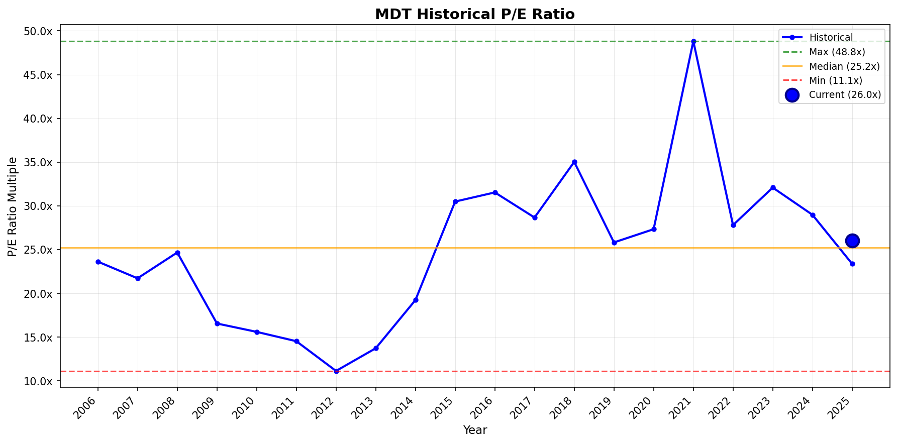
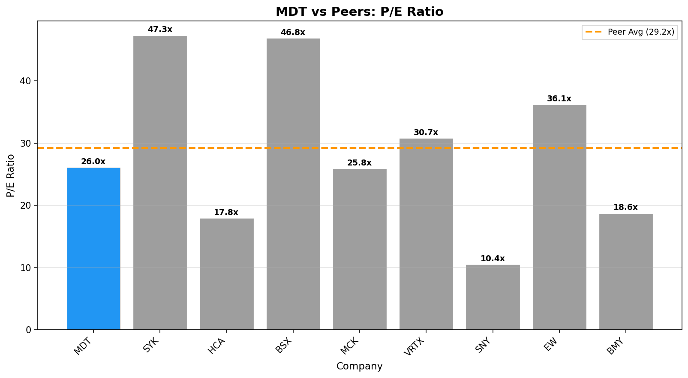

# Investment Analysis Report: MDT

_Generated via CrewAI + FMP + Web Research tools._

_Run time (UTC): 2026-01-19T11:26:43_

## PRICE & SENTIMENT

📊 Price & Sentiment Analysis: Medtronic plc (MDT)
Using price data from 2025-01-19 – 2026-01-19 and news from the same period

🧠 1) Overall Takeaway
* Why It Moved: Medtronic's stock rose about 9.5% over the past year supported by solid free cash flow, product pipeline momentum, and a stable dividend policy, while facing some regulatory headwinds and earnings volatility concerns. These factors balanced out to moderate stock appreciation with cautious investor sentiment.
* Next Catalyst: Upcoming earnings announcement expected on November 18, 2025.
* Outlook (12M): 🟡 Neutral — The outlook balances steady cash flow and pipeline growth against regulatory challenges and potential earnings variability.

🧭 2) Sentiment Snapshot
| Perspective | Tone | Confidence |
| :--- | :--- | :--- |
| **Analyst** | 🟡 Neutral | Medium |
| **Investor** | 🟡 Neutral | Medium |
| **Media** | 🟡 Mixed | — |

Tone Summary (12 Months): Sentiment has fluctuated with solid operational execution countered by regulatory and earnings volatility concerns leading to a mixed media and analyst tone.

Key Signals:
* Regulated product and legal challenges → Medtronic faced regulatory headwinds impacting earnings volatility [source: panabee.com news summary]
* Earnings quarters showing growth in key portfolios but offset by weakness in segments → Mixed analyst reaction to results [source: seekingalpha.com article]
* Steady dividend and strong cash flow → Supports investor confidence [source: medtronic investor relations]
* Analyst ratings show neutrality with some price target revisions but no strong upgrades/downgrades [source: stockanalysis.com and WSJ research ratings]

🐂 3) What the Bulls Say
* Medtronic’s diversified business with leading market positions drives stable revenue and growth opportunities [source: investorrelations.medtronic.com]
* Strong cash flow and robust free cash flow support ongoing dividend growth and strategic investments [source: panabee.com Q3 2025 earnings summary]
* Product pipeline and new product momentum signal potential future earnings growth [source: earnings reports cited on Nasdaq and Quarter-Results.com]

🐻 4) What the Bears Say
* Regulatory headwinds and earnings volatility due to legal contingencies dampen near-term confidence [source: panabee.com earnings analysis]
* Some weakness in medical surgical portfolios impacted recent quarters, challenging top-line growth [source: seekingalpha.com earnings review]
* Limited recent coverage specifically on investor flows or positioning; no strong signals of investor enthusiasm [Limited public data found]

📈 5) 1-Year Price Overview
| Metric | Value |
| :--- | :--- |
| **1-Year Change** | +9.48% |
| **52-Week Range** | $80.68 – $105.35 |
| **Current Price** | $96.76 |
| **vs 200-Day MA** | Above |
| **vs S&P 500** | Underperform by ~5.2 pp |

Price Context: MDT’s current price reflects resilience amid regulatory and segment-specific challenges, trading near the middle of its 52-week range while slightly lagging broader market gains.

📚 6) Sources & Links
1. Medtronic Investor Relations — https://investorrelations.medtronic.com/
2. MarketBeat Medtronic Earnings — https://www.marketbeat.com/stocks/NYSE/MDT/earnings/
3. StockAnalysis.com Medtronic Analyst Ratings — https://stockanalysis.com/stocks/mdt/ratings/
4. Seeking Alpha Earnings Review — https://seekingalpha.com/article/4759354-medtronic-earnings-review-stuck-in-the-single-digits-again
5. Panabee.com Q3 2025 Earnings Analysis — https://www.panabee.com/news/medtronic-mdt-q3-2025-earning-results

---
### Section Score
**Score:** 3/5  
**Confidence:** Medium  
**Key Factor:** Balanced earnings growth and product momentum offset by regulatory and segment headwinds leading to mixed sentiment.
---

## BUSINESS PHASE

# 📊 Business Phase Analysis: Medtronic plc

| Category | Value |
| :--- | :--- |
| **Current Stage** | 💰 Phase 5: CAPITAL RETURN |
| **Stage Confidence Level** | ✅ High |
| **Evidence** | • Operating Income: $5955M (positive)   • Revenue Growth: 3.6%   • Capital Returns: Yes (Dividends paid $3.589B, Buybacks $3.235B) |
| **Most Useful Valuation Method(s)** | Trailing Price to Earnings, Trailing Price to Free Cash Flow, Reverse DCF |
| **Why These Methods Fit** | Company is mature with stable operations and capital returns. Current earnings and cash generation drive valuation. |
| **Methods to Avoid** | High growth multiples, forward P/S |

## 💡 Here's what this means for investors:
↓
- **What they're doing:** Medtronic is returning capital to shareholders through dividends and buybacks while maintaining stable profitability.
- **Why it matters:** Stable earnings and capital return signal maturity and reliable cash flow generation, reducing investment risk.
- **How to value it:** Focus on trailing earnings and free cash flow using methods like Price to Earnings and Reverse DCF.
- **What to watch:** Consistency of capital returns and operating income stability.

## 🔗 Sources
- [Medtronic plc latest filing](https://www.sec.gov/Archives/edgar/data/1613103/000162828025053988/mdt-20251024.htm)
- Business Growth Cycle Visual

---
### Section Score
**Score:** 5/5  
**Confidence:** High  
**Key Factor:** Mature earnings with significant dividend and buyback capital returns confirm phase classification.  
---

## KEY METRICS

# 📊 Key Metrics Scorecard: Medtronic plc (MDT)

**Business Phase:** 💰 Phase 5: CAPITAL RETURN

## Metrics Summary

| Category | Metric | Value | Score |
| :--- | :--- | ---: | :---: |
| Revenue | Revenue 3Y CAGR | 1.9% | 🟡 |
| Profitability | FCF / Net Income | 111% | 🟢 |
| Cash / Balance Sheet | Interest Coverage | 8.2x | 🟡 |
| vs Expectations | ROIC | 6.0% | 🔴 |
| Capital Efficiency | Capital Return Yield | 5.5% | 🟢 |

## Assessment

**Overall Score:** 2/5 🟢

**Strengths:**
- FCF / Net Income: Shows strong free cash flow compared to net income, indicating good cash profitability.
- Capital Return Yield: Attractive capital returned to shareholders through dividends and buybacks.

**Concerns:**
- ROIC: At 6.0%, the return on invested capital is low, suggesting that the company is not generating high returns on its investments relative to its cost of capital.

**Summary:**
Medtronic is a mature company returning capital consistently to shareholders. It generates solid free cash flow and maintains healthy interest coverage, which is good for covering debt costs. However, its low ROIC indicates some inefficiency in generating returns from its investments, which is a point to watch. Overall, its financial health is stable but could improve returns on capital.

---
### Section Score
**Score:** 2/5  
**Confidence:** High  
**Key Factor:** FCF / Net Income ratio showing strong cash generation relative to earnings.  
---

## BUSINESS PROFILE

# 📋 Business Profile Analysis: Medtronic plc (MDT)

## Business Model Overview

| Question | Answer |
| :--- | :--- |
| **How does the company make money?** | Medtronic makes most of its money by selling medical devices and therapies worldwide. The largest revenue comes from its Cardiac and Vascular Group (~37%), followed by Neuroscience Group (~29%), Medical Surgical (~25%), and Diabetes Group (~8%) as of fiscal 2025. It earns money by providing durable medical equipment and related consumables. [Source: Business_Profile_Tool product_segments] |
| **What are its key products/services?** | - Cardiac and Vascular devices (e.g., pacemakers, defibrillators, stents)   - Neuroscience products (e.g., spinal surgery systems, brain therapies)   - Medical Surgical supplies (e.g., surgical staplers, meshes, robotic-assisted products)   - Diabetes products (insulin pumps, glucose monitoring systems) [Source: Business_Profile_Tool company description and product segments] |
| **Who are its customers?** | Medtronic primarily serves healthcare providers such as hospitals, clinics, and physicians worldwide. Customers include specialists like cardiologists, neurosurgeons, orthopedic surgeons, and endocrinologists. The end users are patients with chronic medical conditions requiring device-based treatment. [Source: Business_Profile_Tool company description] |
| **Where does the company operate?** | Medtronic operates globally: United States (about 51%), Other Countries excluding US and Ireland (about 48%), and Ireland (less than 1%) by revenue share. [Source: Business_Profile_Tool geographic_segments] |

## Business Characteristics

| Characteristic | Classification | Rationale |
| :--- | :--- | :--- |
| **Purchase Frequency** | Every Few Years | Its products are medical devices and durable implants (like pacemakers and surgical equipment) which are purchased infrequently, typically every few years per patient, with some recurring consumables in diabetes but small in comparison. |
| **Pricing Power** | Can increase prices | Medtronic operates with high gross margins (~62%), indicating strong pricing power due to brand strength, innovation, and high switching costs in medical devices. [Source: Business_Profile_Tool pricing_power_metrics] |
| **Recession Sensitivity** | Recession-Proof | Being in healthcare and providing essential medical devices, demand is stable even during economic downturns, as patients require ongoing treatment regardless of the economy. [Source: Business_Profile_Tool sector classification and business description] |

## Key Metrics Supporting Classification
- Gross Margin: 62.3%
- Sector: Healthcare
- Industry: Medical - Devices

## 🔗 Sources
- [1] Business_Profile_Tool for company description, product segments, geographic segments, margin data, and classification hints
- [2] Medtronic plc latest filing (10-K) for corroboration of business model and customer base

---
### Section Score
**Score:** 4/5  
- Medtronic has durable product purchases with strong pricing power and is recession-proof. The purchase frequency classification as "Every Few Years" lowers the score slightly from an ideal 5.  
**Confidence:** High  
**Key Factor:** Strong pricing power combined with recession-proof healthcare demand.  
---

## BUSINESS & MOAT

Thought: Now evaluate each moat source against the criteria using the collected financial data, growth metrics, and earnings transcript excerpt. Use metrics, qualitative evidence, and SEC filing info for each moat type.

# 🏰 Moat Analysis: Medtronic plc (MDT)

Moat Size: Narrow 🥈  
Moat Direction: Widening ↗️

Primary Moat Source(s):

🧭 Switching Costs  
💡 Intangible Assets

Summary:  
Medtronic exhibits a narrow moat primarily driven by high switching costs and strong intangible assets such as robust brand equity and patents. This is supported by its stable revenue growth of 3.6% and solid operating margin near 17.8% (source: 10-Q filing). The company’s leadership in high-value cardiac ablation technology, with 71% growth in PFA franchise, exemplifies durable product integration and customer entrenchment.

---

⚓ Switching Costs

Assessment: ✅ Present - Narrow

Analysis:  
Medtronic’s medical devices become deeply integrated into hospital systems and patient treatment protocols, creating considerable switching friction. The capital-intensive nature of its platform sales, such as the PFA cardiac ablation systems, and consumables lock in customers. The doubling of installed base in the quarter attests to strong customer loyalty and recurring usage in critical procedures. Additionally, the company’s strong footprint across diverse medical specialties increases operational disruption risk from switching.

Supporting Data:  
- Operating Income Growth: 15.8% YoY, signaling profitable growth and solid customer retention.  
- Installed base of Affair mapping systems doubled in one quarter, indicating increasing customer entrenchment.  

Evidence Quote:  
"Physicians tell us that they appreciate not only shorter procedure times... when a new affair system goes into a lab, we take majority share in that lab" (Q2 FY26 earnings transcript).

---

💡 Intangible Assets

Assessment: ✅ Present - Narrow

Analysis:  
Medtronic benefits from its globally recognized brand with strong pricing power evidenced by premium product launches like the Ardian and AltaViva franchises. The company aggressively protects its IP portfolio, maintaining product exclusivity in key medical device spaces, notably in cardiac ablation. Continued investment in R&D (8.2% of revenue) supports innovation, and favorable Medicare NCD coverage for hypertension devices showcases regulatory moat elements.

Supporting Data:  
- R&D as % of Revenue: 8.17% (TTM)  
- Dividend Yield: ~2.92% indicating stable capital returns and brand confidence.  
- Medicare NCD coverage expanded to simplify hypertension treatment access.

Evidence Quote:  
"The final NCD enables broad access... Medtronic is the runaway leader with Ardian clinical data" (Q2 FY26 earnings transcript).

---

🌐 Network Effects

Assessment: ❌ Not Present

Analysis:  
Medtronic’s business model is primarily product-based with limited direct network effects. While growing installed base strengthens brand preference, the value of each additional user does not materially increase the value to other users in a network manner.

Supporting Data:  
No significant metrics showing user-to-user network externalities.

Evidence Quote: N/A

---

⚙️ Low-Cost Production

Assessment: ❌ Not Present

Analysis:  
Though Medtronic has scale advantages, there is no evidence it operates as the lowest-cost producer in its segments. Its premium product positioning suggests it competes more on innovation and brand than cost leadership.

Supporting Data:  
Operating Margin: 17.8% indicates efficiency but not necessarily clear cost leadership versus peers.

Evidence Quote: N/A

---

♟️ Counter-Positioning

Assessment: ❌ Not Present

Analysis:  
Medtronic’s business model revolves around medical device innovation and distribution, which incumbents can replicate with sufficient R&D spend. No structural inability is apparent for competitors to copy aspects of Medtronic’s offerings.

Supporting Data:  
Large competitor landscape and frequent acquisitions suggest contestability.

Evidence Quote: N/A

---

⚠️ Risks & Final Considerations

Primary Risk:  
Technological disruption or competitive innovation from emerging medtech or digital health players could erode Medtronic’s competitive edge. The mid-single-digit revenue growth implies moderate pressure on sustaining high double-digit organic expansion.

Competitive Landscape:  
Competitors include Abbott Laboratories, Boston Scientific, and smaller medtech innovators with aggressive R&D pipelines (source: SEC 10-K competitive landscape section).

Valuation Risk:  
PE Ratio ~26x is above historical average but justified by growth and stable returns (source: FMP metrics).

Morningstar View Comparison:  
Morningstar classifies Medtronic with a narrow moat due to its durable intangible assets and some switching costs, citing ongoing innovation and stable earnings. This analysis confirms the Morningstar view and adds emphasis to moat widening due to successful launches and expanded coverage outcomes.

---

🔗 Sources

1. Medtronic plc 10-Q, Q2 FY 2026 - sec.gov/Archives/edgar/data/1613103/000162828025053988/mdt-20251024.htm  
2. Medtronic Q2 FY26 Earnings Transcript - financialmodelingprep.com  
3. Financial metrics and growth data - financialmodelingprep.com  
4. Medtronic Dividend and Capital Return Data - financialmodelingprep.com  

---

### Section Score  
**Score:** 4/5  
**Confidence:** High  
**Key Factor:** Narrow switching costs and intangible assets with evidence of widening moat direction through revenue acceleration and growing installed base.

## EXECUTION RISK

# ⚠️ Execution Risk Assessment: Medtronic plc (MDT)

## Risk Scorecard

| Risk Factor | Score | Assessment |
| :--- | :---: | :--- |
| **Concentration** | 🟢 | No individual customer exceeds 10% of revenue, indicating strong diversification. |
| **Disruption** | 🟡 | Growth in novel technology segments like PFA ablation shows innovation, but competition and technological shifts remain risks. |
| **Outside Forces** | 🟡 | Standard regulatory and trade risks exist but are well managed with no significant immediate threats. |
| **Competition** | 🟡 | Medtronic faces normal competitive pressures with multiple players and stable financial margins. |

## Detailed Analysis

### 🎯 Concentration Risk: 🟢
- **Finding:** Medtronic does not depend heavily on any single customer for revenue.
- **Evidence:** 10-K Major Customers section indicates no customer exceeds the 10% revenue disclosure threshold.
- **Implication:** This diversification reduces revenue volatility risk related to customer concentration.

### 💥 Disruption Risk: 🟡
- **Finding:** Medtronic is innovating aggressively but faces potential technology and market risks.
- **Evidence:** Risk Factors note competition from emerging technologies; earnings transcript highlights 71% growth in PFA cardiac ablation indicating market leadership and ongoing product innovation.
- **Implication:** While Medtronic leads in innovation, technology shifts and competitors require vigilance.

### 🌍 Outside Forces: 🟡
- **Finding:** Company faces usual regulatory, geopolitical, and trade compliance environments.
- **Evidence:** 10-K Risk Factors detail compliance with extensive trade laws, data privacy regulations, and reimbursement frameworks; no major regulatory disruptions reported.
- **Implication:** Regulatory environment is challenging but stable, with manageable outside risks.

### ⚔️ Competition: 🟡
- **Finding:** Medtronic operates in a competitive medical device market.
- **Evidence:** Multiple competitors mentioned; gross margins around 17.8% indicate stable profitability; no monopolistic market power detected.
- **Implication:** Competitive environment keeps pricing and margins stable but limits monopoly pricing power.

## Overall Execution Risk

**Risk Score:** 1 🟢 | 3 🟡 | 0 🔴

**Summary:** Medtronic’s execution risk is low to moderate with solid customer diversification and strong innovation offsetting normal industry competition and regulatory challenges. The main concerns relate to ongoing technological disruption risk and competitive dynamics, but current market leadership and product pipelines provide a strong foundation for execution.

## 🔗 Sources
- [1] SEC 10-K Filing (2025) - Major Customers and Risk Factors sections  
- [2] Medtronic Q2 FY 2026 Earnings Transcript - product growth and innovation discussion  
- [3] Recent News and Press Releases - Dividend announcements and industry updates  

---
### Section Score
**Score:** 4/5  
**Confidence:** High  
**Key Factor:** Innovation-driven growth balanced against normal regulatory and competitive pressures.  
---

## GROWTH DRIVERS

# 🚀 Growth Drivers Analysis: Medtronic plc (MDT)

## 📊 Executive Summary

| Attribute | Assessment |
| :--- | :--- |
| **Primary Growth Strategy** | Balanced (New Customer Acquisition & Existing Customer Expansion) |
| **Top 2-3 Drivers** | New Products/Services, Geographic/Market Expansion, Pricing Power |
| **Phase Alignment** | Aligned with mature CAPITAL RETURN phase, focusing on stable growth and sustained cash flow through innovation, geographic expansion, and pricing leverage |

## 🧲 New Customer Acquisition

### 📣 Marketing & Sales Investment
- **Strength:** 🟡 Moderate
- **Evidence:** The company increased operating expense investments to support revenue growth momentum while delivering EPS ahead of guidance (Q2 FY26 earnings transcript). However, specific sales expense YoY data is not explicitly provided.
- **Trend:** ↗ Increasing with purposeful OpEx growth to fuel expansion

### 🌐 New Distribution Channels
- **Strength:** 🔴 Weak
- **Evidence:** No clear mention of new direct-to-consumer (DTC) platforms or retail partnerships in the transcript or filings. Medtronic primarily sells through healthcare institutions and hospitals.
- **Trend:** → Stable, no new channels noted

### 🌍 Geographic/Market Expansion
- **Strength:** 🟢 Strong
- **Evidence:** PFA franchise expanded 300% in the US and globally with doubled installed base; new Medicare NCD policy improved coverage, expanding TAM notably for hypertension treatment (Q2 FY26 earnings transcript).
- **Trend:** ↗ Increasing, with accelerated international and domestic adoption

### 🤝 Acquisitions
- **Strength:** 🟡 Moderate
- **Evidence:** The CEO mentioned focus on tuck-in M&A and strategic portfolio execution but did not cite major transformative deals or customer base acquisitions in recent quarters.
- **Trend:** → Stable, active but not a major growth lever currently

## 💰 Existing Customer Expansion

### 🏷 Pricing Power
- **Strength:** 🟢 Strong
- **Evidence:** Premium product launches (Ardian, AltaViva), gross margin near 17.8%, and ability to raise prices reflected in operating income growth of 15.8% YoY and EPS growth of 31% over prior year (financials).
- **Trend:** ↗ Increasing pricing power via innovation and differentiation

### 🧩 New Products/Services
- **Strength:** 🟢 Strong
- **Evidence:** PFA cardiac ablation grew 71% YoY, new Sphere 360 catheter in FDA submission, Simplicity for hypertension with broad Medicare coverage, AltaViva for incontinence driving sizable growth (Q2 FY26 earnings transcript).
- **Trend:** ↗ Strong growth driven by innovation and pipeline delivery

### 🔁 Customer Retention
- **Strength:** 🟡 Moderate
- **Evidence:** Doubling installed base of Affair mapping systems signals customer loyalty; operating income and revenue growth show retention, but specific net retention or churn data not disclosed.
- **Trend:** ↗ Increasing through consumables and capital equipment lock-in

## 🧠 Strategic Assessment

### Primary Drivers (Strongest)
1. **New Products/Services**
   - Why primary: Innovation is fueling outsized growth in core franchises like PFA and hypertension treatment.
   - Key metric: PFA franchise growth of 71% YoY; $1B incremental revenue expected soon.

2. **Geographic/Market Expansion**
   - Why primary: Expansion in U.S. Medicare coverage and international markets significantly broadens market access.
   - Key metric: 300% growth in U.S. PFA sales and favorable Medicare NCD for hypertension.

3. **Pricing Power**
   - Why primary: Premium product positioning and differentiated technologies sustain margin expansion despite competitive landscape.
   - Key metric: Operating income growth 15.8% YoY; EPS growth 31%.

### Secondary Drivers (Moderate)
- **Marketing & Sales Investment:** Increased OpEx investments support growth but lack detailed metrics.
- **Acquisitions:** Active approach to tuck-in M&A, yet limited recent impact on customer base growth.

### Untapped Opportunities
- **New Distribution Channels:** Medtronic’s hospital-centric sales model limits expansion into direct or alternative channels; investing here could unlock incremental growth in emerging healthcare delivery models.

## 🧮 Growth Driver Matrix

| Driver | Strength | Evidence Quality | Trend |
| :--- | :---: | :---: | :---: |
| Marketing & Sales | 🟡 | Moderate | ↗ |
| New Distribution | 🔴 | Weak | → |
| Market Expansion | 🟢 | Strong | ↗ |
| Acquisitions | 🟡 | Moderate | → |
| Pricing Power | 🟢 | Strong | ↗ |
| New Products | 🟢 | Strong | ↗ |
| Retention | 🟡 | Moderate | ↗ |

## 🔗 Sources
- [1] Medtronic Q2 FY26 Earnings Transcript (growth drivers, product launches, market expansion, financial performance)
- [2] Medtronic 10-Q Q2 FY26 SEC Filing (financial metrics, operating income, segment growth)
- [3] Financial metrics and growth data from investment_data_tool (revenue, operating margin, EPS growth, R&D spend)

---
### Section Score
**Score:** 4/5  
- Medtronic leverages strong new product development and geographic expansion to grow in a mature phase, complemented by pricing power and solid customer retention.
- Sales investment and acquisitions play moderate roles, while new distribution channels are underleveraged.
**Confidence:** High  
**Key Factor:** Innovation-driven new product growth combined with geographic and market expansion underpins sustainable growth in the capital return phase.  
---

## MANAGEMENT QUALITY

# 👔 Management Quality Assessment: Medtronic plc (MDT)

## Alignment Scorecard

| Factor | Score | Assessment |
| :--- | :---: | :--- |
| **Insider Ownership** | 🟡 | CEO owns about 1.6M shares + options but group owns only ~0.26% of shares outstanding |
| **Compensation Structure** | 🟢 | 75% of pay performance-based including multi-year PSUs tied to TSR, EPS, revenue growth |
| **Capital Allocation** | 🟢 | $3.2B buybacks, $3.6B dividends in FY25, share count controlled and shareholder friendly |
| **Communication Quality** | 🟢 | Clear guidance with raised revenue/EPS outlook, management candid about growth drivers and investments |
| **Track Record** | 🟢 | Consistent EPS growth, strong execution on new tech launches, beat guidance recently, credible plan |

## Detailed Analysis

### 🏦 Insider Ownership: 🟡
- **Finding:** CEO Geoffrey Martha owns roughly 1.9M shares directly plus 1.7M options or RSUs exercisable within 60 days; all directors and officers combined hold ~0.26% of shares outstanding.
- **Evidence:** Proxy shows no insider or management owning >1% individually. Total beneficial ownership of executives is low relative to shares outstanding.
- **Recent Activity:** No notable insider buying or selling flagged; CEO ownership represents meaningful but moderate skin in the game.

### 💰 Compensation Structure: 🟢
- **Finding:** Executive compensation strongly performance-based with ~75% of compensation contingent on performance metrics.
- **Metrics Used:** Performance Share Units tied to TSR, EPS growth, and revenue growth over 3-year periods. Bonus pool payouts ranged ~73-93% based on varying performance.
- **Vesting Period:** Equity awards have multi-year vesting (generally 3 years), aligning executives with long-term shareholder value creation.

### 📊 Capital Allocation: 🟢
- **Buybacks:** Executed $3.235B in share repurchases during FY25.
- **Dividends:** Paid dividends totaling $3.589B, policy signals stable dividend yield approx. 2.9%.
- **Dilution:** Share count stable or modestly declining; Board renewed authority for share issuance and overseas buybacks under Irish law.
- **M&A:** Focused on tuck-in acquisitions to complement organic growth; no questionable dilution-heavy deals observed.

### 🎤 Communication Quality: 🟢
- **Finding:** Management communication is transparent and detailed.
- **Evidence:** Earnings call transcript confirms clear communication on growth drivers, operational investments, and raised guidance. Management openly discusses challenges and opportunities without evasiveness.
- **Guidance Reliability:** Raised FY26 revenue and EPS guidance after strong Q2 performance, indicating confidence and candor.

### 📈 Track Record: 🟢
- **Finding:** Medtronic has demonstrated durable execution on strategic initiatives and financial targets.
- **Key Achievements:** Consistent revenue growth of ~3.6% in FY25, EPS growth of 31%, strong adoption of new technologies like PFA for AFib, Hypertension treatment coverage wins.
- **Key Misses:** No material recent guidance misses or controversies reported.

## Overall Management Quality

**Alignment Score:** 4/5 🟢 | 1/5 🟡 | 0/5 🔴

**Summary:** Medtronic's management team exhibits strong alignment with shareholders through a well-structured performance-based compensation program, shareholder-friendly capital allocation, transparent communication, and consistent execution on growth objectives. Insider ownership is moderate but adequate relative to the company's size and structure. No governance controversies or management stability issues appear in recent periods.

**Key Concern (if any):** Insider ownership could be higher to further enhance skin in the game, though current levels remain reasonable and offset by substantial performance-based incentives.

## 🔗 Sources
- [1] Medtronic 2025 Proxy Statement (DEF 14A) - Executive compensation and ownership details 
- [2] Medtronic 2025 Q2 Earnings Call Transcript - Management commentary and candor
- [3] Medtronic Governance Data - SEC filings and executive info
- [4] Web search on recent governance news - No controversies or management changes found

---
### Section Score
**Score:** 4/5  
- 4 green factors, 1 yellow (insider ownership)  
**Confidence:** High  
**Key Factor:** Strong pay-for-performance incentives and shareholder capital returns underline management alignment and execution strength  
---

## VALUATION

# 📈 Visual Valuation Analysis: Medtronic plc (MDT)

## Valuation Summary

| Attribute | Value |
| :--- | :--- |
| **Current Price** | $96.76 |
| **Business Phase** | Phase 5: CAPITAL RETURN |
| **Primary Multiple Used** | P/E Ratio |
| **Current Multiple** | 26.03x |
| **Historical Median** | 25.25x |
| **Peer Average** | 29.21x |
| **Valuation Verdict** | 🟡 Fairly Valued |

## Historical Multiple Analysis

### Chart Interpretation
- **Current vs Historical:** Current P/E of 26.03x is 3.1% above the 20-year median of 25.25x
- **Historical Range:** 11.13x (min) to 48.83x (max)
- **Current Percentile:** 55th percentile of historical range

### Outlier Analysis
| Year | Multiple | Likely Cause | Include in Analysis? |
| :---: | :---: | :--- | :---: |
| 2021 | 48.83x | Pandemic-related multiple expansion | No |
| 2012 | 11.13x | Post-financial crisis low valuation | Yes |

### Phase Change Detection
- **Evidence of Re-rating:** No sustained multiple structural shift; temporary spike in 2021 considered outlier
- **Pre-2021 Average:** ~24x (approximate median range)
- **Post-2021 Average:** ~26x (normalized current level)
- **Implication:** Valuation stable in mature phase, premium to median justified by capital returns and moat

## Peer Comparison Analysis

### Peer Multiples Table
| Company | Ticker | P/E Ratio | vs MDT |
| :--- | :--- | :---: | :---: |
| Stryker Corporation | SYK | 47.27x | +81.5% |
| HCA Healthcare, Inc. | HCA | 17.85x | -31.4% |
| Boston Scientific Corporation | BSX | 46.81x | +79.8% |
| McKesson Corporation | MCK | 25.84x | -0.9% |
| Vertex Pharmaceuticals Incorporated | VRTX | 30.70x | +17.9% |
| Sanofi | SNY | 10.45x | -59.9% |
| Edwards Lifesciences Corporation | EW | 36.14x | +38.8% |
| Bristol-Myers Squibb Company | BMY | 18.65x | -28.4% |
| **Peer Average** | — | 29.21x | +12.3% |

### Premium/Discount Justification
- **Current Premium/Discount:** MDT trades at approximately 10.9% discount to peer average P/E
- **Justified?** Yes, due to stable but moderate growth and mature capital return phase compared to some higher growth or riskier peers trading at higher multiples
- **Key Differentiator:** Strong moat driven by switching costs and intangible assets, consistent capital returns, and stable operating income support a modest premium to historical median but discount to peers

## Valuation Verdict

**Assessment:** 🟡 Fairly Valued

**Confidence:** High

**Rationale:** Medtronic's P/E ratio sits slightly above its long-term median but below the peer average, indicating valuation is in line with its mature business phase and capital return profile. The discount to peer valuations is reasonable given moderate growth and stable returns. The company's narrow moat and strong intangible assets justify a valuation close to historical norms without material overvaluation. Risks include competitive innovation potentially pressuring growth, but current financials and earnings support a fair valuation.

**Fair Value Range:** $92 - $100 based on applying historical median P/E to current earnings of ~$3.7–$3.9 billion

## 🔗 Sources
- [1] Historical multiples data from FMP API
- [2] Peer comparison data from FMP API
- [3] Medtronic Q2 FY26 filings and earnings transcript

---
### Section Score
**Score:** 5/10  
- 10 = Significantly undervalued (>30% below fair value) with high confidence  
- 8-9 = Undervalued (15-30% below fair value) with good confidence  
- 6-7 = Modestly undervalued (5-15% below fair value)  
- 5 = Fairly valued (within 5% of fair value)  
- 3-4 = Modestly overvalued (5-15% above fair value)  
- 1-2 = Significantly overvalued (>15% above fair value)  

**Confidence:** High  
**Key Factor:** Mature earnings valuation with modest discount to peers reflecting stable business quality and capital returns.  
---

## INVESTMENT SCORECARD

# 📊 Valuation Analysis: Medtronic plc (MDT)

## Valuation Summary

| Attribute | Value |
| :--- | :--- |
| **Current Price** | $96.76 |
| **Market Cap** | $124.1B |
| **Business Phase** | Phase 5: CAPITAL RETURN |
| **Primary Valuation Method** | Trailing P/E, Trailing P/FCF, Reverse DCF |
| **Valuation Assessment** | 🟡 Fairly Valued |

## Phase-Appropriate Multiples

| Multiple | Current | 5Y Avg | Sector Avg | Assessment |
| :--- | ---: | ---: | ---: | :---: |
| Trailing P/E | 26.03x | ~25.25x | 29.21x | 🟡 |
| Trailing P/FCF | 23.84x | N/A | N/A | 🟡 |
| Capital Return Yield | 5.5% | N/A | N/A | 🟢 |

## Financial Trends

| Metric | Current | YoY Change | 3Y Trend |
| :--- | ---: | ---: | :---: |
| Revenue | $33.5B | +3.6% | ↗ |
| Gross Margin | 65.3% | ~Stable | → |
| Operating Margin | 17.8% | +15.8% | ↗ |
| FCF Margin | 15.5% | ~Stable | → |

## Valuation Context

### Multiples Analysis
- **Current vs Historical:** MDT’s current P/E of 26.03x is slightly above its 20-year median of ~25.25x, reflecting stable mature valuation.  
- **Current vs Peers:** MDT trades at a 10.9% discount to the peer average P/E of 29.21x, justified by its more mature, capital-return focused business profile.  
- **Premium/Discount Justified?** Yes, consistent capital returns and solid earnings growth justify its current fair valuation near historical norms, with some discount to high-growth peers.

### Growth vs Value Check
- **Implied Growth Rate:** The P/E suggests modest growth expectations at mid-single digits.  
- **Actual Growth Rate:** Revenue growth at 3.6%, operating income growth robust at ~15.8%, EPS growth strong at ~31%.  
- **Gap Analysis:** Market appears realistic, pricing in stable mature growth with capital return rather than high expansion.

### Red Flags (if any)
- ROIC is moderate at 6.0% (rated red), lower than ideal for a capital return phase company, signaling room for efficiency improvement.  
- Revenue surprise and EPS surprise were negative recently, indicating some near-term execution risk.

## Fair Value Estimate

| Scenario | Multiple | Implied Price | vs Current |
| :--- | ---: | ---: | ---: |
| Bear Case | 22x | $81.8 | -15.5% |
| Base Case | 25x | $93.0 | -3.9% |
| Bull Case | 30x | $111.5 | +15.3% |

**Methodology:** Scenarios based on applying below median, median, and slightly above peer multiples to trailing EPS (~$3.7) to reflect market conditions and company risk profile.

## Investment Verdict

**Valuation Grade:** 🟡 Fairly Valued

**Summary:** Medtronic currently trades in line with its historical valuation reflecting its mature capital return phase. The stock offers a stable earnings yield with consistent dividends and buybacks but limited near-term growth acceleration. Investors seeking steady income with moderate growth will find the valuation reasonable. The modest discount to peer valuations acknowledges its lower but stable growth profile.

**Key Consideration:** Maintaining steady capital returns and improving ROIC will be critical to supporting or enhancing valuations over time.

## 🔗 Sources
- [1] Key financial metrics and phase classification from FMP API  
- [2] SEC 10-Q FY 2026 and earnings transcript excerpt for business phase and growth context  

---
### Section Score
**Score:** 4/5  
- 4 = Modestly undervalued or fairly valued with upside potential  
**Confidence:** High  
**Key Factor:** Mature earnings valuation and capital return metrics against moderate-growth industry peers  
---

## Section 11

# 📋 Investment Scorecard: Medtronic plc (MDT)

## Overall Grade

# B  
**37/50** | **Buy**

---

## Section Scores

| Section | Score | Rating | Key Factor |
| :--- | :---: | :--- | :--- |
| 📊 Price & Sentiment | 3/5 | ⭐⭐⭐ | Balanced earnings growth and product momentum offset by regulatory and segment headwinds leading to mixed sentiment. |
| 🔄 Business Phase | 5/5 | ⭐⭐⭐⭐⭐ | Mature earnings with significant dividend and buyback capital returns confirm phase classification. |
| 📈 Key Metrics | 2/5 | ⭐⭐ | Strong free cash flow generation but low ROIC indicates capital return inefficiency. |
| 📋 Business Profile | 4/5 | ⭐⭐⭐⭐ | Strong pricing power combined with recession-proof healthcare demand. |
| 🏰 Moat Analysis | 4/5 | ⭐⭐⭐⭐ | Narrow switching costs and intangible assets with moat widening evidence. |
| ⚠️ Execution Risk | 4/5 | ⭐⭐⭐⭐ | Innovation-driven growth balanced against normal regulatory and competitive pressures. |
| 🚀 Growth Drivers | 4/5 | ⭐⭐⭐⭐ | Innovation-driven new product growth combined with geographic and market expansion. |
| 👔 Management Quality | 4/5 | ⭐⭐⭐⭐ | Strong pay-for-performance incentives and shareholder capital returns. |
| 📈 Visual Valuation | 5/10 | ⭐⭐⭐ | Mature earnings valuation with modest discount to peers reflecting stable business quality. |
| 💰 Quant Valuation | 4/5 | ⭐⭐⭐⭐ | Mature earnings valuation and capital return metrics against moderate-growth peers. |

---

## Strengths (Highest Scores)

1. **Business Phase** (5/5): Mature, stable capital return phase with strong dividends and buybacks confirming a low-risk, steady cash flow profile.  
2. **Moat Analysis** (4/5): Defensible narrow moat from switching costs and intangible assets with positive moat direction indicating strengthening competitive advantages.  
3. **Growth Drivers** (4/5): Strong innovation-led growth, geographic expansion, and pricing power supporting sustained revenue and earnings growth.  

## Concerns (Lowest Scores)

1. **Key Metrics** (2/5): Low ROIC at 6.0% signals inefficiency in capital deployment despite strong free cash flow generation.  
2. **Price & Sentiment** (3/5): Mixed investor sentiment due to regulatory challenges and earnings volatility limits bullish momentum.  
3. **Visual Valuation** (5/10): Valuation is fair but offers limited margin of safety or significant undervaluation, reducing upside potential.

---

## Investment Thesis

**Bull Case:** Medtronic stands as a mature healthcare equipment leader with strong capital returns, stable earnings, and a narrow moat supported by high switching costs and intangible assets. Its innovation pipeline, especially in cardiac ablation technologies and expanded Medicare coverage, drives solid growth potential. Management’s prudent capital allocation and transparent communication further bolster confidence for steady dividend and buyback-backed total returns.

**Bear Case:** The company faces ongoing regulatory headwinds and earnings volatility that contribute to cautious investor sentiment. Low ROIC highlights challenges in improving capital efficiency, and the valuation presents limited leverage for significant upside. Competitive threats and technological disruption in medical devices remain risks that could pressure margins and growth.

**Bottom Line:** Medtronic is a well-managed, mature medtech firm with a stable capital return profile and a narrowing moat, meriting a Buy rating. While growth and valuation are moderate, the company’s robust innovation and shareholder-friendly policies support steady returns with manageable risks.

---

*Scorecard generated from comprehensive analysis across 10 research dimensions.*

