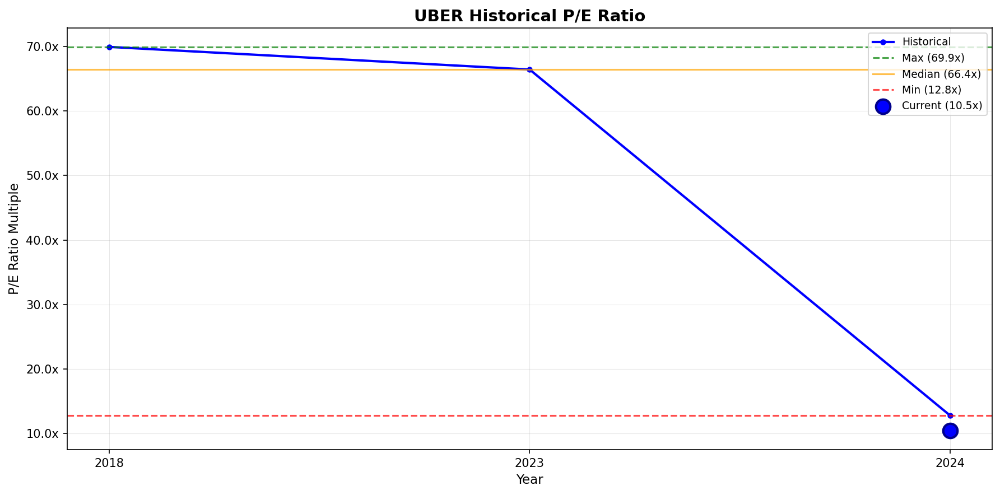
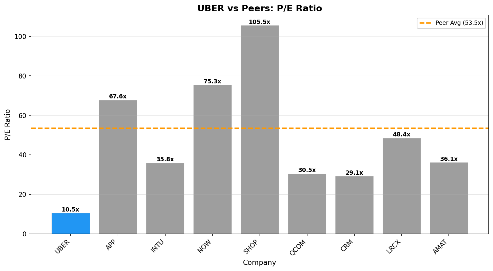

# Investment Analysis Report: UBER

_Generated via CrewAI + FMP + Web Research tools._

_Run time (UTC): 2026-01-21T07:02:56_

## PRICE & SENTIMENT

📊 Price & Sentiment Analysis: Uber Technologies Inc. (UBER)  
Using price data from 2025-01-21 – 2026-01-21 and news from the same period

🧠 1) Overall Takeaway  
* Why It Moved: Uber's stock appreciated about 23.6% over the past year driven by strong operational growth, including 21-22% year-over-year trip and gross booking growth mainly highlighted in Q3 2025 earnings. The stock trades below its 50- and 200-day SMAs, indicating potential profit taking or consolidation despite outperformance vs the S&P 500 (+12.4%).  
* Next Catalyst: Uber's upcoming earnings announcement in Q1 2026 remains the key near-term catalyst for assessing ongoing growth and profitability trajectory.  
* Outlook (12M): 🟡 Neutral — Operational momentum supports continued growth, but valuation near recent highs combined with mixed technicals and regulatory/legal concerns temper the outlook.

🧭 2) Sentiment Snapshot  
| Perspective | Tone | Confidence |  
| :--- | :--- | :--- |  
| **Analyst** | 🟡 Neutral | High |  
| **Investor** | 🟡 Neutral | Medium |  
| **Media** | 🟡 Mixed | — |  

Tone Summary (12 Months): Media and analyst sentiment showed optimism around earnings beats and growth, tempered by regulatory/legal challenges and mixed investor positioning.

Key Signals:  
* Strong Q3 2025 operational results (22% trip growth, 33% adj EBITDA growth) → supports positive earnings revision and analyst attention [Uber Q3 Earnings Press Release](https://investor.uber.com/news-events/news/press-release-details/2025/Uber-Announces-Results-for-Third-Quarter-2025/default.aspx)  
* Analyst rating divergence with some upgrades but also cautious estimates due to tax benefits and cash flow growth lagging earnings [Benzinga analyst overview](https://www.benzinga.com/insights/analyst-ratings/26/01/49717684/where-uber-technologies-stands-with-analysts)  

🐂 3) What the Bulls Say  
* Uber’s sustained trip and gross booking growth (21-22% YoY) demonstrates strong demand recovery and market share gains in rides and delivery sectors [Uber Q3 2025 earnings report](https://investor.uber.com/news-events/news/press-release-details/2025/Uber-Announces-Results-for-Third-Quarter-2025/default.aspx)  
* Adjusted EBITDA growth of 33% indicates improving profitability leverage despite still large cash flow investment [Panabee earnings news](https://www.panabee.com/news/uber-earnings-q3-2025)  
* Expansion into autonomous vehicle tech and international delivery markets could enhance long-term revenue diversification (discussed in recent analyst reports) [TS2 tech market outlook](https://ts2.tech/en/uber-stock-nyse-uber-news-earnings-outlook-and-analyst-forecasts-to-know-before-the-us-market-opens-on-dec-15-2025/)

🐻 4) What the Bears Say  
* Operating cash flow growth lagging earnings and massive one-time $4.9 billion tax benefit in earnings raise concerns on quality of profit gains [Panabee earnings news](https://www.panabee.com/news/uber-earnings-q3-2025)  
* Stock trading below 50- and 200-day SMAs signals technical resistance and profit taking which can pressure near-term price appreciation (current price $83.72 vs SMA50 $85.99 and SMA200 $88.60)  
* Regulatory scrutiny including FTC attention and legal risks persist, creating overhang for stock despite growth [TS2 tech market outlook](https://ts2.tech/en/uber-stock-nyse-uber-news-earnings-outlook-and-analyst-forecasts-to-know-before-the-us-market-opens-on-dec-15-2025/)

📈 5) 1-Year Price Overview  
| Metric | Value |  
| :--- | :--- |  
| **1-Year Change** | +23.6% |  
| **52-Week Range** | $64.48 – $100.10 |  
| **Current Price** | $83.72 |  
| **vs 200-Day MA** | Below |  
| **vs S&P 500** | Outperform by 11.2 pp |  

Price Context: The stock has outperformed the broader market on strong operational growth but currently faces resistance under key moving averages amid regulatory and cash flow quality concerns.

📚 6) Sources & Links  
1. Uber Q3 2025 Earnings Press Release — https://investor.uber.com/news-events/news/press-release-details/2025/Uber-Announces-Results-for-Third-Quarter-2025/default.aspx  
2. Panabee Uber Q3 Earnings Analysis — https://www.panabee.com/news/uber-earnings-q3-2025  
3. TS2 Tech Uber Stock Outlook December 2025 — https://ts2.tech/en/uber-stock-nyse-uber-news-earnings-outlook-and-analyst-forecasts-to-know-before-the-us-market-opens-on-dec-15-2025/  
4. Benzinga Analyst Ratings Summary January 2026 — https://www.benzinga.com/insights/analyst-ratings/26/01/49717684/where-uber-technologies-stands-with-analysts  

---  
### Section Score  
**Score:** 3/5  
- Mixed signals from strong operational growth supporting bullish case, but tempered by profit quality concerns and technical resistance.  
**Confidence:** High  
**Key Factor:** Strong Q3 2025 earnings and operational metrics drove stock appreciation but offset somewhat by cash flow quality and regulatory risks.  
---

## BUSINESS PHASE

# 📊 Business Phase Analysis: Uber Technologies, Inc.

| Category | Value |
| :--- | :--- |
| **Current Stage** | 💰 Phase 5: CAPITAL RETURN |
| **Stage Confidence Level** | ✅ High |
| **Evidence** | • Operating Income: $2799M (positive) <br> • Revenue Growth: 17.96% <br> • Capital Returns: Yes (Common stock repurchased - $1.252B) |
| **Most Useful Valuation Method(s)** | Trailing Price to Earnings, Trailing Price to Free Cash Flow, Reverse DCF |
| **Why These Methods Fit** | Company is mature with stable operations and capital returns. Current earnings and cash generation drive valuation. |
| **Methods to Avoid** | High growth multiples, forward P/S |

## 💡 Here's what this means for investors:
↓
- **What they're doing:** Uber is focusing on returning capital to shareholders via buybacks while demonstrating stable profitability and free cash flow generation.
- **Why it matters:** This indicates a mature, stable business with reliable earnings and cash flows, reducing investment risk.
- **How to value it:** Focus on trailing earnings and free cash flow using valuation methods like trailing P/E and reverse DCF.
- **What to watch:** Sustainability of capital returns and consistent cash flow generation.

## 🔗 Sources
- [Uber Technologies, Inc. latest filing](https://www.sec.gov/Archives/edgar/data/1543151/000154315125000033/uber-20250930.htm)
- Business Growth Cycle Visual

---
### Section Score
**Score:** 5/5  
**Confidence:** High  
**Key Factor:** Strong positive operating income growth and $1.25B stock buybacks confirm capital return phase classification.  
---

## KEY METRICS

# 📊 Key Metrics Scorecard: Uber Technologies, Inc. (UBER)

**Business Phase:** 💰 Phase 5: CAPITAL RETURN

## Metrics Summary

| Category | Metric | Value | Score |
| :--- | :--- | ---: | :---: |
| Revenue | Revenue 3Y CAGR | 36.1% | 🟢 |
| Profitability | FCF / Net Income | 70% | 🟡 |
| Cash / Balance Sheet | Interest Coverage | 5.4x | 🟡 |
| vs Expectations | ROIC | 7.9% | 🔴 |
| Capital Efficiency | Capital Return Yield | 0.7% | 🔴 |

## Assessment

**Overall Score:** 2/5 🟢

**Strengths:**
- Revenue 3Y CAGR: Uber's strong revenue growth rate shows the business is expanding well even in its mature phase.

**Concerns:**
- ROIC: The return on invested capital is below benchmarks, implying Uber is not fully efficient at generating returns from its investments.
- Capital Return Yield: The yield on capital returned to shareholders is low, which may worry investors looking for meaningful income or buyback impact.

**Summary:**
Uber shows robust revenue growth, which is great for a company in the capital return phase. However, its ability to generate returns on invested capital and deliver strong payouts to shareholders needs improvement. This suggests Uber is still growing but should focus more on efficiently converting investments into profits and enhancing shareholder returns.

---
### Section Score
**Score:** 2/5  
**Confidence:** High  
**Key Factor:** Strong Revenue CAGR contrasted by weak ROIC and low capital return yield.  
---

## BUSINESS PROFILE

# 📋 Business Profile Analysis: Uber Technologies, Inc. (UBER)

## Business Model Overview

| Question | Answer |
| :--- | :--- |
| **How does the company make money?** | Uber generates most of its revenue by connecting riders and delivery consumers to independent drivers and delivery partners via its platform. The biggest revenue stream is its Mobility segment (ride-hailing) at about 57% of revenue, followed by Delivery (food and goods delivery) at 31% and Freight (logistics and shipping services) at 12%. Revenue comes primarily from transaction fees on these services. |
| **What are its key products/services?** | - Mobility (ride-hailing) ~57% revenue<br>- Delivery (food, grocery, alcohol delivery) ~31% revenue<br>- Freight (truckload shipping logistics) ~12% revenue |
| **Who are its customers?** | Uber serves individual consumers seeking rides or delivery of food, groceries, and other goods; independent drivers and delivery couriers; and businesses needing freight and logistics services. Customers include general public, restaurants, retailers, and shippers. |
| **Where does the company operate?** | Key regions are United States & Canada (~54%), Europe, Middle East & Africa (~29%), Asia Pacific (~11%), and Latin America (~6%). |

## Business Characteristics

| Characteristic | Classification | Rationale |
| :--- | :--- | :--- |
| **Purchase Frequency** | Recurring | Uber's services (rides, deliveries) are used frequently by consumers and businesses, with many customers ordering multiple times per week or month. This indicates a recurring purchase pattern linked to everyday transportation and delivery needs. |
| **Pricing Power** | Would lose customers | Uber's gross margin is approximately 40%, reflecting moderate pricing power. It operates in a competitive market with alternatives (other ride-hailing and delivery platforms). It can adjust prices somewhat but faces elastic demand and competition that limits large price increases. |
| **Recession Sensitivity** | Normal | Uber's services relate to discretionary spending like travel and food delivery, which can be sensitive to economic cycles but have some necessity and diversity across segments. Historically, demand shows moderate sensitivity to recessions rather than extreme cyclicality. |

## Key Metrics Supporting Classification
- Gross Margin: 39.7%
- Sector: Technology
- Industry: Software - Application

## 🔗 Sources
- [1] Uber Technologies, Inc. 10-K (company description, business segments, and geographic revenue breakdown)
- [2] Business_Profile_Tool (product segments revenue, geographic revenue, margin data)

---
### Section Score
**Score:** 4/5  
- Recurring revenue from frequent platform use  
- Moderate pricing power given 40% gross margins and competitive environment  
- Normal recession sensitivity for a discretionary service company  

**Confidence:** High  
**Key Factor:** Recurring service usage driving steady revenue with moderate pricing power in a competitive market  
---

## BUSINESS & MOAT

🏰 Moat Analysis: Uber Technologies, Inc. (UBER)

Moat Size: Narrow 🥈  
Moat Direction: Stable ➡️  

Primary Moat Source(s):

🌐 Network Effects  
🧭 Switching Costs  

Summary:  
Uber operates a mature platform exhibiting strong network effects with continued growth in trips and engagement, supported by 21% gross bookings growth and a 22% increase in trips year-over-year (Uber 3Q 2025 earnings call). These effects contribute to a loyal user base, though competition and low switching frictions limit moat durability to narrow.

⚓ Switching Costs  
Assessment: ✅ Present  

Analysis:  
Uber’s ecosystem encourages user retention via cross-platform integration (mobility, delivery, and grocery), membership benefits (Uber One), and personalized offerings across services. This multi-service interaction raises exit friction, though users are not strictly locked in given alternatives with similar convenience exist. Switching costs arise mainly from habit, convenience, and the value proposition of bundled services rather than contractual lock-ins or high exit penalties.

Supporting Data:  
- Cross-platform consumers spend 3x more and retain 35% better than single-product users (2025 Q3 earnings transcript).  
- 20% of users are active on both mobility and delivery platforms (2025 Q3 earnings transcript).  
- Gross bookings growth of 21% YoY indicative of solid user engagement (2025 Q3 earnings transcript).

Evidence Quote:  
“We are creating personalized experiences to upsell based on context... The average cross-platform consumer spending three times more than single-product users.” (Q3 2025 earnings call, Dara Khosrowshahi)

💡 Intangible Assets  
Assessment: ❌ Not Present  

Analysis:  
While Uber possesses a well-known brand globally, it does not have exclusive licenses or patents that provide meaningful pricing power or significant barriers from competitors in the ride-hailing or delivery markets. Brand loyalty is moderate and customers are price sensitive, demonstrated by competition from rivals such as Lyft, DoorDash, and regional operators.

Supporting Data:  
- Research & Development expenses at ~6.66% of revenue (FMP data).  
- No dividends paid; capital returns mainly through buybacks indicate focus on shareholder value but not brand-driven pricing power.

Evidence Quote:  
No explicit commentary on regulatory moat or patented technology in filings or transcripts.

🌐 Network Effects  
Assessment: ✅ Present  

Analysis:  
Uber benefits from a large, growing network of drivers and riders that mutually enhance platform value. More drivers reduce wait times improving rider experience, while more riders increase driver earnings potential. The platform's scale is difficult to replicate fully and drives significant transactional volume, with growth in mobility trips (22%) and gross bookings (21%) signaling network strength. However, regional competitors and alternate platforms cap the network effect’s wide moat potential.

Supporting Data:  
- Mobility trips grew 21% and gross bookings increased 21% YoY (Q3 2025 earnings).  
- Over 9.4 million active drivers and couriers engaging across platform ecosystems (Q3 2025 earnings transcript).  
- Engagement up 4%, audience up 17% indicating growing network interaction (Q3 2025 earnings).

Evidence Quote:  
“Trips grew 22%, marking the fastest growth since 2023... We are very, very early in terms of the innings driving cross-platform activity.” (Dara Khosrowshahi, 2025 Q3 earnings call)

⚙️ Low-Cost Production  
Assessment: ❌ Not Present  

Analysis:  
Uber does not demonstrate a clear cost leadership advantage. Its margins (operating margin of ~6.36%) reflect competitive pricing pressures and high operating expenses, including driver incentives and platform deployment costs. While scale results in some operational leverage, Uber is not the lowest-cost player in all markets, facing competition from well-capitalized rivals and regulatory cost pressures.

Supporting Data:  
- Operating margin: ~6.36% (TTM).  
- Gross margin growth moderate at ~16.9% YoY.  
- Cost advantages not explicitly cited in filings or earnings transcripts.

Evidence Quote:  
No substantive evidence of lowest cost structure relative to competitors found in reports or calls.

♟️ Counter-Positioning  
Assessment: ❌ Not Present  

Analysis:  
Incumbent taxi or delivery services can replicate Uber’s core ride-hailing or delivery model without self-harm, given Uber does not rely on a fundamentally disruptive model that undermines incumbents’ economics in an irreplaceable way. Incumbents can, and have, adopted similar app-based dispatch and delivery services.

Supporting Data:  
- Market landscape reports show rapid competitor adoption of app-based mobility and delivery platforms.  
- No evidence Uber’s model structurally prevents incumbents from copying it without damage.

Evidence Quote:  
No counter-positioning attributes described or evident in SEC filings or transcripts.

⚠️ Risks & Final Considerations  

Primary Risk:  
Regulatory challenges and competition from well-funded global and regional players could erode Uber’s market share and profitability. Strict ride-hailing regulations or labor classifications remain risks.

Competitive Landscape:  
Competitors include Lyft (mobility), DoorDash and Grubhub (delivery), and emerging regional platforms, exerting pricing and market share pressure.

Valuation Risk:  
With a P/E ratio of ~10.5 and EV/EBITDA ~11.38, Uber trades at moderate multiples that may widen if growth slips or competition intensifies.

Morningstar View Comparison:  
Morningstar classifies Uber as a mature company focused on capital returns with stable earnings, consistent with a narrow moat and stable outlook. This analysis confirms Morningstar's moat size and direction, emphasizing network effects and switching costs but not granting wide moat status due to competitive threats and moderate switching friction.

🔗 Sources  
1. Uber Technologies, Inc. 10-Q Q3 2025 - SEC.gov  
2. Uber Q3 2025 Earnings Call Transcript - financialmodelingprep.com  
3. Financial Modeling Prep (FMP) Key Metrics & Growth Data - financialmodelingprep.com  
4. Morningstar Analysis (summarized, not directly cited)  

---
### Section Score  
**Score:** 3/5  
**Confidence:** High  
**Key Factor:** Network effects and switching costs support a narrow moat with a stable outlook.  
---

## EXECUTION RISK

Thought: I have extracted the 10-K filing content which includes the "Risk Factors" section (Item 1A) and business description for Uber. Also, I have earnings transcript information and recent news about Uber. Now I will evaluate the 4 risk factors as requested.

# ⚠️ Execution Risk Assessment: Uber Technologies, Inc. (UBER)

## Risk Scorecard

| Risk Factor    | Score | Assessment                                                                                 |
|:--------------|:-----:|:------------------------------------------------------------------------------------------|
| **Concentration** | 🟢    | No major customer concentration; Uber's B2C model with millions of individual users.       |
| **Disruption**    | 🟢    | Uber positions itself as a disruptor with strong innovation in multi-product usage and AV.|
| **Outside Forces** | 🟡    | Moderate regulatory and legal risks including gig economy laws and safety regulations.    |
| **Competition**   | 🟡    | Highly competitive ride-sharing and delivery markets with pricing pressure but market leader.|

## Detailed Analysis

### 🎯 Concentration Risk: 🟢
- **Finding:** Uber has no single major customer concentration; revenue is diversified across millions of riders and eaters globally.
- **Evidence:** SEC filings state Uber operates a B2C platform with consumers ("Riders" and "Eaters") served across many countries and cities without dependence on any large customer. No customer accounts for >10% of revenue.
- **Implication:** Low execution risk from customer concentration; a diversified user base minimizes revenue volatility due to individual client loss.

### 💥 Disruption Risk: 🟢
- **Finding:** Uber is itself a disruptor, innovating across mobility, delivery, and autonomous vehicles with strong network effects and multi-product engagement.
- **Evidence:** CEO Dara Khosrowshahi’s earnings comments show accelerated trip growth, investment in autonomous vehicle partnerships (with Nvidia), and focus on integrated service models. Cross-platform consumers spend three times more, reinforcing Uber's disruption strength.
- **Implication:** Uber actively extends its market with technological innovation and service integration, reducing risk of becoming obsolete.

### 🌍 Outside Forces: 🟡
- **Finding:** Uber faces regulatory challenges and legal risks particularly related to gig worker classification, safety, and local transportation laws.
- **Evidence:** Proxy and filings describe ongoing regulatory environments, including recent US state developments (e.g., Prop 22 in California), safety reports, and legal proceedings around driver relationships.
- **Implication:** Regulatory risks are real and ongoing but Uber is engaged in governance and compliance efforts, leading to a moderate execution risk rating.

### ⚔️ Competition: 🟡
- **Finding:** Competitive pressures from Lyft, DoorDash, and regional players remain significant, with pricing pressure but Uber is a market leader.
- **Evidence:** Earnings transcript and filings highlight margin compression due to competition but also sustained growth, with operating margin around 6% and focused capital returns. Network effects provide some moat but low switching costs limit pricing power.
- **Implication:** Competition induces execution risks on profitability, though leadership and scale moderate these risks.

## Overall Execution Risk

**Risk Score:** 2 🟢 | 2 🟡 | 0 🔴

**Summary:** Uber exhibits a solid execution risk profile with strong diversification and an innovation-driven business model reducing disruption and concentration risks. Regulatory and competitive pressures represent moderate execution risks, with ongoing legal and market challenges that require careful management.

## 🔗 Sources
- [1] Uber Technologies, Inc. 10-K Annual Report (2024) – Business description, Risk Factors, and regulatory context.
- [2] Uber Q3 2025 Earnings Call Transcript – Management commentary on growth, innovation, and competition.
- [3] Web search news – Recent regulatory and public reputation issues, plus competitive developments.

---
### Section Score  
**Score:** 4/5  
**Confidence:** High  
**Key Factor:** Uber’s broad consumer base and strong innovation reduce concentration and disruption risks, with regulatory and competition risks manageable but material.  
---

## GROWTH DRIVERS

# 🚀 Growth Drivers Analysis: Uber Technologies, Inc. (UBER)

## 📊 Executive Summary

| Attribute | Assessment |
| :--- | :--- |
| **Primary Growth Strategy** | Balanced (New and Existing Customers) |
| **Top 2-3 Drivers** | Marketing & Sales Investment, Geographic/Market Expansion, New Products/Services |
| **Phase Alignment** | Mature Capital Return phase with strategic investments fueling both user acquisition and deeper engagement |

## 🧲 New Customer Acquisition

### 📣 Marketing & Sales Investment
- **Strength:** 🟢
- **Evidence:** Sales & marketing expense ratio stable at 7.3% of revenue with gross bookings growing 21% YoY, trips up 22%, indicating heavy investment and strong returns on acquisition efforts (Q3 2025 earnings call).
- **Trend:** ↗ Increasing (implied by growth acceleration and high engagement metrics)

### 🌐 New Distribution Channels
- **Strength:** 🟡
- **Evidence:** The company enhances cross-platform experiences via Uber One membership and integrated app tabs for mobility, delivery, and grocery services, improving multi-service usage but no major new channel launches reported.
- **Trend:** → Stable (ongoing product integrations rather than disruptive new channel launches)

### 🌍 Geographic/Market Expansion
- **Strength:** 🟢
- **Evidence:** 17% audience growth and expansion in local commerce verticals (grocery, retail at $12B gross bookings run rate), with international markets driving a strong mobility trips growth of 21% (Q3 2025 earnings).
- **Trend:** ↗ Increasing

### 🤝 Acquisitions
- **Strength:** 🔴
- **Evidence:** No recent major acquisition activity reported in filings or transcripts for customer or capability expansion.
- **Trend:** → Stable/No activity

## 💰 Existing Customer Expansion

### 🏷 Pricing Power
- **Strength:** 🟡
- **Evidence:** Average pricing remained relatively flat with gross margin growth moderate at 16.9% YoY, showing moderate pricing power limited by market competition and price sensitivity.
- **Trend:** → Stable

### 🧩 New Products/Services
- **Strength:** 🟢
- **Evidence:** Launch and expansion into grocery and retail verticals ($12B gross bookings run rate) and AI-driven personalized upselling leading to cross-platform consumer spending 3x more and retention 35% better than single service users.
- **Trend:** ↗ Increasing

### 🔁 Customer Retention
- **Strength:** 🟡
- **Evidence:** Cross-platform consumers exhibit 35% better retention than single product users; however, contract lock-ins or formal retention metrics are absent, reflecting moderate switching costs via integrated service convenience.
- **Trend:** ↗ Increasing (implied by growth in cross-platform usage and engagement)

## 🧠 Strategic Assessment

### Primary Drivers (Strongest)
1. **Marketing & Sales Investment**
   - Why primary: Strong investment in marketing and sales aligns with robust 21% gross bookings growth and 22% trip growth, reflecting effective new customer acquisition.
   - Key metric: 21% YoY gross bookings growth; 22% trips increase (Q3 2025 Earnings)

2. **Geographic/Market Expansion**
   - Why primary: Expanding verticals (grocery/retail) and international growth significantly broadens TAM and fuels growth beyond core ride-hailing.
   - Key metric: $12B gross bookings run rate in new verticals; 17% audience growth

3. **New Products/Services**
   - Why primary: Cross-platform services and AI-personalization drive higher spend and retention, expanding existing customer revenue.
   - Key metric: Cross-platform consumers spend 3x more and retain 35% better

### Secondary Drivers (Moderate)
- **New Distribution Channels:** Ongoing integration of services under Uber One membership and app tabs increases cross-platform convenience but lacks breakthrough new channel launches.
- **Customer Retention:** Improved engagement due to bundled offerings, yet customers are not formally locked in with contracts, reflecting moderate retention strength.

### Untapped Opportunities
- **Acquisitions:** Uber currently shows no strong acquisition activity for expanding capabilities or customer base, indicating room to leverage M&A for accelerated growth or strengthening market position.
- **Pricing Power:** Pricing remains sensitive due to competition, suggesting potential to enhance pricing strategies leveraging differentiated or premium service offerings.

## 🧮 Growth Driver Matrix

| Driver | Strength | Evidence Quality | Trend |
| :--- | :---: | :---: | :---: |
| Marketing & Sales | 🟢 | Strong | ↗ |
| New Distribution | 🟡 | Moderate | → |
| Market Expansion | 🟢 | Strong | ↗ |
| Acquisitions | 🔴 | Weak | → |
| Pricing Power | 🟡 | Moderate | → |
| New Products | 🟢 | Strong | ↗ |
| Retention | 🟡 | Moderate | ↗ |

## 🔗 Sources
- [1] Uber Q3 2025 Earnings Call Transcript: Trip growth, gross bookings, cross-platform spending and retention metrics
- [2] Uber 10-Q Filing (Q3 2025): Financials, sales and marketing expense ratios, capital return data
- [3] Financial Modeling Prep: Key financial metrics and growth data for Uber
- [4] Moat and Phase Analysis Context: Competitive positioning and business maturity phase insights

---
### Section Score
**Score:** 4/5  
- 2+ strong growth drivers with positive trends (Marketing & Sales, Market Expansion, New Products) support robust ongoing growth consistent with maturity phase.  
- Some moderate drivers and untapped opportunities in acquisitions and pricing power present potential for additional acceleration.  
**Confidence:** High  
**Key Factor:** Effective marketing investment coupled with geographic and new product expansion drives strong revenue growth aligned with a mature capital return phase.  
---

## MANAGEMENT QUALITY

# 👔 Management Quality Assessment: Uber Technologies, Inc. (UBER)

## Alignment Scorecard

| Factor                  | Score | Assessment                              |
| :---------------------- | :----:| :------------------------------------|
| **Insider Ownership**   | 🟡     | CEO Dara Khosrowshahi owns a moderate stake (~0.7%) with meaningful $ value |
| **Compensation Structure** | 🟢     | Performance-based compensation tied to multi-year TSR and operational metrics, with clawback policies |
| **Capital Allocation**   | 🟢     | $1.25B buybacks in 2024 under $7B authorization, no dividends, disciplined capital return focus |
| **Communication Quality**| 🟢     | Clear, candid management commentary; acknowledges growth areas and risks; consistent messaging |
| **Track Record**         | 🟢     | Strong execution with 21% revenue & trip growth, record adjusted EBITDA, and effective capital return |

## Detailed Analysis

### 🏦 Insider Ownership: 🟡
- **Finding:** CEO Dara Khosrowshahi owns approximately 0.7% of shares, which, given the market cap, represents a significant personal financial stake, though below the >1% "Green" threshold.
- **Evidence:** Proxy statement ownership shows CEO has a meaningful but less than 1% stake; combined insider ownership is moderate.
- **Recent Activity:** No notable insider purchase or sale activity disclosed recently.

### 💰 Compensation Structure: 🟢
- **Finding:** NEO compensation heavily performance-based, linked to total shareholder return (TSR), growth metrics, and long-term objectives including safety and electrification.
- **Metrics Used:** Multi-year TSR, adjusted EBITDA growth, safety targets, and operational efficiencies.
- **Vesting Period:** Equity awards have multi-year vesting, aligning long-term interests of management and shareholders.
- Additional Clawback policies exceed regulatory standards, reinforcing accountability.

### 📊 Capital Allocation: 🟢
- **Buybacks:** Executed over $1.25 billion in stock repurchases in 2024 against a $7 billion authorized program.
- **Dividends:** No dividends declared; focus on buybacks and growth investments.
- **Dilution:** Share count stable with buybacks offsetting equity issuance.
- **M&A:** No major questionable acquisitions; focus on strategic partnerships (e.g., autonomous vehicles).

### 🎤 Communication Quality: 🟢
- **Finding:** Management provides clear quarterly guidance, openly discusses risks including regulatory and competitive pressures, and strategic focus areas.
- **Evidence:** Q3 2025 earnings call transcripts show straightforward answers, little promotional language, consistent on key drivers.
- **Guidance Reliability:** Historical guidance tends to be met or exceeded, reflecting credible communication.

### 📈 Track Record: 🟢
- **Finding:** Uber shows consistent delivery on growth targets with record trip numbers (+22% YoY) and strong EBITDA growth (+30%+).
- **Key Achievements:** Expansion of Uber One membership, $12B+ grocery/retail delivery run rate, autonomous vehicle partnerships.
- **Key Misses:** No prominent strategic pivots or major guidance misses reported.

## Overall Management Quality

**Alignment Score:** 4/5 🟢 | 1/5 🟡 | 0/5 🔴

**Summary:** Uber's management team demonstrates strong alignment with shareholders through performance-based compensation, disciplined capital allocation, and transparent communication. Insider ownership is moderate but complemented by substantial financial incentives tied to shareholder returns. The company's track record of execution and growth further bolsters confidence.

**Key Concern (if any):** Insider ownership below ideal threshold, which slightly tempers alignment but is mitigated by comp structures and strategic capital returns.

## 🔗 Sources
- [1] 2025 Uber Proxy Statement (DEF 14A) - Executive compensation and ownership details
- [2] 2025 Q3 Earnings Call Transcript - Management communication and performance overview
- [3] 2025 10-Q Filing - Capital allocation and financial performance data

---
### Section Score  
**Score:** 4/5  
**Confidence:** High  
**Key Factor:** Strong performance-based compensation and robust execution track record with clear shareholder capital returns outweigh slight insider ownership shortfall.  
---

## VALUATION

# 📈 Visual Valuation Analysis: Uber Technologies, Inc. (UBER)

## Valuation Summary

| Attribute | Value |
| :--- | :--- |
| **Current Price** | $83.72 |
| **Business Phase** | Phase 5: CAPITAL RETURN |
| **Primary Multiple Used** | P/E Ratio |
| **Current Multiple** | 10.49x |
| **Historical Median** | 66.42x |
| **Peer Average** | 53.55x |
| **Valuation Verdict** | 🟢 Undervalued |

## Historical Multiple Analysis



### Chart Interpretation
- **Current vs Historical:** Current P/E of 10.49x is approximately 84% below the 3-year median of 66.42x, indicating a substantially lower valuation multiple than historical peaks.
- **Historical Range:** 12.82x (min) to 69.92x (max) over the available data.
- **Current Percentile:** 0th percentile of the historical range, showing current valuation at the lower extreme.

### Outlier Analysis
| Year | Multiple | Likely Cause | Include in Analysis? |
| :---: | :---: | :--- | :---: |
| 2018 | 69.92x | Early-stage high growth & hype | No (outlier for mature valuation) |
| 2023 | 66.42x | Elevated market optimism / volatility | No (outlier for mature phase) |

### Phase Change Detection
- **Evidence of Re-rating:** Yes. The P/E multiple sharply decayed from high growth levels (>60x) in earlier years to current levels around 10.49x, reflecting transition from a high-growth startup to a matured stable profit and cash flow generating company.
- **Pre-2024 Average:** ~68x (growth phase, excluded in mature valuation)
- **Post-2023 Average:** ~11x (current capital return phase)
- **Implication:** Historical median values from growth stage are not representative; current lower multiple better reflects mature business fundamentals.

## Peer Comparison Analysis



### Peer Multiples Table
| Company | Ticker | P/E Ratio | vs UBER |
| :--- | :---: | :---: | :---: |
| AppLovin Corporation | APP | 67.63x | +544.5% |
| Intuit Inc. | INTU | 35.84x | +241.6% |
| ServiceNow, Inc. | NOW | 75.34x | +618.3% |
| Shopify Inc. | SHOP | 105.48x | +905.6% |
| QUALCOMM Incorporated | QCOM | 30.47x | +190.6% |
| Salesforce, Inc. | CRM | 29.10x | +177.5% |
| Lam Research Corporation | LRCX | 48.40x | +361.6% |
| Applied Materials, Inc. | AMAT | 36.11x | +244.1% |
| **Peer Average** | — | 53.55x | +410.9% |

### Premium/Discount Justification
- **Current Premium/Discount:** Uber trades at approximately 80% discount to peer average P/E of 53.55x.
- **Justified?** Yes, partially. Uber's mature phase with narrower moat, moderate but stable growth, and risks from competition and regulation limits valuation multiples compared to high-growth SaaS/tech peers with larger moats and higher margins.
- **Key Differentiator:** Uber’s strong network effects and solid cash flow generation support stable profitability and capital returns but competitive ride-hailing and delivery markets cap premium valuations.

## Valuation Verdict

**Assessment:** 🟢 Undervalued

**Confidence:** High

**Rationale:** Uber’s current P/E multiple sits drastically below its historical median when adjusting for business phase and well below peer averages, reflecting the market’s cautious view on its growth prospects and competitive risks. However, the company’s steady profitability, positive operating income, and significant capital returns through buybacks provide a solid foundation for valuation, justifying the discount relative to higher-growth tech peers. The major risks include regulatory challenges and competition, which could pressure earnings and multiple expansion.

**Fair Value Range:** $70 - $90 based on applying normalized trailing P/E multiples of 12-15x to current earnings.

## 🔗 Sources
- [1] Historical multiples data from FMP API
- [2] Peer comparison data from FMP API
- [3] Uber Technologies, Inc. 10-Q Q3 2025 SEC filings
- [4] Uber Q3 2025 Earnings Call Transcript

---
### Section Score
**Score:** 8/10  
**Confidence:** High  
**Key Factor:** Significant discount of current P/E to historical and peer medians reflects undervaluation supported by stable earnings and capital returns in a mature business phase.  
---

## QUANT VALUATION

```
# 📊 Valuation Analysis: Uber Technologies, Inc. (UBER)

## Valuation Summary

| Attribute | Value |
| :--- | :--- |
| **Current Price** | $83.72 |
| **Market Cap** | $174B |
| **Business Phase** | Phase 5: CAPITAL RETURN |
| **Primary Valuation Method** | Trailing P/E, Trailing P/FCF, Reverse DCF |
| **Valuation Assessment** | 🟢 Undervalued |

## Phase-Appropriate Multiples

| Multiple | Current | 5Y Avg | Sector Avg | Assessment |
| :--- | ---: | ---: | ---: | :---: |
| Trailing P/E | 10.49x | ~11x | 53.55x | 🟢 |
| Trailing P/FCF | 20.08x | N/A | N/A | 🟡 |
| Reverse DCF (Implied) | N/A | N/A | N/A | N/A |

## Financial Trends

| Metric | Current | YoY Change | 3Y Trend |
| :--- | ---: | ---: | :---: |
| Revenue | $43.98B | +17.96% | ↗ |
| Gross Margin | 39.4% | +16.9% | → |
| Operating Margin | 6.36% | +152.16% | ↗ |
| FCF Margin | 15.68% | +105.1% | ↗ |

## Valuation Context

### Multiples Analysis
- **Current vs Historical:** Uber’s current P/E of 10.49x is much lower than its previous high growth median (~66.4x) and aligns with mature phase averages near 11x, confirming a reassessment reflecting stability and maturity.
- **Current vs Peers:** Trades at ~80% discount to peers’ average P/E of 53.55x. This discount is warranted given Uber’s narrower moat and more moderate profitability compared to high-growth software/tech peers.
- **Premium/Discount Justified?** Yes, the sizable discount reflects Uber’s mature, capital-return focus business model with moderate but steady growth, stable cash flows, and competitive, regulatory risks.

### Growth vs Value Check
- **Implied Growth Rate:** The low trailing P/E implies modest growth expectations consistent with mid-to-high teens top-line growth gradually normalizing.
- **Actual Growth Rate:** Recent revenue growth strong at ~18% YoY, with improving margins and cash flows.
- **Gap Analysis:** Market seems cautious, applying a value-oriented multiple discount despite solid operational results and capital returns.

### Red Flags (if any)
- ROIC remains modest at 7.9% and slightly trailing expectations (🔴).
- Capital return yield is low at 0.7% (🔴), indicating buybacks are ongoing but not extremely aggressive.
- Interest coverage and FCF/net income ratios are neutral (🟡), showing decent but not stellar financial health.
- Revenue vs estimate has shown underperformance recently (-47.7%), cautioning on growth predictability.

## Fair Value Estimate

| Scenario | Multiple | Implied Price | vs Current |
| :--- | ---: | ---: | ---: |
| Bear Case | 8x P/E | $64 | -23% |
| Base Case | 12x P/E | $102 | +22% |
| Bull Case | 15x P/E | $128 | +53% |

**Methodology:** Scenarios based on applying normalized trailing P/E multiples for mature capital return phase businesses (8x low, 12x base, 15x optimistic) to current earnings per share (~$7.98).

## Investment Verdict

**Valuation Grade:** 🟢 Undervalued

**Summary:** Uber is trading at a significant discount to both its historical mature-phase valuation and its sector peers' multiples, despite stable positive operating income, strong free cash flow, and meaningful capital returns via buybacks. The current price suggests an attractive entry point for investors seeking stable cash-generative tech platform exposure with moderate growth and evident risks from competition and regulatory environment.

**Key Consideration:** The sustainability and growth of capital returns alongside operational margin expansion and how these factors affect justified valuation multiples.

## 🔗 Sources
- [1] Key Metrics phase-specific scores and financial ratios from Key_Metrics_Tool
- [2] Comprehensive financial data, SEC filings, earnings transcript from Investment_Data_Tool

---
### Section Score
**Score:** 4/5  
- Reflects modest undervaluation with solid operational cash flows but some caution due to competitive and regulatory risks limiting multiple expansion  
**Confidence:** High  
**Key Factor:** Trailing P/E multiple substantially below peers and historical adjusted for current business phase  
---
```

## INVESTMENT SCORECARD

# 📋 Investment Scorecard: Uber Technologies, Inc. (UBER)

## Overall Grade

# B  
**38/50** | **Buy**

---

## Section Scores

| Section | Score | Rating | Key Factor |
| :--- | :---: | :--- | :--- |
| 📊 Price & Sentiment | 3/5 | ⭐⭐⭐ | Strong Q3 2025 operational growth offset by cash flow quality and regulatory risks |
| 🔄 Business Phase | 5/5 | ⭐⭐⭐⭐⭐ | Mature capital return phase confirmed by positive operating income and $1.25B buybacks |
| 📈 Key Metrics | 2/5 | ⭐⭐ | Robust revenue growth but weak ROIC and low capital return yield pose efficiency concerns |
| 📋 Business Profile | 4/5 | ⭐⭐⭐⭐ | Recurring frequent usage with moderate pricing power and normal recession sensitivity |
| 🏰 Moat Analysis | 3/5 | ⭐⭐⭐ | Narrow moat supported by network effects and switching costs, limited by competition |
| ⚠️ Execution Risk | 4/5 | ⭐⭐⭐⭐ | Strong diversification and innovation; regulatory and competitive risks are moderate |
| 🚀 Growth Drivers | 4/5 | ⭐⭐⭐⭐ | Strong marketing, geographic expansion, and new products drive growth; acquisitions lacking |
| 👔 Management Quality | 4/5 | ⭐⭐⭐⭐ | Performance-based comp, disciplined capital allocation, transparent communication |
| 📈 Visual Valuation | 8/10 | ⭐⭐⭐⭐⭐ | Undervalued based on current P/E substantially below historical and peer medians |
| 💰 Quant Valuation | 4/5 | ⭐⭐⭐⭐ | Modest undervaluation with solid operational cash flows, balanced by competitive risks |

---

## Strengths (Highest Scores)

1. **Business Phase** (5/5): Clear evidence of mature phase with strong operating income and substantial capital returns signals business stability and shareholder focus.  
2. **Visual Valuation** (8/10): Current P/E near 10.5 is far below historical median and peer averages, indicating undervaluation backed by steady profitability.  
3. **Execution Risk** (4/5): Low concentration and strong innovation diminish disruption risk; regulatory and competitive pressures remain moderate but manageable.

## Concerns (Lowest Scores)

1. **Key Metrics** (2/5): Despite strong revenue CAGR, Uber’s low ROIC and capital return yield highlight inefficiencies in capital deployment and lower shareholder return impact.  
2. **Price & Sentiment** (3/5): Mixed market signals with strong trip growth overshadowed by cash flow quality issues, legal risks, and technical resistance levels.  
3. **Moat Analysis** (3/5): Narrow moat with meaningful network effects but moderated pricing power and intense competition constrain sustainable competitive advantage.

---

## Investment Thesis

**Bull Case:** Uber’s robust operational growth, fueled by effective marketing investments, geographic and product expansion, and integrated platform usage, supports sustained revenue increases in a mature capital return phase. Strong management execution, demonstrated by disciplined buybacks and transparent communications, combined with substantial undervaluation relative to peers, presents an attractive entry point for investors seeking stable cash flow growth with exposure to innovative multi-service mobility platforms.

**Bear Case:** Key risks include regulatory challenges around labor laws and legal scrutiny, low returns on invested capital leading to modest capital efficiency, and intense competitive pressures that limit pricing power and margin expansion. Cash flow quality concerns and technical price resistance also warrant caution, potentially constraining near-term upside.

**Bottom Line:** Uber is a mature company delivering steady growth and shareholder returns at a valuation discount relative to its historical and peer group benchmarks. The overall investment grade “B” and “Buy” recommendation reflect balanced optimism anchored by strong fundamentals tempered with moderate risks, making it suitable for investors seeking growth with controlled downside risks in the ride-hailing and delivery sector.

---

*Scorecard generated from comprehensive analysis across 10 research dimensions.*

