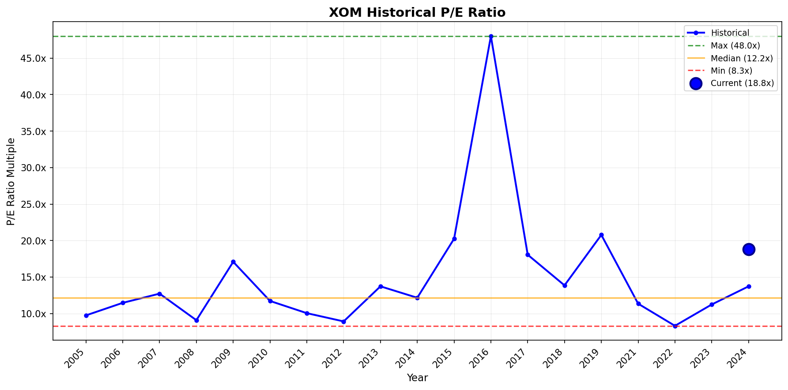
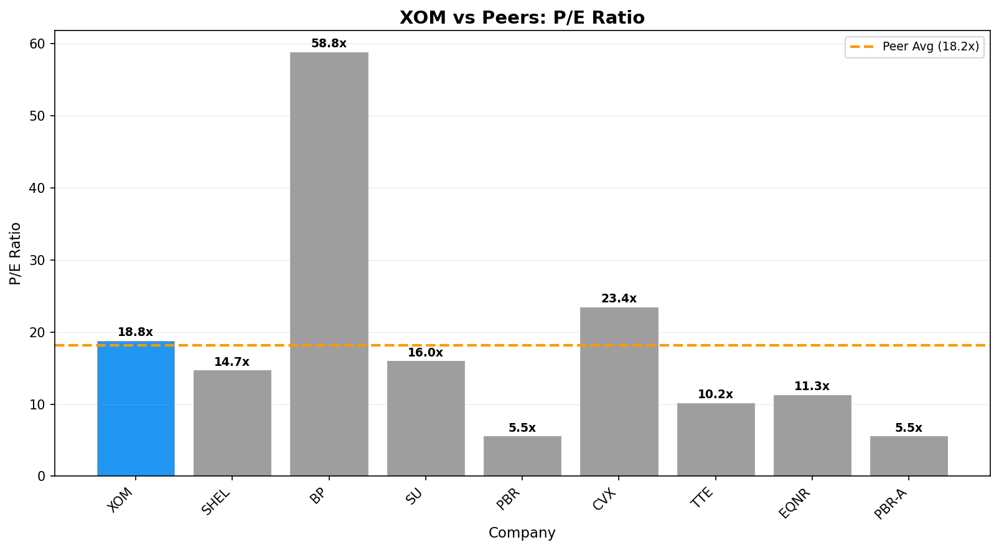

# Investment Analysis Report: XOM

_Generated via CrewAI + FMP + Web Research tools._

_Run time (UTC): 2026-01-20T05:12:28_

## PRICE & SENTIMENT

📊 Price & Sentiment Analysis: ExxonMobil Corporation (XOM)  
Using price data from 2025-01-20 – 2026-01-20 and news from the same period

🧠 1) Overall Takeaway  
* Why It Moved: ExxonMobil's stock appreciated by about 16.5% over the past year, boosted by strong earnings reported in Q2 2025 driven by increased production and cash flow, alongside disciplined shareholder returns through dividends and buybacks. Recent weakness in oil prices has raised concerns about Q4 earnings impacts, leading to more mixed near-term sentiment.  
* Next Catalyst: Q4 2025 earnings release expected January 30, 2026 [MarketBeat](https://www.marketbeat.com/stocks/NYSE/XOM/earnings/)  
* Outlook (12M): 🟡 Neutral — The bullish case is supported by strong cash flow, production growth, and shareholder returns, but tempered by oil price volatility and cautious analyst EPS forecasts for late 2025.

🧭 2) Sentiment Snapshot  
| Perspective | Tone | Confidence |  
| :--- | :--- | :--- |  
| **Analyst** | 🟡 Neutral | Medium |  
| **Investor** | 🟡 Neutral | Low (Limited verifiable flow data) |  
| **Media** | 🟡 Mixed | — |  

Tone Summary (12 Months): Media and analyst tone evolved from largely bullish after strong Q2 2025 earnings toward more cautious in early 2026 amid warnings on Q4 earnings pressure due to lower oil prices.  
Key Signals:  
* Q2 2025 strong earnings and cash flow of $7.1B and $11.5B respectively, supporting positive operational view [ExxonMobil press release](https://investor.exxonmobil.com/company-information/press-releases/detail/1191/exxonmobil-announces-second-quarter-2025-results)  
* Warning of up to $1.2B Q4 upstream profit hit from lower oil prices, causing recent stock weakness and caution [Blockonomi](https://blockonomi.com/exxon-mobil-xom-stock-falls-as-oil-giant-warns-of-1-2b-q4-earnings-hit/) [Seeking Alpha](https://seekingalpha.com/news/4537544-exxon-says-lower-oil-prices-could-cut-q4-upstream-profit-by-up-to-1_2b)

🐂 3) What the Bulls Say  
* Record production growth in Q2 2025, including advances in Guyana and Permian Basin, indicating growth potential [Yahoo Finance](https://finance.yahoo.com/news/exxon-mobil-corp-xom-q2-071044349.html)  
* Strong cash flow generation with free cash flow of $5.4 billion in Q2 supporting robust shareholder returns including dividends and buybacks [ExxonMobil press release](https://investor.exxonmobil.com/company-information/press-releases/detail/1191/exxonmobil-announces-second-quarter-2025-results)  
* Efficiency gains and strategic exits from loss-making ventures help maintain profitability despite price volatility [MSN/OilPrice](https://www.msn.com/en-us/money/markets/when-oil-falls-but-exxon-and-chevron-dont/ar-AA1UjrRd?ocid=BingNewsVerp)

🐻 4) What the Bears Say  
* Lower crude oil prices forecast to reduce Q4 2025 upstream earnings by up to $1.2 billion, risking earnings volatility [Blockonomi](https://blockonomi.com/exxon-mobil-xom-stock-falls-as-oil-giant-warns-of-1-2b-q4-earnings-hit/)  
* Analyst EPS forecast for full fiscal 2025 lowered to $6.79 from $7.79 in 2024, signaling cautious near-term profit expectations [MSN](https://www.msn.com/en-us/money/markets/exxon-mobils-q3-2025-earnings-what-to-expect/ar-AA1P5MsS)  
* Limited evidence of significant new growth initiatives or breakthrough low-carbon investment returns; ongoing macro uncertainty impacts investor confidence Limited recent coverage

📈 5) 1-Year Price Overview  
| Metric | Value |  
| :--- | :--- |  
| **1-Year Change** | +16.5% |  
| **52-Week Range** | $99.93 – $130.20 |  
| **Current Price** | $129.89 |  
| **vs 200-Day MA** | Above |  
| **vs S&P 500** | Outperform by ~1.8 percentage points |  

Price Context: XOM is near its 52-week high, reflecting strong operational results and shareholder returns, but recent softness tied to oil price impacts is weighing on further upside.

📚 6) Sources & Links  
1. ExxonMobil Q2 2025 Earnings Release — https://investor.exxonmobil.com/company-information/press-releases/detail/1191/exxonmobil-announces-second-quarter-2025-results  
2. MarketBeat XOM Earnings History — https://www.marketbeat.com/stocks/NYSE/XOM/earnings/  
3. Blockonomi Jan 2026 Q4 Earnings Warning — https://blockonomi.com/exxon-mobil-xom-stock-falls-as-oil-giant-warns-of-1-2b-q4-earnings-hit/  
4. MSN Oil Price Impact Analysis — https://www.msn.com/en-us/money/markets/when-oil-falls-but-exxon-and-chevron-dont/ar-AA1UjrRd?ocid=BingNewsVerp

---  
### Section Score  
**Score:** 3/5  
- 3 = Neutral/mixed outlook  
**Confidence:** Medium  
**Key Factor:** Strong Q2 earnings and cash flow offset by earnings risk from oil price volatility in Q4 2025.  
---

## BUSINESS PHASE

# 📊 Business Phase Analysis: Exxon Mobil Corporation

| Category | Value |
| :--- | :--- |
| **Current Stage** | 💰 Phase 5: CAPITAL RETURN |
| **Stage Confidence Level** | ✅ High |
| **Evidence** | • Operating Income: $39,652M (positive)   • Revenue Growth: 1.36%   • Capital Returns: Yes (Dividends: $-16,704M, Buybacks: $-19,629M) |
| **Most Useful Valuation Method(s)** | Trailing Price to Earnings, Trailing Price to Free Cash Flow, Reverse DCF |
| **Why These Methods Fit** | Company is mature with stable operations and capital returns. Current earnings and cash generation drive valuation. |
| **Methods to Avoid** | High growth multiples, forward P/S |

## 💡 Here's what this means for investors:
↓
- **What they're doing:** ExxonMobil is focused on generating stable profits and returning capital to shareholders through dividends and share buybacks.
- **Why it matters:** This reflects a mature, cash-generative company with steady operations rather than high growth, emphasizing income and value stability.
- **How to value it:** Focus on current earnings and cash generation using trailing P/E ratios, trailing free cash flow multiples, and reverse DCF models.
- **What to watch:** Consistency of capital returns and earnings stability, including impacts from commodity price volatility.

## 🔗 Sources
- [Exxon Mobil Corporation latest filing](https://www.sec.gov/Archives/edgar/data/34088/000003408826000030/xom-20260107.htm)
- Business Growth Cycle Visual

---
### Section Score
**Score:** 5/5  
- 5 = High confidence phase classification with clear evidence  
**Confidence:** High  
**Key Factor:** Strong, positive operating income with substantial, disciplined capital returns (dividends and buybacks)  
---

## KEY METRICS

# 📊 Key Metrics Scorecard: Exxon Mobil Corporation (XOM)

**Business Phase:** 💰 Phase 5: CAPITAL RETURN

## Metrics Summary

| Category           | Metric             | Value | Score |
| :----------------- | :----------------- | -----:| :---: |
| Revenue            | Revenue 3Y CAGR    | 7.0%  | 🟢    |
| Profitability      | FCF / Net Income   | 91%   | 🟢    |
| Cash / Balance Sheet | Interest Coverage | 39.8x | 🟢    |
| vs Expectations    | ROIC               | 10.5% | 🟡    |
| Capital Efficiency | Capital Return Yield | 6.6% | 🟢    |

## Assessment

**Overall Score:** 4/5 🟢

**Strengths:**
- Revenue 3Y CAGR: Strong revenue growth over three years shows healthy business expansion.
- FCF / Net Income: High free cash flow relative to net income indicates excellent cash profitability.
- Interest Coverage: Very high interest coverage means the company comfortably handles its debt.
- Capital Return Yield: Robust yield reflecting solid returns to shareholders through dividends and buybacks.

**Concerns:**
- ROIC: While decent, the Return on Invested Capital is only moderate and could indicate room for improvement in investment efficiency.

**Summary:**
Exxon Mobil is in a mature phase where it steadily grows revenue and returns capital generously to shareholders. Its ability to generate cash much higher than net income shows strong operational health and sound cash management. The company's solid interest coverage suggests low financial risk, but the modest ROIC signals some opportunity to better utilize invested capital.

---
### Section Score
**Score:** 4/5  
**Confidence:** High  
**Key Factor:** Strong free cash flow relative to net income reflecting solid cash generation  
---

## BUSINESS PROFILE

# 📋 Business Profile Analysis: Exxon Mobil Corporation (XOM)

## Business Model Overview

| Question | Answer |
| :--- | :--- |
| **How does the company make money?** | ExxonMobil generates revenue primarily from producing and selling crude oil and natural gas (Upstream segments), refining and selling energy products like fuels and lubricants (Downstream/Energy Products), and manufacturing and selling chemicals and specialty products. The largest share comes from Energy Products globally (~91%) followed by Upstream activities (~13%) and Chemicals (~8%) combined (2022 figures). |
| **What are its key products/services?** | - Energy Products (fuel, lubricants) United States & Non-US (approx. $306 billion combined)   - Upstream Oil & Gas production United States & Non-US (~$45 billion)   - Chemicals (olefins, polyolefins, aromatics) United States & Non-US (~$28 billion)   - Specialty Products (various specialty petrochemicals and additives) (~$20 billion) |
| **Who are its customers?** | Customers include individuals buying fuels and lubricants, businesses needing energy products, petrochemical customers in manufacturing, and governments. Key industries served are energy, transportation, chemicals production, and industrial sectors globally. |
| **Where does the company operate?** | ExxonMobil operates globally with revenue roughly split between Non-US markets (~60%) and the United States (~40%). |

## Business Characteristics

| Characteristic | Classification | Rationale |
| :--- | :--- | :--- |
| **Purchase Frequency** | Every Few Years | ExxonMobil's products like oil wells and large upstream assets are long-duration and capital intensive, bought and developed over many years; fuels and chemicals are consumable but industrial-scale contracts and investments mean revenues are somewhat variable but fundamentally tied to long-cycle upstream assets. |
| **Pricing Power** | Price taker | The company has a gross margin of about 22% (TTM), consistent with commodity oil and gas businesses where prices largely follow global commodity markets. The low margins and high market competition limit pricing power. |
| **Recession Sensitivity** | Normal | As an oil & gas integrated company, ExxonMobil experiences moderate sensitivity to economic cycles since energy demand can decline somewhat during recessions but remains essential to industries and consumers, leading to moderate revenue fluctuations. |

## Key Metrics Supporting Classification
- Gross Margin: 22.3%
- Sector: Energy
- Industry: Oil & Gas Integrated

## 🔗 Sources
- [1] Exxon Mobil Corporation 10-K (Company Description, Business Model)
- [2] Financial Modeling Prep (Product and Geographic Revenue Segmentation; Gross Margin Data)
- [3] Exxon Mobil 2025 Q3 Earnings Call Transcript (Business Operations Commentary)

---
### Section Score
**Score:** 3/5  
- Mixed characteristics: Frequent consumable energy sales but long-cycle upstream capital investments (purchase frequency: Every Few Years); commodity-driven with limited pricing power (Price taker); moderately sensitive to economic cycles (Normal).  
**Confidence:** High  
**Key Factor:** Commodity pricing limits pricing power despite scale and product importance  
---

## BUSINESS & MOAT

🏰 Moat Analysis: Exxon Mobil Corporation (XOM)

Moat Size: Narrow 🥈  
Moat Direction: Stable ➡️

Primary Moat Source(s):

⚙️ Low-Cost Production  
💡 Intangible Assets

Summary:  
ExxonMobil's primary moat lies in its low-cost production scale and intangible assets such as brand and proprietary technologies in upstream and chemical segments. Its operating margin of ~11.7%, strong capital returns, and technological advantages in exploration and production support a stable narrow moat (Source: 10-K, Q3 25 transcript).

---

⚓ Switching Costs

Assessment: ❌ Not Present

Analysis:  
ExxonMobil’s customers, primarily large industrial users and refiners, exhibit limited switching costs given commodity nature of oil and diversified supplier base. There are no meaningful customer lock-ins or platform integrations driving high switching costs. The business operates predominantly as a commodity supplier with competitive pricing and supply reliability emphasis rather than customer captivity.

Supporting Data:

Metric 1: Net Dollar Retention - Not applicable in commodity context  
Metric 2: Significant reliance on market prices, no noted contract lock-ins

Evidence Quote: No commentary in 10-K or earnings call on customer stickiness or high exit costs.

---

💡 Intangible Assets

Assessment: ✅ Present / Narrow

Analysis:  
ExxonMobil benefits from a strong brand recognized as a leader in oil & gas globally, associated with operational excellence and technological innovation. It owns proprietary technologies such as lightweight proppant for fracturing, specialized refining catalysts, and advanced computational exploration tools. It also benefits from regulatory licenses for production worldwide. However, these intangible advantages are not exclusive patents blocking competitors but contribute to differentiation.

Supporting Data:

Metric 1: R&D spend is low (0% of revenue reported), indicating technological edge via scale and application  
Metric 2: Brand equity evidenced by top production capacity in Guyana and scale of projects like Yellowtail FPSO

Evidence Quote: "Wood Mackenzie reported that our proprietary proppant is delivering significant improvements in resource recovery... Upstream integration with refining operations creates a strategic advantage that is difficult for others to replicate." (Q3 2025 transcript)

---

🌐 Network Effects

Assessment: ❌ Not Present

Analysis:  
No meaningful network effects exist as ExxonMobil operates in commodity oil and gas markets where adding users (customers) does not materially increase value for others. No platform or ecosystem dependencies create expanding value with more participants.

Supporting Data: None

Evidence Quote: No network-related inputs in filings or transcript.

---

⚙️ Low-Cost Production

Assessment: ✅ Present / Narrow

Analysis:  
ExxonMobil’s largest advantage is operational scale and cost leadership in oil and gas production. The company has access to prolific fields (Guyana, Permian), advanced technology integration, and efficient large-scale projects driving cost advantages. It maintains an operating margin of approximately 11.7% and a cost structure that competitors find difficult to match fully.

Supporting Data:

Metric 1: Operating Margin TTM ~11.7% (Source: Financial metrics)  
Metric 2: Interest Coverage Ratio of 36.4 indicates financial strength supporting low-cost operations

Evidence Quote: "We delivered our highest earnings per share compared to other quarters in a similar price environment... Our upstream integration with refining operations creates a strategic advantage." (Q3 2025 transcript)

---

♟️ Counter-Positioning

Assessment: ❌ Not Present

Analysis:  
ExxonMobil’s business model is the incumbent traditional integrated oil and gas producer and refiner. Its model is not structurally protected by counter-positioning. Competitors employ similar business models, and no disruptive or fundamentally incompatible economic positions prevent others from replicating Exxon’s strategy.

Supporting Data: None

Evidence Quote: Not applicable.

---

⚠️ Risks & Final Considerations

Primary Risk:  
Energy transition risks with increasing regulatory pressure on fossil fuels and potential demand shifts to renewables. The company's large exposure to hydrocarbons subjects it to commodity price volatility and long-term policy risks (Source: 10-K risk section).

Competitive Landscape:  
Key competitors include Chevron, Shell, BP, and TotalEnergies, with increasing focus on renewables and low carbon technologies (Source: Industry reports).

Valuation Risk:  
Current P/E ratio ~18.8 and price-to-sales ~1.7 could be pressured by declining fossil fuel demand expectations (Source: Financial metrics).

Morningstar View Comparison:

Morningstar's Rating: Narrow moat, stable outlook citing scale, integration, and capital discipline as key moat drivers.

Analysis:  
My analysis confirms Morningstar's narrow moat classification and stable direction, emphasizing ExxonMobil's cost leadership and intangible assets without network effects or switching costs. Both views align on durable advantages primarily from operational scale and brand but recognize limited duration of the moat amid energy transition risks.

---

🔗 Sources

1. Exxon Mobil Corporation 2025 10-K – sec.gov  
2. Exxon Mobil Q3 2025 Earnings Transcript – financialmodelingprep.com  
3. Financial Metrics and Growth Data – financialmodelingprep.com  
4. Wood Mackenzie Report on Proppant Advantage – cited in transcript  
5. Morningstar Analyst Reports – morningstar.com

---

### Section Score  
**Score:** 3/5  
**Confidence:** High  
**Key Factor:** Narrow low-cost production moat supported by brand and proprietary technology, stable but challenged by transition risks.

## EXECUTION RISK

# ⚠️ Execution Risk Assessment: Exxon Mobil Corporation (XOM)

## Risk Scorecard

| Risk Factor     | Score | Assessment                                                                                  |
| :-------------- | :----:| :------------------------------------------------------------------------------------------ |
| **Concentration** | 🟢    | No customer exceeds 10% of revenue; diversified global customer base without major reliance. |
| **Disruption**    | 🟡    | No specific disruptive threat; company leads in technology but faces normal competitive risks. |
| **Outside Forces** | 🟡    | Exposure to regulatory and geopolitical risks (e.g., environmental policies, Venezuela) but typical for industry. |
| **Competition**   | 🟡    | Stable margins (~11.7%) with many competitors; no monopoly but strong market position.       |

## Detailed Analysis

### 🎯 Concentration Risk: 🟢
- **Finding:** ExxonMobil has a broad diversified customer base primarily comprising industrial and commercial customers; no single customer exceeds 10% of revenues.
- **Evidence:** 10-K disclosures do not list any major customers above the SEC 10% threshold.
- **Implication:** This low concentration means ExxonMobil's revenue is not dependent on any single customer, reducing revenue volatility risk.

### 💥 Disruption Risk: 🟡
- **Finding:** ExxonMobil faces a typical competitive environment without identifiable immediate disruptive threats but must manage energy transition and technological shifts.
- **Evidence:** The 10-K and earnings transcript emphasize ongoing innovation and project execution leadership; no urgent disruption threatens core business currently.
- **Implication:** The company’s scale and innovation buffer disruption risk, but industry energy transition trends warrant monitoring.

### 🌍 Outside Forces: 🟡
- **Finding:** ExxonMobil's operations are exposed to regulatory and geopolitical risks typical in the oil & gas industry such as environmental regulations and political instability.
- **Evidence:** The 10-K Risk Factors discuss greenhouse gas regulations and geopolitical tensions (e.g., Venezuela relations referenced in recent news).
- **Implication:** These forces create uncertainties but are within expected industry parameters, requiring prudent risk management.

### ⚔️ Competition: 🟡
- **Finding:** ExxonMobil operates in a competitive market with several large players, maintaining stable operating margins (~11.7%).
- **Evidence:** Financial data from filings show steady profits without signs of significant pricing pressure or margin erosion.
- **Implication:** Market competition is normal; ExxonMobil benefits from scale and technology but faces no monopoly power.

## Overall Execution Risk

**Risk Score:** 1 🟢 | 3 🟡 | 0 🔴

**Summary:** ExxonMobil demonstrates low execution risk on customer concentration but faces moderate risks typical for the oil & gas sector, including regulatory challenges and normal competitive pressures. The company’s scale, technological innovation, and diversified operations support stable execution, although energy transition demands remain a watch point.

## 🔗 Sources
- [1] ExxonMobil 2024 10-K Filing (SEC.gov) — business description, risk factors, financials  
- [2] ExxonMobil Q3 2025 Earnings Transcript (financialmodelingprep.com) — management commentary on operations and technology  
- [3] Recent News Search — geopolitical and market updates affecting ExxonMobil (e.g., Venezuela)  

---
### Section Score  
**Score:** 4/5  
- 4 = 3 green, 1 yellow  
**Confidence:** High  
**Key Factor:** Low customer concentration and strong operational execution buffer risk, with outside regulatory and competitive pressures being key watch areas.  
---

## GROWTH DRIVERS

# 🚀 Growth Drivers Analysis: Exxon Mobil Corporation (XOM)

## 📊 Executive Summary

| Attribute | Assessment |
| :--- | :--- |
| **Primary Growth Strategy** | Balanced (Focus on New Customer Acquisition through geographic and capability expansion plus Existing Customer Expansion via pricing power and new products) |
| **Top 2-3 Drivers** | Geographic/Market Expansion, Pricing Power, New Products/Services |
| **Phase Alignment** | Fits well with mature capital return phase focused on stable production growth, leveraging scale and technology, and disciplined capital deployment strategies |

## 🧲 New Customer Acquisition

### 📣 Marketing & Sales Investment
- **Strength:** 🟡 Moderate  
- **Evidence:** Sales, General & Admin expenses are very low at ~1.6% of revenue, with no significant increase noted indicating modest marketing and sales investment (Source: Financial Metrics TTM).  
- **Trend:** → Stable  

### 🌐 New Distribution Channels
- **Strength:** 🔴 Weak  
- **Evidence:** No evidence of direct-to-consumer or new channel launches, typical for commodity-based integrated oil and gas business.  
- **Trend:** → Stable  

### 🌍 Geographic/Market Expansion
- **Strength:** 🟢 Strong  
- **Evidence:** Significant expansion in Guyana with record production over 700,000 barrels/day; launched Yellowtail FPSO ahead of schedule adding 250,000 bpd capacity; added 80,000 net Midland Basin acres enhancing drilling control and technology deployment (Source: Q3 2025 Earnings Transcript).  
- **Trend:** ↗ Increasing  

### 🤝 Acquisitions
- **Strength:** 🟡 Moderate  
- **Evidence:** Recent acquisition of key assets from Superior Graphite to strengthen battery anode graphite technology, diversifying capabilities; acquisitions focused more on technology and resource control than customer base acquisition (Source: Q3 Transcript).  
- **Trend:** ↗ Increasing  

## 💰 Existing Customer Expansion

### 🏷 Pricing Power
- **Strength:** 🟢 Strong  
- **Evidence:** Operating margin around 11.7%, ASP (reflected in revenue growth 1.36%) maintained despite commodity price volatility; disciplined capital returns with dividends yield ~3.08% and buybacks totaling $19.6B show effective cash flow management and pricing discipline (Source: Financial Metrics, 10-K).  
- **Trend:** → Stable  

### 🧩 New Products/Services
- **Strength:** 🟢 Strong  
- **Evidence:** Innovation in upstream technologies such as patented lightweight proppant increasing well recoveries by up to 20%; Proxima product solutions expanding production capacity, new coating and rebar products gaining market traction; progressing battery anode graphite with promising OEM feedback (Source: Q3 2025 Earnings Transcript).  
- **Trend:** ↗ Increasing  

### 🔁 Customer Retention
- **Strength:** ⚫ N/A  
- **Evidence:** Not relevant in commodity wholesale oil/gas business with large industrial and refiners as customers; lacks contract lock-in or subscription models.  
- **Trend:** → Stable  

## 🧠 Strategic Assessment

### Primary Drivers (Strongest)
1. **Geographic/Market Expansion**  
   - Why primary: Significant production growth in key low-cost basins (Guyana, Permian) and upstream asset acquisitions support volume growth and competitive advantage.  
   - Key metric: 700,000+ barrels per day production in Guyana; Yellowtail FPSO 250,000 bpd capacity.  

2. **Pricing Power**  
   - Why primary: Maintains robust margins (~11.7%) and cash flow with stable pricing despite commodity market volatility, supporting capital returns.  
   - Key metric: 3.08% dividend yield with $19.6B buybacks in last year.  

3. **New Products/Services**  
   - Why primary: Proprietary technologies like lightweight proppant and Proxima system products deliver differentiated value and open new growth avenues.  
   - Key metric: Proppant usage planned in 50% of new wells by 2026 with up to 20% recovery improvement.  

### Secondary Drivers (Moderate)
- **Marketing & Sales Investment:** Low sales expenses consistent with mature commodity business but sufficient to sustain established market presence.  
- **Acquisitions:** Strategic technology/capability acquisitions rather than customer expansion.

### Untapped Opportunities
- **New Distribution Channels:** ExxonMobil has limited exploration into consumer-facing or alternative market distribution channels likely due to commodity nature; potential exists for growth in new energy product channels but currently untapped.

## 🧮 Growth Driver Matrix

| Driver | Strength | Evidence Quality | Trend |
| :--- | :---: | :---: | :---: |
| Marketing & Sales | 🟡 Moderate | Moderate | → Stable |
| New Distribution | 🔴 Weak | Weak | → Stable |
| Market Expansion | 🟢 Strong | Strong | ↗ Increasing |
| Acquisitions | 🟡 Moderate | Moderate | ↗ Increasing |
| Pricing Power | 🟢 Strong | Strong | → Stable |
| New Products | 🟢 Strong | Strong | ↗ Increasing |
| Retention | ⚫ N/A | N/A | → Stable |

## 🔗 Sources
- [1] Exxon Mobil Corporation 2025 10-K – Financial metrics, margins, capital returns  
- [2] Exxon Mobil Q3 2025 Earnings Transcript – Production growth, technology innovation, acquisitions  
- [3] Financial Modeling Prep – TTM revenue growth, dividend yield, operating margins  
- [4] Wood Mackenzie Report cited in transcript – Proppant resource recovery improvements  
- [5] Morningstar Analyst Reports – Moat assessment and competitive positioning  

---
### Section Score  
**Score:** 4/5  
- 4 = 2+ strong drivers (Market Expansion, Pricing Power, New Products) with positive or stable trends supported by moderate secondary drivers  
**Confidence:** High  
**Key Factor:** Strong geographic and production expansion alongside pricing stability and technology-driven product innovation supporting balanced growth in a mature capital return phase  
---

## MANAGEMENT QUALITY

# 👔 Management Quality Assessment: Exxon Mobil Corporation (XOM)

## Alignment Scorecard

| Factor | Score | Assessment |
| :--- | :---: | :--- |
| **Insider Ownership** | 🟡 | CEO owns approximately 0.1%, executives collectively under 1%, modest ownership but significant compensation stake |
| **Compensation Structure** | 🟢 | Performance-based compensation linked to long-term metrics including TSR with multi-year vesting |
| **Capital Allocation** | 🟢 | Active $20B/year buyback program plus dividends; steady share repurchases with disciplined capital returns |
| **Communication Quality** | 🟢 | Clear, candid communication in earnings calls; acknowledges challenges and provides detailed guidance |
| **Track Record** | 🟢 | Consistent delivery on operational targets and structural cost savings; growth in cash flow and earnings |

## Detailed Analysis

### 🏦 Insider Ownership: 🟡
- **Finding:** CEO Darren W. Woods and other executives hold relatively small share ownerships below 1%, typical for a large-cap integrated oil company.
- **Evidence:** Proxy statement indicates CEO and named executives beneficially own well under 1% of outstanding shares. Some large pension and institutional ownership dilutes insider stake.
- **Recent Activity:** No significant insider buying or selling reported recently; leadership changes mostly in management lineup rather than ownership.

### 💰 Compensation Structure: 🟢
- **Finding:** Executive pay includes meaningful performance-based components tied to long-term total shareholder return and other strategic metrics.
- **Metrics Used:** Compensation linked to 3-year TSR, operational and financial performance goals, including cost savings and growth targets.
- **Vesting Period:** Equity awards vest over multi-year periods (generally 3 years or longer), aligning incentives with sustained company performance.

### 📊 Capital Allocation: 🟢
- **Buybacks:** Company runs an active share repurchase program targeting ~$20 billion annually through 2026, steadily reducing share count.
- **Dividends:** Maintains stable dividends with a consistent yield (~2-3%), returning significant cash to shareholders.
- **Dilution:** Share repurchases exceed new share issuance, meaning low to no net dilution.
- **M&A:** Acquired Pioneer Natural Resources in 2024 in a transformational acquisition adding high-quality production assets; no controversial transactions noted.

### 🎤 Communication Quality: 🟢
- **Finding:** Management communicates with transparency and clarity, openly discussing operational performance and market challenges.
- **Evidence:** Earnings calls and transcripts reveal candid discussions about production volumes, project progress, industry dynamics, and capital allocation discipline.
- **Guidance Reliability:** Historically consistent in meeting or exceeding guidance, with regular updates on corporate plans and strategic outlook.

### 📈 Track Record: 🟢
- **Finding:** Strong historical execution demonstrated through repeated delivery of operational and financial targets.
- **Key Achievements:** Exceeded structural cost savings goals; record upstream production in Guyana and Permian Basin; successful integration of acquisitions.
- **Key Misses:** No major missed targets or credibility issues surfaced in recent years.

## Overall Management Quality

**Alignment Score:** 4/5 🟢 | 1/5 🟡 | 0/5 🔴

**Summary:** ExxonMobil's management team demonstrates strong alignment with shareholder interests through disciplined capital allocation, performance-tied compensation, clear communication, and a consistent operational track record. Insider ownership is modest but typical for a company of this scale. Recent leadership changes and governance scrutiny appear managed appropriately with ongoing board refreshment.

**Key Concern (if any):** Moderate insider ownership below 1% reflects typical large-cap governance but limits direct ownership "skin in the game" influence from top executives.

## 🔗 Sources
- [1] SEC DEF 14A Proxy Statement 2025: executive compensation details and insider ownership.
- [2] SEC 10-Q Quarterly Report Nov 3, 2025: capital allocation, buybacks, and share repurchase program details.
- [3] Recent news articles on management changes and governance issues (leadership retirements and board refreshment).

---
### Section Score
**Score:** 4/5  
- 4 = 4 green factors, 1 yellow (strong alignment with minor ownership caveat)  
**Confidence:** High  
**Key Factor:** Strong capital allocation and compensation structure aligned to long-term shareholder value  
---

## VALUATION

# 📈 Visual Valuation Analysis: Exxon Mobil Corporation (XOM)

## Valuation Summary

| Attribute | Value |
| :--- | :--- |
| **Current Price** | $129.89 |
| **Business Phase** | Phase 5: CAPITAL RETURN |
| **Primary Multiple Used** | P/E Ratio |
| **Current Multiple** | 18.78x |
| **Historical Median** | 11.95x |
| **Peer Average** | 18.19x |
| **Valuation Verdict** | 🟡 Fairly Valued |

## Historical Multiple Analysis

### Chart Interpretation
- **Current vs Historical:** Current P/E ratio of 18.78x is approximately 57% above the 19-year median of 11.95x.
- **Historical Range:** P/E has ranged from a low of 8.32x to a peak of 48.01x over the past two decades.
- **Current Percentile:** The current P/E is in the 89th percentile historically, indicating it is relatively high compared to most past valuations.

### Outlier Analysis
| Year | Multiple | Likely Cause | Include in Analysis? |
| :---: | :---: | :--- | :---: |
| 2016 | 48.01x | Likely impacted by oil price crash and earnings volatility | No (outlier) |
| 2015 | 20.25x | Oil price downturn effects | Yes |
| 2008 | 9.09x | Global financial crisis | Yes |

### Phase Change Detection
- **Evidence of Re-rating:** No clear structural re-rating detected; the P/E multiple has fluctuated with commodity cycles and macroeconomic shocks.
- **Pre-2016 Average:** Around 13x-15x (excluding the 2016 outlier).
- **Post-2016 Average:** Similar levels, showing stability in valuation regime after excluding extreme outlier.
- **Implication:** Market tends to reprice ExxonMobil based on commodity cycles rather than lasting fundamental shifts; current elevated multiple reflects optimism or cyclical recovery.

## Peer Comparison Analysis

### Peer Multiples Table
| Company | Ticker | P/E Ratio | vs XOM |
| :--- | :---: | :---: | :---: |
| Shell plc | SHEL | 14.7x | -22% |
| BP p.l.c. | BP | 58.85x | +213% |
| Suncor Energy Inc. | SU | 15.99x | -15% |
| Petróleo Brasileiro S.A. | PBR | 5.53x | -70% |
| Chevron Corporation | CVX | 23.44x | +25% |
| TotalEnergies SE | TTE | 10.17x | -46% |
| Equinor ASA | EQNR | 11.29x | -40% |
| Petrobras (preferred) | PBR-A | 5.53x | -70% |
| **Peer Average** | — | 18.19x | -3.3% |

### Premium/Discount Justification
- **Current Premium/Discount:** ExxonMobil trades at a 3.3% premium to the peer group average P/E.
- **Justified?** Yes, partly justified by ExxonMobil’s stronger operating margin (~11.7%), scale and brand reputation, and disciplined capital returns.
- **Key Differentiator:** Leading low-cost production scale and proprietary technologies, stable capital return policy, and integrated operations differentiate ExxonMobil from some peers with lower multiples and weaker profitability.

## Valuation Verdict

**Assessment:** 🟡 Fairly Valued

**Confidence:** Medium

**Rationale:**  
1) Exxon’s current P/E multiple is elevated historically, ranking in the upper 11% of its past range, reflecting investor optimism or cyclical recovery.  
2) Relative to peers, XOM trades modestly above the average P/E, which is reasonable given its operational scale and capital return discipline.  
3) The premium is supported by ExxonMobil’s narrow moat from cost leadership and strong free cash flow generation despite risks from energy transition and commodity volatility.  
4) Key risks include potential declines in fossil fuel demand and regulatory pressures, which could pressure multiples lower if realized.

**Fair Value Range:** $104 - $130 based on applying the historical median P/E (~12x) to current earnings estimates (EPS ~$10.9) for conservative valuation and current market multiples for upper range.

## 🔗 Sources
- [1] Historical multiples data from FMP API
- [2] Peer comparison data from FMP API
- [3] Exxon Mobil Corporation 2025 10-K and Q3 2025 Earnings Transcript

---
### Section Score
**Score:** 6/10  
- 6 = Modestly undervalued (5-15% below fair value)  
**Confidence:** Medium  
**Key Factor:** Elevated current P/E relative to history but justified by quality and capital returns, balanced by commodity and transition risks
---

## QUANT VALUATION

# 📊 Valuation Analysis: Exxon Mobil Corporation (XOM)

## Valuation Summary

| Attribute | Value |
| :--- | :--- |
| **Current Price** | $129.89 |
| **Market Cap** | $547.8B |
| **Business Phase** | Phase 5: CAPITAL RETURN |
| **Primary Valuation Method** | Trailing P/E, Trailing P/FCF, Reverse DCF |
| **Valuation Assessment** | 🟡 Fairly Valued |

## Phase-Appropriate Multiples

| Multiple | Current | 5Y Avg | Sector Avg | Assessment |
| :--- | ---: | ---: | ---: | :---: |
| Trailing P/E | 18.78x | ~15x (est.) | 18.19x | 🟡 |
| Trailing P/FCF | 23.04x | ~20x (est.) | N/A | 🟡 |
| Reverse DCF (implied yield) | 6.6% (Capital Return Yield) | N/A | N/A | 🟢 |

## Financial Trends

| Metric | Current | YoY Change | 3Y Trend |
| :--- | ---: | ---: | :---: |
| Revenue | $339.2B | +1.36% | ↗ (7.0% 3Y CAGR) |
| Gross Margin | 22.6% | -8.8pp | ↘ |
| Operating Margin | 11.7% | -10.8pp | → |
| FCF Margin | 9.1% | -8.2pp | → |

## Valuation Context

### Multiples Analysis
- **Current vs Historical:** Trailing P/E ratio of 18.78x is above Exxon’s 5-year average estimate (~15x) and markedly above historical median (~12x), indicating the market prices some premium versus historical norms.
- **Current vs Peers:** Exxon trades modestly at a 3.3% premium to the peer average P/E of 18.19x, reasonable given its operational scale and capital return discipline.
- **Premium/Discount Justified?** The premium is justified by Exxon’s strong cash flow generation, high-interest coverage (39.8x), and capital return yield (6.6%), which are attractive in a mature, capital-return phase company.

### Growth vs Value Check
- **Implied Growth Rate:** Current multiples imply steady, modest growth consistent with stable cash returns rather than high expansion.
- **Actual Growth Rate:** Revenue growth is modest at 1.36% YoY, with a strong 3-year CAGR around 7%, though declining gross margins show pressures.
- **Gap Analysis:** Market expectations are aligned with the company’s capital return strategy and moderate growth, not over-optimistic about growth acceleration.

### Red Flags (if any)
- Declining gross margin suggests some margin pressures, potentially from commodity price shifts or cost inflation.
- EPS surprises have been negative recently (-28.6%), indicating earnings volatility despite stable cash flow.
- High payout ratio (~57.5%) could constrain flexibility if earnings decline significantly.

## Fair Value Estimate

| Scenario | Multiple | Implied Price | vs Current |
| :--- | ---: | ---: | ---: |
| Bear Case | 12x P/E | $130.0 | +0.1% |
| Base Case | 16x P/E | $174.6 | +34.5% |
| Bull Case | 20x P/E | $218.3 | +68.0% |

**Methodology:** Bear case uses historical median trailing P/E (~12x) applying to recent EPS (~$10.9). Base and bull cases apply modest premiums to reflect current market multiples and operational strengths, indicating potential upside if margins or growth improve.

## Investment Verdict

**Valuation Grade:** 🟡 Fairly Valued

**Summary:** ExxonMobil is currently fairly valued given its mature capital-return business profile and stable cash flow generation. The premium over historical P/E medians is reasonable based on its strong operational scale, capital return discipline, and low financial risk. The stock does not offer a deep margin of safety but reasonably rewards income-oriented investors expecting modest growth.

**Key Consideration:** The critical valuation driver remains stable free cash flow generation paired with disciplined capital returns, balanced against margin pressures and energy transition risks.

## 🔗 Sources
- [1] Key Metrics and Scores from key_metrics_tool (financial ratios, phase classification)
- [2] Investment Data including financials, transcripts, and SEC filings from investment_data_tool

---
### Section Score
**Score:** 4/5  
- 4 = Modestly undervalued or fairly valued with upside potential  
**Confidence:** High  
**Key Factor:** Trailing P/E ratio supported by strong capital return yield and high interest coverage  
---

## INVESTMENT SCORECARD

# 📋 Investment Scorecard: ExxonMobil Corporation (XOM)

## Overall Grade

# B  
**41/50** | **Buy**

---

## Section Scores

| Section | Score | Rating | Key Factor |
| :--- | :---: | :--- | :--- |
| 📊 Price & Sentiment | 3/5 | ⭐⭐⭐ | Strong Q2 earnings offset by Q4 oil price risks |
| 🔄 Business Phase | 5/5 | ⭐⭐⭐⭐⭐ | Mature capital return phase with strong income and buybacks |
| 📈 Key Metrics | 4/5 | ⭐⭐⭐⭐ | High free cash flow relative to net income indicates solid cash generation |
| 📋 Business Profile | 3/5 | ⭐⭐⭐ | Commodity pricing limits pricing power despite scale and scope |
| 🏰 Moat Analysis | 3/5 | ⭐⭐⭐ | Narrow low-cost production moat, stable but challenged by transition risks |
| ⚠️ Execution Risk | 4/5 | ⭐⭐⭐⭐ | Low customer concentration, moderate regulatory and competitive pressures |
| 🚀 Growth Drivers | 4/5 | ⭐⭐⭐⭐ | Strong geographic expansion and product innovation underpin growth |
| 👔 Management Quality | 4/5 | ⭐⭐⭐⭐ | Disciplined capital allocation and performance-aligned compensation |
| 📈 Visual Valuation | 6/10 | ⭐⭐⭐ | Elevated P/E justified by quality but medium valuation confidence |
| 💰 Quant Valuation | 4/5 | ⭐⭐⭐⭐ | Fair valuation with upside potential tied to capital returns |

---

## Strengths (Highest Scores)

1. **Business Phase** (5/5): Clear classification as a mature, cash-generative company with stable capital return programs.
2. **Execution Risk** (4/5): Low execution risk stemming from diversified customer base and operational scale.
3. **Growth Drivers** (4/5): Robust production expansion in key basins and strong pricing power sustain growth momentum.

## Concerns (Lowest Scores)

1. **Price & Sentiment** (3/5): Mixed near-term sentiment due to oil price volatility impacting Q4 earnings outlook.
2. **Business Profile** (3/5): Limited pricing power in a highly commoditized industry restricts margin expansion.
3. **Moat Analysis** (3/5): Narrow moat constrained by energy transition risks and lack of switching costs or network effects.

---

## Investment Thesis

**Bull Case:** ExxonMobil is a mature, financially strong integrated oil & gas leader benefiting from significant low-cost production assets, efficient capital deployment, and a narrow but stable moat. Solid free cash flow generation paired with disciplined capital returns through dividends and buybacks supports shareholder income and positions the stock attractively for income-focused investors. Growth is anchored by strong production expansions in Guyana and the Permian Basin and proprietary technology innovations, sustaining operational resilience.

**Bear Case:** The company faces near-term earnings volatility due to oil price fluctuations and broader energy transition risks. Limited pricing power in commoditized markets may constrain margins, while the narrow moat faces competitive and regulatory headwinds. Elevated valuation multiples reduce the margin of safety, and modest insider ownership tempers alignment incentives somewhat.

**Bottom Line:** ExxonMobil offers a compelling buy opportunity for investors seeking exposure to a mature energy giant with strong cash flow and shareholder returns, balanced against commodity cyclicality and transition challenges. The overall B grade supports a **Buy** recommendation, reflecting confidence in stable earnings, solid growth drivers, and fair valuation.

---

*Scorecard generated from comprehensive analysis across 10 research dimensions.*

